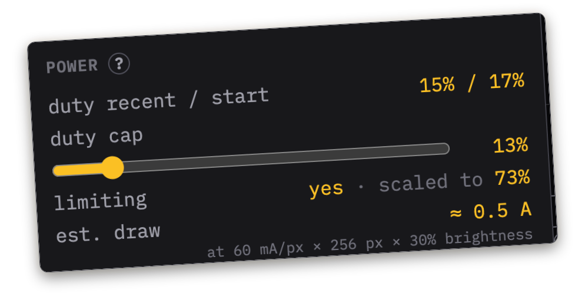
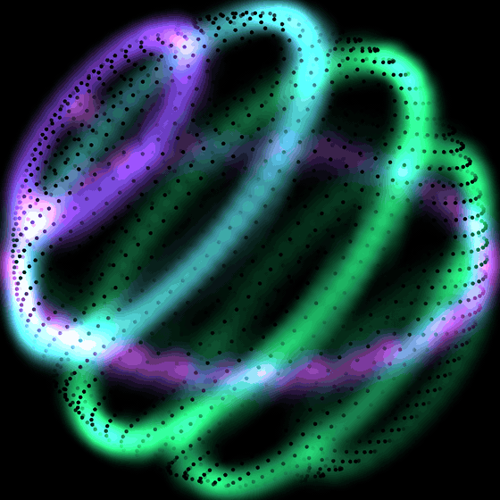
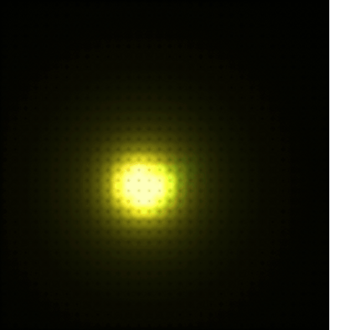

# PXLBLZ-IDE

> [!IMPORTANT]
> **Studio sign-in is invite-only for a few more days** while the v2 launch
> settles. Email [pxlblz@whiteroomsoftware.com](mailto:pxlblz@whiteroomsoftware.com)
> for an invite — the Gallery, documentation, previews, and live Controller
> access are open without an account 😺

PXLBLZ-IDE is an IDE for [Pixelblaze](https://electromage.com/) LED
controllers, built around one idea: do more with Patterns without editing
code. Write and preview Patterns, add new
functionality to existing ones, and recombine complete Patterns into
**Shows** on a timeline (like iMovie or CapCut). Everything compiles down
to a regular Pixelblaze Pattern you can run on the controller.

Everything in the IDE runs in the browser, so you can write Patterns, create
Shows, and see it all running — no Pixelblaze controller required. If you
have a controller, install the companion
[Chrome extension](https://chromewebstore.google.com/detail/pxlblz-ide-controller-hel/hjdkmngopeofakdbjfkaomcmgkcidoeg)
and connect to it live.

*MagneticFilaments — [watch it live](https://pxlblz-ide.whiteroomsoftware.com/p/magnetic-filaments).*

## Shows

A Show takes one, two, or more Patterns and recombines them into a
brand-new Pattern: arrange them on a timeline, transition between them,
animate their controls, and layer Effects over them. Your Show runs on a
Pixelblaze controller just like any other Pattern.

Two fun uses for Shows:

- **Remix your favorite Pattern.** You have a Pattern you love. Put it on
  the timeline and remix it into a two-minute set: animate its controls over
  time, layer Effects over it, crossfade between variants of it. The
  ten-second Pattern becomes a performance.
- **Stage a light show.** Divide your custom map into named zones, each
  running its own Pattern — or its own variant of one Pattern — with
  precisely coordinated moments across the whole piece, without paying a
  separate runtime cost per zone.

## Quality of life mods

The PXLBLZ compiler can add code fragments (mixins) to any Pattern on its
way to the hardware:

- **Brightness on every Pattern.** A hardware brightness control on any
  Pattern, without modifying its code.
- **Physical knobs without code edits.** Bind a potentiometer or button to
  any exported control, function, or variable. The original Pattern source is
  never modified.
- **Power management.** Limit power usage from the controller, estimated
  from the active LED duty cycle.
- **A permanent home for Patterns and Shows.** Patterns, Shows, maps, and
  Controller profiles live in a real database on a cloud workspace behind
  GitHub or Google sign-in.

You can always see the final code that PXLBLZ generates — **View generated
artifact** shows exactly what will run.

## Why it exists

I built the Pixelblaze tool I wanted for myself, and the original wishlist
was modest: develop Patterns without a controller on my desk, store them
somewhere durable, and stop copy-pasting the same helper functions between
them. Getting there meant writing a real parser and compiler for the Pattern
language, and that foundation kept paying for itself. Shared libraries became
practical, then safe code injection, then combining complete Patterns. At
that point a timeline that transitions between Patterns, animates their
controls, and routes different work to different zones stopped being a
fantasy and became the obvious next step. PXLBLZ has gone well beyond the
tool I originally wished for. I was not dreaming big enough.

*AuroraSphere — [watch it live](https://pxlblz-ide.whiteroomsoftware.com/p/aurora-sphere).*

## The rest of the tour

- **Gallery** — built-in Patterns rendered live in the IDE.
- **Editor** — rich editing for the Pixelblaze language: symbol completion,
  hover help, inline errors, quiet auto-save, and exported controls beside
  the preview.
- **Preview** — 1D, 2D, and 3D maps as a WebGL point field.
- **Maps** — built-in and custom maps, all viewable in the preview —
  including new map-debugging views that show the order of your LEDs.
- **Libraries** — built-in libraries of reusable functions, plus your own.
  Compilation tree-shakes only what a Pattern actually calls into its
  artifact.
- **Controller integration** — discovery and live connection through the
  extension, Run/Save with the controller's own compiler, and durable
  per-device profiles.

## How it was built

This codebase was written using Claude and Codex in roughly equal amounts,
working under a process with real teeth: test-driven slices, cross-model
code review on every commit, mutation testing on the high-risk engines, and
full end-to-end suites before anything ships. The process is documented
throughout the repo, starting in [`docs/agents/`](docs/agents/).

*Harmonograph — [watch it live](https://pxlblz-ide.whiteroomsoftware.com/p/harmonograph).*

## What it deliberately does not do

- It does not manage WiFi, LED hardware settings, playlists, or other device
  administration. The Pixelblaze web UI already does that well.
- It cannot recover source from a saved Pattern that contains only compiled
  code. Import `.epe` files or source-bearing programs instead.
- It does not synchronize a Show across several controllers.

## Documentation

Start with the
**[Feature Guide](https://pxlblz-ide.whiteroomsoftware.com/docs/feature-guide)**
for a tour of every surface, read
**[Inside the Show Compiler](https://pxlblz-ide.whiteroomsoftware.com/docs/show-compiler)**
for how a timeline becomes one Pattern, and reach for the
**[Pixelblaze Ecosystem Primer](https://pxlblz-ide.whiteroomsoftware.com/docs/ecosystem-primer)**
if the platform itself is new to you. The full documentation set lives in the
in-app **Docs** workspace (and in [`docs/`](docs/) here).

Controller traffic stays between your browser and your local network — the
hosted app never proxies it. The
[privacy page](https://pxlblz-ide.whiteroomsoftware.com/docs/privacy) has the
details.

## Acknowledgement

Thanks to [Ben Hencke](https://electromage.com/about) and ElectroMage for
building Pixelblaze. It has been a small box with an outsized effect: a lot of
fun, and a generous way into making electronics feel approachable. PXLBLZ-IDE
is an independent project and is not affiliated with or endorsed by
ElectroMage 😺

## Previous release

The original 1.0 release remains available at
[jon-whiteroomsoftware.github.io/PXLBLZ-IDE](https://jon-whiteroomsoftware.github.io/PXLBLZ-IDE/).
Version 2 is a new application with cloud accounts and does not migrate v1
browser storage.

## License and feedback

PXLBLZ-IDE is free and open source under the [ISC license](LICENSE). Bug
reports and suggestions are welcome on the
[issue tracker](https://github.com/jon-whiteroomsoftware/PXLBLZ-IDE/issues);
general project mail can go to
[pxlblz@whiteroomsoftware.com](mailto:pxlblz@whiteroomsoftware.com).
