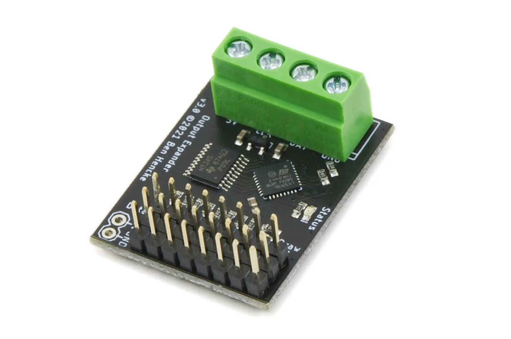
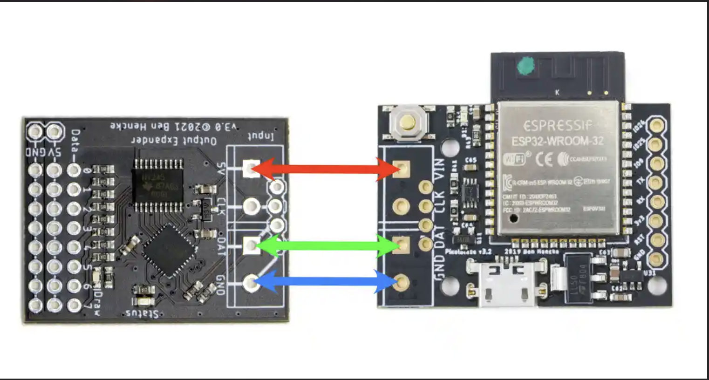
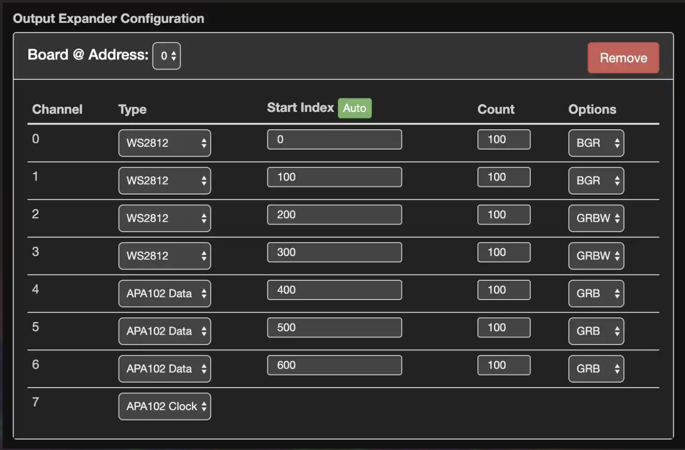
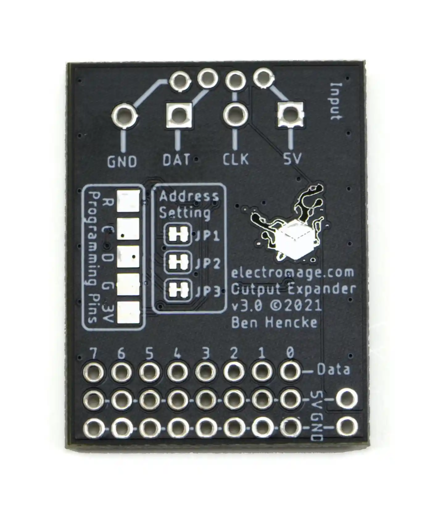

# Output Expander

> Source: https://electromage.com/docs/output-expander (captured 2026-07-08)

## A Serial to 8x WS2812/APA102 Driver

### What is it?

This is a UART serial to addressable LED driver board. It supports these LEDs (and compatibles):

-   WS2811 / WS2812 / WS2813 / WS2815 / GS8208 / SK6812 / NeoPixel
-   APA102 / SK9822 / DotStar

It can be used with just about any microcontroller's serial (UART) port(s), Raspberry Pi, USB serial adapters, and even software serial implementations. The outputs are level-shifted to 5 V with 100 ohm impedance matching resistors for twisted pair like found in CAT 5/CAT 6. The protocol allows for up to 8 driver boards to run from the same serial line, with cuttable jumpers to set the address. Pixel data is buffered, displayed simultaneously across all channels, and includes CRC error checking to prevent glitches.

Each channel can have its own color ordering, and can support a mix of RGB and RGBW across channels or LED types, and any mix of length, up to 800 RGB pixels or 600 RGBW pixels per channel for the WS2812 / NeoPixel types, and 600 LEDs for the APA102 / DotStar types. Thats up to 6,400 pixels per board, or 51,200 with eight!

Since data is buffered on this board and the protocol doesn't have any timing requirements, you can calculate pixel data on the fly and there's no need to buffer anything on your micro, freeing up memory.

For APA102 / SK9822 / DotStar, at least one channel is dedicated to clock output. This can be shared to multiple LEDs clock inputs, so you can drive up to 7 channels of APA102.

You can mix and match APA102 with WS2812 on the same board by specifying each channels type.

The input serial protocol runs at 2Mbps. This allows up to 66k pixels/sec to be drawn per serial line, about twice the speed of typical WS2812.

Power and GND connections are also available per channel, and works great for lower powered applications (up to 3 A). Assuming full white at 50% max power (still very bright), that's enough for 100 typical 5V LEDs. For more LEDs, or for using 12V LEDs, just connect your power supply directly to the LEDs instead of distriubuting main power through this expander. Experienced users who understand the convenience of distributing power through an expander with plugs will appreciate the 15 A capacity of our [Pro Expander](https://electromage.com/docs/pro-output-expander).

In this kit you get the driver board (pictured), 5mm screw terminals, and 0.1" pin headers. It's sold as a kit, and some easy soldering is involved to attach the optional screw terminals and headers.

### Why did you make it?

Originally designed to expand output options for Pixelblaze, this driver board can be driven by just about any microcontroller.

### What makes it special?

This solves many issues that are tough to accomplish with existing hardware/libraries:

<!-- Item 1 of this list was lost in the page capture (the source page is JS-rendered), so the list starts at 2. -->

2.  Handles all of the WS2812 timing requirements. No need to lock up your CPU, disable interrupts, etc.
3.  Mix and match the most common LED types side by side, and drawing simultaneously.
4.  Buffers data, so you don't have to dedicate memory for each pixel!
5.  Outputs all channels simultaneously (up to 64 with 8 boards).
6.  CRC error checking to avoid glitches in noisy environments.
7.  Handles all of the color re-ordering, and accepts RGB or RGBW ordered data.
8.  Works on a single data line!
9.  Input can be either 3.3 V or 5 V, and level shifts for 5V LEDs.
10.  Doubles the pixels/second possible from a single output (WS2812 type)

### Drivers

-   [Arduino ESP8266 Driver](https://github.com/simap/PBDriverAdapter)
-   Pixelblaze v2.22 and above includes support for APA102 channels and an easy to use configuration screen.

### Specs and Serial Protocol

The board can deliver up to 3 A total.

For details on the serial protocol, see [this writeup](https://github.com/simap/pixelblaze_output_expander) in the source repo.

### Connecting to Pixelblaze

Connect 5V power, GND, and data from the output side of Pixelblaze. The boards can be connected directly, or with wire. For wiring multiple expanders, the data line is shared.

### Setup

To use with Pixelblaze, go to the Settings tab and change the LED type to "Pixelblaze Output Expander" - then click on "Add Board" for each connected expander board. The interface will let you set up each channel's type, start index, pixel count, and color order. A count of zero effectively disables that channel.

APA102 / SK9822 type LEDs need a clock signal to work. Any of the channels can be configured to be used as the clock output, and a single clock output channel can be connected to multiple strings of LEDs.

#### Using multiple output expanders

Up to 8 boards are supported on the same serial line.

##### Address Jumper Configuration

The board address can be set by cutting a trace on the back of the expander board, and defaults to zero. Cutting JP1 adds 1 to the address, cutting JP2 adds 2, and JP3 adds 4. For example:

-   no cuts = address 0
-   cut JP1 = address 1
-   cut JP1 + JP3 = address 5

