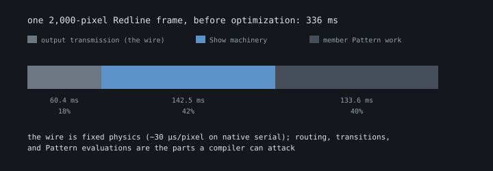
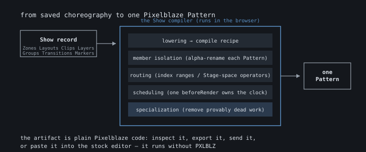
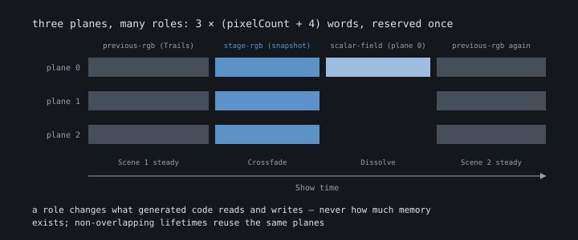

# Inside the Show compiler

A Show looks like a video editing project: a timeline, scenes, clips, zones,
transitions, effects. But nothing like a video player exists on the other end.
A Pixelblaze is one microcontroller core doing fixed-point math, and the only
thing it knows how to run is a single ordinary Pattern. So the Show compiler's
job is a small magic trick: flatten an entire choreographed timeline — every
Pattern, every Transition, every Effect, every zone — into one self-contained
Pixelblaze Pattern that performs the whole Show by itself.

This guide is a tour of how that works and what it costs, written for people
who want to know what's happening under the hood without reading compiler
source. It also covers the optimization program: what we tried, what the
hardware said, and which clever ideas turned out to be slower. If you want to
make **your own Pattern** faster, that's the
[Optimization Guide](Optimizing Pixelblaze patterns.md); this document is about
what the compiler does to a **Show** on your behalf. Every percentage here is a
real measurement on a Pixelblaze 32 running firmware 3.67, not an estimate.

---

## The machine we're compiling for

Everything the compiler does follows from the resource axes it has to live
inside. A generated Show has to satisfy four runtime constraints while staying
within one conservative program-size planning scale:

| Budget | Limit | What consumes it |
|---|---|---|
| Array memory | 10,240 words | every array, plus a 4-word header each |
| Persistent globals | 256 | member Pattern state, compiler scalars |
| Program-size planning | 68,384-byte advisory scale | delivered source and estimated Controller bytecode |
| Renderer depth | warn at 3–4, block at 5 | simultaneous Pattern evaluations per pixel |
| Frame time | whatever's left | everything above, per pixel, per frame |

These axes don't trade against each other. A Show can have plenty of free memory
and still fail to activate because its compiled program is too large; a tiny
artifact can still crawl because it evaluates three Patterns per pixel. VM words,
globals, and renderer depth can block directly; frame time determines whether the
result is usable. The 68,384-byte program-size figure is advisory because only
the Controller compiler can decide actual bytecode fit. The compiler keeps the
axes separate. The Show editor keeps delivered source and VM words visible,
surfaces actionable warnings, and leaves deeper breakdowns in the source
inventory and compiler model.

Program size needs one extra distinction. Source spelling is not Controller
bytecode: a generated `table[i] = value` costs 20 bytecode bytes per value, a
numeric array literal costs about 4.25, and a guarded packed 2x15 literal reaches
2.25 per value at 2,048 values. The compiler therefore keeps the delivered-source
inventory and a bytecode-axis estimate side by side, repricing the measured data
forms while leaving ordinary code at source parity. The Controller compiler is
still authoritative when a device is available; neither planning proxy pretends
to be the final bytecode measurement.

The 68,384-byte limit stays deliberately conservative. Literal-heavy hardware
probes on firmware 3.67 activated at largest observed sizes from 70,475 to 77,111
bytes depending on device state; the same 76,579-byte artifact failed in one run
and activated in another. Every observed failure was above 70,607 bytes. The
spread is the reason not to spend the higher number: 68,384 remains below the
measured uncertain band and applies consistently to generated Shows.

Run `npm run census` to see the current stock catalogue on both axes. It compiles
every stock Show, rejects any resource blocker, and prints VM words by owner
category, delivered artifact bytes, the bytecode estimate, and budget percentage.
Source-inventory chunks retain their category and owner. When a Show emits
Scene-owned routing/render plans, the census groups the `routing-render-plans`
bytes by Scene, so an oversized plan is attributed to the part of the score that
created it instead of disappearing into one whole-artifact total. Set
`SHOW_CENSUS_OUT` when the same rows and per-Scene attribution are needed as JSON.

There's also a limit no compiler pass can touch: the wire. WS281x-family LEDs
receive data at a fixed 800 kHz, which works out to roughly 30 microseconds
per pixel. At 2,000 pixels on a single native serial output, just **shipping**
a finished frame takes 60.4 ms: a hard ceiling of about 16.6 FPS if the
Controller computed everything else instantly. Output Expanders and clocked
LED families move that floor, which is why Controller profiles carry a
declared output profile and why every FPS number in our evidence names one.

Compiled Shows support at most 2,000 output pixels. We measured 4,000 directly
— 1.86 FPS on the reference Show — and decided that shipping a number is not
the same as supporting an experience.

That chart is the frame-time attribution for Redline, our heaviest reference
Show, before the optimization program: 336 ms per frame, of which 60 ms is the
wire, 143 ms is Show machinery (routing, transitions, composition), and 134 ms
is the member Patterns doing their own rendering. It's the map the whole
optimization program worked from: you can't decide what to attack until you
know where the time goes.

## From timeline to one Pattern

The pipeline runs in the browser every time you edit a Show:

1. **Lowering.** The saved Show (Scenes, Zone Layouts, clips, boundaries,
   property curves) becomes a compile recipe: which Pattern instances exist,
   which Scenes activate them, and what every boundary does.
2. **Member isolation.** Each Pattern instance is renamed so its variables and
   functions can't collide with any other member or with the Show's own
   machinery. Your Patterns are combined verbatim, not rewritten: a member
   still reads like the Pattern you authored.
3. **Routing.** Every output pixel gets an owner. Installation Shows route by
   physical index ranges; Portable Shows route by normalized Stage position,
   so the same Show adapts to any compatible 2D surface. The compiler picks
   the cheapest faithful representation: a direct formula for regular
   layouts, ordered comparisons for irregular ones, and a packed lookup table
   only when the branch chain would be genuinely deeper than the table is
   expensive.
4. **Scheduling.** A generated `beforeRender` advances the Show clock, works
   out the active Scene and boundary, updates property ramps and Effect
   parameters once per frame, and advances each active Pattern instance
   exactly once, even when several placements show the same instance.
5. **Specialization.** The compiler then removes every piece of work it can
   **prove** unnecessary. This is where most of this document lives.

The output is ordinary Pixelblaze code. You can read it (**View code**),
export it as an `.epe`, send it to a Controller, or paste it into the stock
editor. Nothing about it requires PXLBLZ to exist afterward.

## The three-plane render target

One early decision shapes everything else. Every generated Show reserves
exactly three full-output arrays: think of them as three grayscale
photographic plates the size of your installation. Together they can hold one
complete RGB frame, or two coordinates per pixel, or one scalar value per
pixel with room to spare. At 2,000 pixels that reservation is 6,012 of the
10,240 available words, leaving 4,228 words for **everything else in the Show
combined**.

Why three and not more? Because two complete RGB frames would need six planes,
and six planes don't fit alongside real Patterns. So the compiler never keeps
two full frames. Instead, the same three planes change **roles** over the life
of the Show:

- **`stage-rgb`** — a captured composite frame, used by snapshot Crossfades
  and Pattern-output reuse;
- **`scalar-field`** — one reusable value per pixel, used by Dissolve
  geometry and static Vignette mattes;
- **`sample-xy`** — two coordinates per pixel (a diagnostic role; production
  never uses it — see the failures section);
- **`previous-rgb`** — last frame's output, used by Trails.

A planner assigns those roles deterministic lifetimes: candidates declare what
they store, when it becomes invalid, and what it saves; required authored
policies win first, exact caches beat approximations, and losers keep their
ordinary uncached behavior plus a note in the compile report explaining why.
Two things that never overlap in time can share the same planes. Two things
that do overlap fight, and one of them loses politely.

## The free wins: exact specialization

The first family of optimizations changes nothing you can see — output is
bit-identical in both preview modes, verified frame by frame. These are on
for every Show, always.

The core moves will be familiar if you've read the Optimization Guide,
because they're the same moves a careful Pattern author makes by hand; the
compiler just applies them with proofs instead of intuition:

- **Prove it, then hoist it.** Any expression the compiler can prove is
  pure and identical for every pixel moves out of the per-pixel path and
  runs once per frame. That includes subtrees like `wave(time(.05))` buried
  inside an `hsv()` call, a shape that's everywhere in community Patterns.
- **Stop testing what can't happen.** When physical zone ranges provably
  cover the output exactly once, routing becomes an ordered short-circuit
  where the last branch doesn't even need a test.
- **Delete dead machinery.** Pre-render clears vanish when every code path
  provably writes a color. Identity mirrors, identity brightness multiplies,
  and neutral Effects vanish when the Show proves they can't vary.
- **Inline tiny helpers.** A one-line pure helper function gets substituted
  into its call sites: a function call costs 2–3 microseconds on this VM,
  which is real money when it happens per pixel.
- **Refresh route constants once per frame.** The routing arms used to
  recompute `ceil(sqrt(pixelCount))` and the split-position zone sizes for
  every pixel; those depend only on `pixelCount` and values the scheduler
  writes once per frame, so the compiler now computes them at the end of
  `beforeRender` and the arms read a global (+2–3% on Portable Shows).
- **Fold the plumbing.** The generated wrappers between the routing arm and
  the member — the pass-through capture wrapper, the one-line paint helper,
  the clear sink — each cost a call boundary per pixel for no work; when
  their bodies are trivial and their arguments are plain names, the
  compiler pastes them into the arm and deletes the wrapper.
- **Unroll small fixed loops and drop the slow increment.** A `for`
  iteration costs 3.15 µs of compare, branch, and increment (4.87 µs with
  `i = i + 1`), so a member's loop with a literal or constant bound up to 16
  trips is unrolled with the index substituted as a literal, and every
  `i = i + 1` update becomes `i++` (+4.5–9.7% on unrolled stock members at 256 px;
  +0.9–1.4% from the idiom rewrite alone).

Together, the first wave of these took the Redline reference from 2.36 to
3.04 FPS (+28.8%) without changing a single output pixel.

The second wave got more surgical, guided by microbenchmarks of what the VM
actually charges for things. The star finding: the generated HSV→RGB
conversion used for captured output costs about 35 µs per pixel, around
44 multiplies' worth. So when a steady Scene's captured output has no
consumer, the compiler now lets the member paint the LED directly through
native `hsv()` and skips the whole capture round trip: **+69% FPS** on
HSV-heavy Shows. When capture **is** needed, each member gets its own
specialized conversion instead of a shared dispatch chain: 39.6 µs down to
22.9 µs per call. Neither change is visible; both were qualified on hardware.

## The big wins: skip whole renders

Exact expression tricks buy percentages. The large multipliers all come from
one observation: **the most expensive thing in a Show is asking a Pattern for
a pixel, so the best optimization is not asking.**

- **Pattern-output reuse (+91.7%).** Five equal-size zones all showing the
  same Pattern instance don't need five renders. The compiler proves the
  placements are genuinely identical (same instance, same clock, same
  controls, same local coordinates, a renderer that provably doesn't mutate
  state), renders one zone's worth of pixels into the arena, and replays the
  RGB for the other four. 400 evaluations instead of 2,000.
- **Scalar fields (+44.1%).** A Dissolve's coherent-noise geometry doesn't
  change during the transition; only the threshold sweeping through it does.
  So the noise field is computed once into one plane, and every later frame
  reads one value per pixel while progress and edge policy stay live. The
  static Vignette matte works the same way (+26.6%), and it costs zero
  additional memory because the plane was already reserved.
- **Content-aware keys (+59.9%).** When a keyed overlay is mostly opaque, the
  Pattern underneath it is mostly invisible. The compiler renders the top
  layer first, derives its alpha, and evaluates the layer below only where
  holes and feather actually expose it. Cost becomes `N + U` where `U` is the
  uncovered set, and with three layers it stops as soon as accumulated
  coverage reaches one, which measured **+122%** on a fully-covered stack.

Each of these is exact: the compiler proves compatibility rather than
guessing, and anything it can't prove (a stateful renderer, mismatched
clocks, an animated parameter) quietly keeps independent rendering and says
why in the compile report.

## The honest approximations

A third family deliberately changes the visual contract, so these are
authored policies you choose, never silent substitutions.

- **Snapshot/live Crossfade (+76.7%).** A true crossfade evaluates both
  Scenes for its whole duration: the only place a Show pays `2N` per pixel.
  The snapshot policy captures the outgoing composite on the boundary's
  first frame, then blends that frozen image against the live incoming
  Scene. The outgoing Pattern visibly stops moving during the fade; that's
  the trade, stated plainly. It's the default for new boundaries, and
  existing Shows keep live/live until you opt in.
- **Freeze at entry (+46%).** A static backdrop doesn't need re-rendering
  every frame. Freeze captures one complete traversal at Scene entry and
  replays it for the Scene's lifetime while the Pattern's private clock
  keeps advancing underneath.
- **Rolling Refresh (+20%).** The gentler sibling: after one complete frame,
  re-evaluate a quarter of the pixels per frame in an interleaved sweep. No
  pixel is ever more than three frames stale, which reads as live for most
  material at a fraction of the cost.

- **Spatial hold-and-lerp (+79% at ×2, +227% at ×4 on heavy members).**
  Every second (or fourth) pixel is rendered, one stride ahead, and the
  pixels between two rendered anchors are a straight blend of them. The
  member runs N/stride + 1 times per frame instead of N. It is a
  compile-time option with no editor surface yet, off by default, and it
  only applies where the compiler synthesizes coordinates from the pixel
  index (Installation Shows and single-zone Shows); a Show routed by the
  firmware's own map coordinates keeps full evaluation and the compile
  report says why.

**Trails** belongs in this section with the sign flipped: it's a visual
affordance that **costs** a measured 35–37% FPS on native serial output,
because feedback means reading and writing the previous frame per pixel. It
adds zero memory (it borrows the same three planes) and we disclose the
cost rather than pretending an effect that touches every pixel twice is free.

## Phase is the cheapest voice; crossfades are the expensive one

Placement `phase` is a **hue rotation, not a time offset**. It compiles inside
the member's output sink to `h` plus a per-member phase global, so it costs one
add per pixel. That makes it the
cheapest way to give a zone its own visual identity. It is property-animatable,
and phase keyframes are **validated** to 0..1 rather than clamped: an
out-of-range keyframe is an authoring error, not a silent adjustment. Clamp
before you write, not after.

Crossfade boundaries are the opposite. Measured across five physical zones, each
crossfade boundary costs roughly 20 device-budget points: the same Show landed at
66% of budget with two crossfades against 27% with cuts. Where a Show needs the
*feel* of a transition without that price, staggered phase-glide tracks deliver
it as score data instead of as compiled crossfade machinery.

Two related facts fall out of the same measurements. Effects are stateless per
frame (there are no trails or persistence in the toolkit) so structural variety
comes from the distort family re-rendering a shared instance rather than from
accumulation. And `paint()`/`setPalette()` members translate through their own
palette path, so placement phase does **not** affect them; that is
firmware-faithful, because paint is an RGB lookup rather than an HSV emission.

## Capacity wins: smaller, not faster

Some optimizations never show up in an FPS counter but decide whether a Show
fits on the Controller at all. Long choreography used to emit code per
boundary: twenty transitions meant twenty copies of nearly identical
machinery, and our three long reference Shows were 110–180 KB of source that
wouldn't reliably activate at high pixel counts.

The fix is the oldest idea in computing: separate data from machinery. The
**table-driven Show score** stores choreography as five words per boundary
(outgoing stack, incoming stack, transition kernel, easing, duration) and
emits each unique Pattern instance, Scene stack, and kernel exactly once. The
scheduler reads the score; the pixel renderer dispatches over a handful of
interned kernels regardless of how many Scenes the timeline holds. Source
fell 75–86% on the qualified references, Controller bytecode fell 67–79%,
and one artifact that previously failed to activate at 1,000+ pixels now
loads in a fraction of the time. Measured frame rate: unchanged. That's the
point: it's the same machinery, selected by data instead of duplicated by
time.

The same shape repeats at smaller scales: compatible Motion transitions share
generated kernels (source −37.5%), repeated animated Effects share one
parameterized update body, and Restart-only Pattern members whose lifetimes
can't overlap share one physical "machine" with compiler-owned state banks:
17 logical members packed into 8, a fifth of the artifact gone, with every
member's identity, clock, and controls kept strictly separate.

## What didn't work

We keep the negatives on the record deliberately; they do as much work as
the wins. Every one of these looked plausible, most looked **obviously good**
in an operation-count model, and the hardware disagreed.

- **Caching transformed coordinates (−6.4%).** The poster child. Static
  routed Scenes recompute the same transformed X/Y every frame — so cache
  the pair in two planes and replay it, saving an estimated 16,600
  operations per frame. Exact, provable, measurable... and slower. Array
  reads aren't free, the extra code grew the artifact by half, and cheap
  coordinate arithmetic was never the expensive part. The emitter survives
  as a diagnostic, disabled in production.
- **Function-valued dispatch (−3.9%).** Swapping a per-call flag branch for
  rebinding the output function pointer removes a ~1.5 µs branch and adds a
  ~2–3 µs user-call hop. On this VM the branch is the cheap one.
- **Fixed-point bit tricks (invalid).** The classic `floor`/`frac`-as-mask
  identities assume bitwise ops see raw 16.16 bits. On firmware 3.67 the
  bitwise operators integer-coerce their operands first, so the identities
  are simply wrong, and `floor` already prices below a multiply anyway.
- **Strength-reducing zone math (wrong and pointless).** Modulo turned out
  to be as cheap as a multiply, and replacing division by reciprocal
  multiplication in coordinate decode accumulates row-scale error that's
  exact only for power-of-two sizes.
- **Property-specialized render kernels (neutral).** Removing dispatch
  branches shrank the artifact but never produced a stable runtime gain.
  A smaller artifact is not a faster artifact, so it's not reported as one.

One near-miss earned a permanent rule: an early acceptance artifact inlined
all its transition bodies into one giant `render2D`, and it **failed on
hardware** — reliably — whenever a snapshot capture and a scalar field
coexisted. Isolating each transition into its own generated helper function
fixed activation completely. That structure is now a firmware-safety
boundary, not a style preference.

## What the evidence taught us

The program's working rules, in the order they earn their keep:

1. Remove dead work before you cache anything.
2. Count renderer evaluations before counting arithmetic: one skipped
   `render2D` call outweighs a hundred saved multiplies.
3. Cache expensive stable **producers** (noise fields, rendered output), not
   cheap coordinate math.
4. Array traffic and generated code size are real costs, not bookkeeping.
5. Keep exact sharing and authored approximation strictly separate, and
   label which one the user is getting.
6. Memory, globals, bytecode, stack, and FPS are five budgets, not one.
7. Represent repeated choreography as data selecting shared machinery;
   never duplicate machinery to encode time.
8. Keep a direct counterfactual for every optimization, and require paired
   hardware evidence before believing anything.
9. Write the failures down so the next attempt needs a genuinely new
   premise, not just fresh optimism.

## Seeing it yourself

The creator-facing consequences are inspectable per Show. The compile bar under
the timeline reports delivered source, VM words, and support-envelope warnings.
Hovering the **Show source** figure opens an exact byte-level inventory of the
generated artifact. Each Pattern row separates one compiled copy from
Show-specific settings and placement source, then distinguishes configured
uses, copies in the delivered code, and timeline placements. A separate figure
reports the peak copies active across the Controller and the steady/peak
renderer depth per pixel. The inventory presents measurements rather than
heuristic repair advice. Arena assignments, cache choices, and rejected
specializations stay out of the persistent authoring UI. **View code** shows
the whole generated Pattern, because the best answer to "what did the compiler
do?" is the code it wrote.

For the measured evidence behind every number here, see
[Show Rendering Optimization Results](../reference/Show%20Rendering%20Optimization%20Results.md).
For the engineering contracts (planner semantics, compatibility proofs,
representation rules) the
[Technical Reference](../reference/PXLBLZ%20Technical%20Reference.md) is the
authority. And for making your own Patterns fast before the Show compiler
ever sees them, start with
[Optimizing Pixelblaze Patterns](Optimizing Pixelblaze patterns.md).
