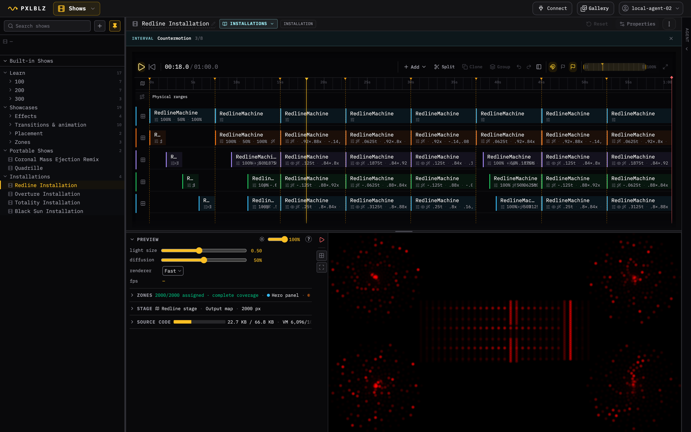
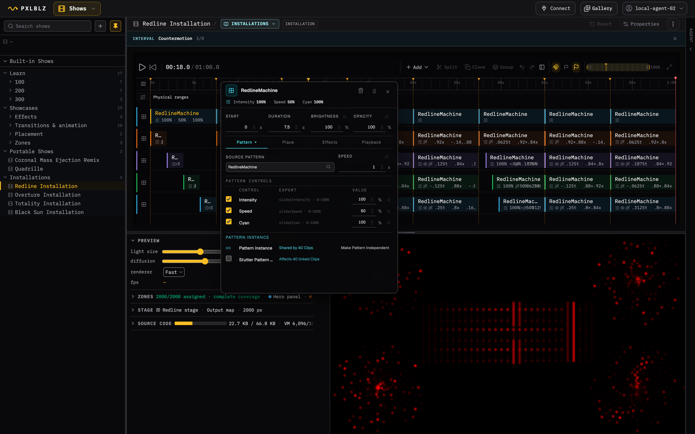
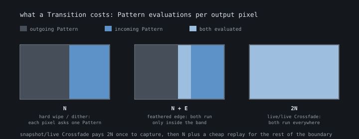

# Visual effects guide

This guide explains how to animate and combine visual material in a Show.
**Property animation** changes a saved number over time, an **Effect** changes
one Clip, and a **Transition** exchanges two adjacent Clips. They share
parameters and timing controls, but they own different parts of the Show.
Choosing the right class keeps the timeline readable and makes the compiled
cost predictable.

The fastest way to learn the system is to open **Shows > Built-in Shows** in
Studio. **Learn** builds the authoring model through numbered examples, while
**Showcases** collects visual references and finished scores. Built-ins use the
same editor as personal Shows, but their changes live only in an in-memory
draft. Undo/Redo works normally; **Reset** or reload restores the shipped
definition, and no personal record is created.

## The ownership rule

Start by asking what the change belongs to.

| Class | Owns | Lives in the editor | Use it when |
| --- | --- | --- | --- |
| Property animation | One numeric property and its incoming change | A compact property lane and the owning Entity Detail Panel | A saved value should move from the previous target to the next target |
| Effect | One clip and one visual source | The clip's **Effects** stack | The same source should be transformed, distorted, addressed, or recolored |
| Transition | The junction between two Clips on one Layer | The junction affordance and its compact Details popover | The outgoing and incoming sources must exchange ownership over time |

This ownership is literal. A clip carries its Effects when it moves or is
cloned. A Clip junction carries its Transition. The destination Clip carries a
Property animation's target value, while the incoming junction carries the
optional start, duration, and easing used to reach it.

The editor has one authoring scope. Each Zone owns a visible stack of Layers;
Clips on one Layer are mutually exclusive, while Clips on different Layers can
run concurrently. Use **Split** when a change must begin inside a Clip. The two
resulting Clips preserve Pattern time at the split unless the user explicitly
chooses an independent Pattern instance.

## Reading the timeline

The unified timeline shows structure first. Clips occupy Layer rows, Transition
junctions sit between connected Clips, and animated values appear as compact
property bands directly below their owner. A sparkline shows the useful shape of
a value even when small differences would be invisible at literal scale. Its
dots mark authored targets; edit exact values and times in Details rather than
treating the tiny marks as drag handles.

Selecting a Show entity opens one modeless **Details** popover attached to it.
Several popovers may remain open for comparison. Clicking an already-selected
owner toggles its popover closed; clicking anywhere outside the open popovers
closes them all. During a drag, popovers hide and then reopen at their owners so
they never obscure placement.

## Choosing an Effect

Select a clip, open **Effects**, and choose **Add**. The palette is a fast picker,
not a second editing workspace. Search and family filters narrow the catalogue;
hover or keyboard focus reveals a description, a small animated mnemonic, and
the cost class. Hover never restarts or changes the Stage. Clicking applies the
Effect with default values, after which the clip's Entity Detail Panel owns the
exact controls.

The catalogue uses one consistent vocabulary:

- A **family** is the broad visual operation, such as Distort or Color & output.
- A **variant** is one member of that family, such as Ripple or Hue.
- A **preset** writes a named starting bundle into normal parameters. It is not
  a separate hidden implementation.
- A **parameter** is an editable value such as Amount, Radius, Rotation, or
  Opacity.

The applied stack reflects the compiler's real stages: **Transform**, **Distort**,
**Address**, then **Color & output**. Reordering works within a stage. It never
suggests that an output color operation can run before the Pattern renderer or
that Wrap can run before the complete coordinate transform.

Expand an Effect for exact values. Duplicate makes an independent copy; Remove
deletes only that Effect. **Mirror** is a discrete horizontal flip: it appears in
the Transform stage and can be added or removed there, but has no numeric curve
or duplicate command. Neutral values compile away where the operation allows
it. Animated Effect parameters use the same boundary-owned Property animation
mechanism as clip brightness or animation speed, provided adjacent clips retain
the same stable Effect identity and kind.

## Choosing a Transition

Select a boundary in the **Transitions** lane and choose **Change**. Search and
family filters cover Blend, Fade, Wipe, Dissolve, Shape reveal, and Motion.
Hover temporarily seeks the real Stage to the middle of that boundary so the
candidate uses the actual outgoing and incoming Patterns. Leaving the row or
closing the palette restores the saved Transition and playhead.

Clicking a variant applies its defaults. A preset such as **Quick**, **Smooth**,
**East**, **Black**, or **White** writes ordinary parameters that remain editable.
The boundary panel then exposes the legal fields for that variant:

- **Duration** is how long the boundary occupies Show time.
- **Easing** changes temporal progress - for example Linear, Sine in-out, Steps,
  Hold, Back, or a cubic Bezier curve.
- **Edge policy** decides how a spatial boundary treats pixels near its edge.
  Hard and stable dither select one source; Blend can evaluate both inside the
  feather band.
- Family parameters control direction, center, scale, feather, shape, seed,
  anchor, rotation, or other variant-specific geometry.

**Reset to cut** keeps the boundary entity but removes visual transition time.
A separate routing-layout marker at the same boundary remains separate.

## Property animation

Property animation is a change between saved targets, not another kind of
Effect. The destination owns the target. Its incoming boundary may own an
explicit start value, duration, and easing; otherwise the change inherits the
boundary timing.

The current editor exposes Animation speed, Brightness, active public Pattern
controls, moving split position, sample repeat scale, and compatible Effect
parameters. Several properties can change at one boundary without creating
several independent clocks. Enter exact values in Entity Details. A static
override stays in the Clip summary and Entity Details; it does not create a
flat, uninformative sparkline. The Timeline adds a compact sparkline only when
the value actually changes over time, where the curve supports recognition,
comparison, and alignment.

## Similar-looking operations

Several operations can produce a shrinking or fading picture, but they answer
different ownership questions.

| Operation | What actually happens | Choose it when |
| --- | --- | --- |
| Clip **Opacity** Effect | One captured source is multiplied toward the black Show background | One clip should become dimmer or disappear without introducing another source |
| **Fade > Through color** Transition | The outgoing source moves to a chosen color, then the incoming source moves out of that color | The boundary needs an intentional black, white, or custom-color beat |
| **Shape reveal > Shrink outgoing** | A spatial mask selects outgoing versus incoming pixels as the authored shape contracts | The outgoing Clip should disappear through a recognizable geometric aperture |
| **Motion > Content shrink** | The outgoing content's coordinates scale toward an anchor while source ownership changes | The image itself should recede or collapse rather than merely being clipped by a shape |

Opacity is therefore not a crossfade. Shape shrink is not content shrink. The
first changes a mask; the second transforms the sampled content. Their names are
close because the pictures can rhyme, not because the compiler does the same
work.

## Cost: how many Pattern evaluations happen

Show-level warnings describe the finished artifact, not a generic cost attached
to a menu item. Clip details deliberately do not repeat those Show totals. Let
`N` be the number of output pixels and `E` the pixels inside a blended spatial
edge.

- **One-source / parameter** work keeps one Pattern evaluation per pixel. Static
  Effects, Property animation, and Fade through color normally remain `N`.
- A **cheap selector** chooses outgoing or incoming for each pixel, so Wipes,
  stable dither, and hard shape edges also remain `N`.
- A **bounded blend** evaluates both sources only inside the feather band. Its
  work is `N + E`; a narrow edge can be much cheaper than a whole-frame blend.
- A **full two-renderer blend** evaluates outgoing and incoming across the active
  frame. Crossfade and full-blend Motion are `2N` during their transition window.

Effects can still add scalar, trigonometric, square-root, or address work around
that one Pattern evaluation. The current UI does not itemize those per-Effect
operations. The Add Effect palette exposes broad cost policies while you choose;
the Show source inventory summarizes steady and worst renderer depth, while the
compile bar keeps source size, VM words, and compatibility warnings visible for
the finished artifact.

## Built-in Show companion

The Built-in catalogue uses small executable examples rather than an embedded
tutorial system. Each Show note names the idea to notice and two safe changes to
try; the sections below explain the corresponding mechanism.

### Clips, Cuts, and blank time

A Clip chooses a Pattern and its values for a span of time. A Layer orders Clips
that cannot overlap in time. The junction between adjacent Clips owns the Cut,
Crossfade, Wipe, or other Transition that exchanges them; a Cut occupies no
duration but remains selectable so it can be changed.

Time a Layer does not schedule is blank, and blank time renders black. It is an
ordinary authoring choice rather than a gap to repair, so a Show can breathe
between phrases without inserting a dimmed filler Clip. Show End marks where the
choreography stops; Markers beyond it stay dormant rather than extending it.

### Clip Transform

Clip Transform is the placement geometry of one Clip: Position, Rotation, Scale,
and Mirror. It changes where the Clip samples its Pattern without editing
Pattern source and without allocating a second Pattern instance, so two Clips
sharing one instance can hold different poses while one clock drives both.

Transform applies before any ordered Effects on the same Clip and stays distinct
from them. An authored Scale Effect and a Transform scale can coexist, and only
the Effect stack participates in Effect ordering.

### Transitions and Clip values

Transition geometry and Clip values remain separate even when they change over
the same interval. The destination Clip owns its saved brightness, speed, and
Pattern-control targets; the incoming boundary supplies interpolation timing.

### Clip Effects

Effects run after one Clip's Pattern renders. Their order is meaningful within
the compiler's Transform, Distort, Address, and Color & output stages, and the
Effect stack moves with its Clip.

### Portable Zones

Portable Zones divide normalized space, not fixed LED indexes. The same Show can
therefore adapt to another compatible 2D surface while each Zone retains an
independent Pattern instance and clock. The Zone Map on the timeline authors
the Zones themselves - name, color, membership - while the Layouts lane above
the Zone rows shows which Zone Layout routes them across each stretch of the
ruler.

### Building a complete Show

Build an arc from a few legible decisions: establish structure, introduce one
dominant change at a time, then release it. More active Zones do not require
every Clip to change Pattern, Effect, value, and Transition simultaneously.

Vary the junctions. Consecutive Clips can be joined by any Transition family, and
using one everywhere hides that the choice exists. Where both sides of a junction
share a Pattern, a blend has nothing to show; a Dissolve, Wipe, or shape reveal
does. End deliberately as well: give each Zone a release curve on the same
schedule so they go dark together, take the curve to zero rather than near it,
and leave held black before Show End so the Show finishes instead of stopping.

### Layers and property animation

One Layer is a mutually exclusive schedule: its Clips may touch but not
overlap. Additional Layers add concurrent Clips, and higher Layers composite
above lower ones. An overlay Clip's Opacity is a mix with everything below it,
so raising one voice necessarily recedes the others.

A Property curve animates a value the Clip already owns - Opacity, brightness,
a Transform axis - without adding filler Clips. A curve carries any number of
keyframes: the diamond beside the owning field opens an editor that adds,
moves, revalues, and removes them, and each segment between two keyframes owns
its easing. The curve lives inside its Clip's interval, and hidden keyframes
are preserved if a Clip is shortened, so lengthening it again restores the
authored motion rather than destroying it.

### Content and Clip Viewport

Content and the Clip Viewport are two different rectangles. Content is the
Clip's placement geometry: it decides where the Pattern's picture is sampled,
and moving it slides different material into view. The Viewport is an
independently positioned, axis-aligned aperture: it decides where on the Stage
the Clip may draw at all. Pixels outside the aperture fall through to the
Layer below, which is why a lower Layer makes a Viewport edge easy to read.

Enabling a Viewport for the first time frames the Clip's current geometric
bounds instead of expanding to the whole Stage. Its default Soft edge feathers
that boundary immediately. Both rectangles can be animated, and they answer
different questions: Content answers "which part of the Pattern," the Viewport
answers "which part of the Stage."

### Pattern instance lifecycle

A Pattern instance owns private state, a clock, and control values; Clips only
present it. Splitting a Clip leaves both halves sharing one instance, so the
junction changes nothing on the Stage. An ordinary duplicate takes a fresh
instance of the same Pattern, which starts over from the Pattern's beginning.

An instance's clock runs only while some Clip presents it. Rejoining a shared
instance therefore resumes exactly where the last presenting Clip left off,
and Make Pattern Independent hands a Clip its own instance with the same
authored settings - the new instance starts from the Pattern's beginning
rather than inheriting the shared instance's running state. Clip identity and
instance identity are separate facts: one instance can serve many Clips, and
two Clips of one Pattern can live in different worlds.

### Presentation modes

Presentation changes how one Clip exposes a running Pattern without touching
the Pattern itself. Live shows every frame. Freeze holds the frame the Clip
arrived on. Strobe re-captures a fresh frame on a fixed beat and holds it
between beats. Blink gates visibility on and off. Under all four, the Pattern
instance's clock keeps running, so when a Freeze or Blink ends the Pattern has
moved on.

Stutter is different in kind: it quantizes the Pattern instance's own clock,
so every Clip sharing that instance snaps to the same beat. The first four are
Clip-owned choices; Stutter is an instance-owned one.

### Groups and linked reuse

A Group definition is reusable choreography: a small phrase of Clips, Layers,
and Property curves with its own local timeline. An occurrence places the
whole phrase at a time, Zone, and Layer, optionally translated. Occurrences of
one definition stay linked - editing the definition changes every occurrence -
but each occurrence materializes its own fresh Pattern instances, so linked
copies repeat the moves without sharing private state.

Make Unique detaches an occurrence into its own definition when one copy must
diverge; Ungroup dissolves the phrase back into ordinary Clips.

### Aperture shapes and edges

The Clip Viewport aperture has an authored silhouette from a sectioned
catalogue - Geometric (Rectangle, Ellipse, Diamond, Ring, Rounded box, Cross,
Regular polygon), Icons (Heart, Star, Crescent, Cloud), and Signature (the
three cats) - and every silhouette carries an edge treatment: Hard cuts at
the boundary, Soft feathers it, and Stable Dither trades the smooth ramp for
a fixed texture that survives LED quantization. A silhouette can rotate
inside its frame while the frame itself stays axis-aligned, and its Mode can
flip from admitting the inside to cutting the silhouette out; both Modes
share one boundary and one feather. Shaped apertures feather Soft by
default, and smooth is almost always the right choice - especially when the
aperture or its Content moves, where a travelling hard edge reads as a
rendering artifact. Choose Hard consciously. Shape and edge are placement
geometry owned by the Clip, exactly like the frame's position and size: they
change what the Clip may draw without touching Content, Pattern time, or
Effects. **207 Aperture Shapes and Edges** holds everything else still so
silhouette and edge are the only variables, and the two Aperture references
carry the full sectioned matrix.

### Changing Zone Layouts

Zone names express ownership and Zone Layouts express geometry. The same ruler
can carry a sequence of Layout intervals - full surface, a split, rings -
while Zones keep their names and their Pattern instances. Each interval
presents its own Layout, with one deliberate exception: a duplicated interval
stays linked to its source, so one edit changes both until Make Unique clones
the Layout for that occurrence. A Layout boundary re-routes pixels rather than blending them: it
can restate the topology in one atomic step or sweep the new geometry across
the Stage, and neither is a visual Transition. Pattern instances continue
across a Layout boundary without restarting, which is what separates changing
the Layout from changing the content.

### Installation output and physical ranges

An Installation output contract fixes both the map and LED count. Every active
routing layout must assign every output index exactly once, including when one
named Zone owns several non-contiguous ranges.

**301 Installation Mapping** stages this contract on the Proscenium stage:
1,000 LEDs wired in the installer's walk order - left tower, dance floor,
arch, right tower. Each surface is a named Zone whose ranges restate that
walk, which is why the Towers Zone owns two non-contiguous ranges at opposite
ends of the index space: one physical role, two stretches of wire. The map
selector edits the same fact spatially: selecting a Zone's pixels and editing
its ranges are one operation. When coverage breaks, the diagnostics name the
exact failure - missing pixels are a gap, doubly owned pixels are an overlap,
and pixels past the LED count are out of range - and the Show cannot publish
until the ranges cover the output exactly once again.

### Composing a fixed Installation

Use physical groupings that match how people perceive the object: pucks, rows,
arches, panels, or other units. Symmetry in Pattern choice and timing can make
an irregular measured map read as one intentional composition.

**302 Installation Composition** plays the whole Redline stage from one
Pattern instance: a single Harmonograph render, one clock, one compiled
machine. Geometry deals the first difference - the same frame lands as a
panel in the middle and four radial blooms around it - and each passage adds
one tier of voice on top: placement phase splits the satellites into a
four-hue split-complementary family built on the render's own base color
(the compiled artifact adds one number inside the shared hsv call, the
cheapest voice in the toolkit), translate-under-wrap
windows stagger the same frame a quarter width apart, a mirrored pair and a
posterized pair join, and two property-animated invert pulses flash the
hero's dark field on scheduled beats. Introducing one tier per junction is
what keeps a physical score decipherable: when every group changes at once,
correct output reads as noise.

### Compile, simplify, and deliver

A Show never stops being editable choreography, but it publishes as one
ordinary Pixelblaze Pattern. The artifact inventory prices that generated
Pattern line by line - each Pattern's executable, the routing and render
plans, Effects and Transitions, and the score data - and **Ways to slim this
Show** names the contributors you can act on. The compiler already reuses one
physical machine across compatible instances of the same Pattern, so the tips
distinguish real duplicates from structure that simply costs what it costs.

**303 Compile, Simplify, and Deliver** carries one deliberately expensive
treatment - an independent weave echo overlaid near the end - so the learner
can price a treatment, remove it, and compare inventories before exporting
the EPE or reading the generated code.

### Ruthlessly engineered spectacle

**Redline Installation** treats a fixed Stage as five instruments: one
800-pixel hero panel and four 300-pixel target arrays. Its 60-second score is
32 bars at 128 BPM, divided into eight equal phrases that ignite, build, drop,
leave a vacuum, rebuild, compress, peak, and release.

The Show gets scale from constraint. One shared Pattern instance advances one
clock and evaluates once per output pixel; affine Effects make the four targets
counter-rotate, shear, mirror, and answer one another. Cheap block fields,
target rings, shutters, and glyph masks do the per-pixel work. Black provides
negative space, red carries pressure, white marks impact, and sparse cyan
ornaments surface between beats before cyan takes over during the breakdown.
The compiled artifact reports its real cost, but this Built-in Show is an
outer-limit production reference rather than a promise that every Controller
and LED protocol can sustain the same frame rate at the 2,000-pixel ceiling.

### Transform and Address Effects

Mirror flips the source horizontally before the other transforms. In 1D it
reverses the clip's local pixel order; in 2D it maps the local X coordinate to
`1 - x`. Translate, Rotate, Scale, and Shear then alter the coordinates used to
sample a Pattern. The reference Show keeps one affine Effect stack and eases its
numeric values between examples, so the compass moves continuously through
Translate, Scale, Rotate, and Shear instead of switching or blending rendered
frames. Wrap applies after the complete transform when samples outside the
source domain should re-enter from the opposite edge; it remains a discrete
example because address policy has no fractional state.

### Distortion Effects

Ripple, Swirl, Bulge, Pixelate, and Kaleidoscope remap sample positions through
non-linear geometry. The stained glass's leaded panes bend visibly under each
remap, making its center, radius, amount, and orientation readable; the Ripple
runs at study tempo and the rest cut past.

### Color Adjustment Effects

Brightness, Hue, Saturation, Contrast, Invert, Threshold, Posterize, and Color
map change rendered color without moving geometry. The glass carries every hue
at once, so a long reference beat establishes the true colors and each
adjustment identifies itself in a single look. Opacity and the key Effects
live in the Compositing and Key reference, where a lower Layer gives them
something to reveal.

### Compositing and Key Effects

Opacity, Luma Key, Chroma Key, and Vignette decide which of a Clip's pixels
reach the mix, so this reference runs a warm bed underneath keyed subjects
for its whole duration. Each Effect rides the subject that shows it best:
grayscale Luma Rings carry the two opacities (Layer opacity thins toward the
bed; an animated fade dissolves the rings into it) and Luma Key, where the
matte is the image itself; DoomFire carries Chroma Key, its orange body
carving out while the black field and bright cores stay; the Vignette closes
the whole frame - bed and keyed waves together - toward black; and the ender
animates the waves' own Angle, Width, and Spacing under a held key.

### Luma Sources

The seven Luma Patterns are grayscale key sources: Stripes, Chevron, Rings,
Pinwheel, Dots, Weave, and Spiral, each an endlessly tiling field with one
shared control set. This reference runs eight beats - Stripes appears twice,
once as bars and once configured as sine waves - each bare first, then
brought alive by a single animated property chosen for that beat's
character: Stripes fattens its Width, Sine Waves tips its Lean into breaking
sawtooths, Chevron breathes its Fold, Rings pours through its Spacing,
Pinwheel glides off-center, Dots wheels its lattice, Weave boils its pace,
and Spiral zooms its winding. Every animation rides an ordinary Property
track; the Compositing and Key Effects reference next door shows what
keying these fields unlocks.

### Blend and Fade Transition reference

Blends mix complete rendered images and fades pass through a color. The
reference runs the junction vocabulary in ascending drama: a bare Cut, one
Crossfade slow enough to study both worlds coexisting, then the black and
white Fades at quicker tempo.

### Wipe Transition reference

Wipes move a geometric selector across the junction. One eastward Linear Wipe
runs slow enough to study its edge, then the other cardinal directions and
every patterned Wipe - split, doors, blinds, clock, checker, grid - pass as
quick cuts. Diagonal directions and center-in modes stay continuous in the
inspector.

### Dissolve Transition reference

Dissolves distribute the selector across pixels or regions instead of moving
one edge. The pixel dissolve is the slow exemplar; block, coherent-noise, and
soft-threshold differ only in the structure of what crumbles.

### Shape reveal Transition reference

Shape reveals move a signed-distance boundary across the Stage. The shape
defines that boundary, while reveal mode decides whether the incoming image
grows or the outgoing image shrinks. Circle demonstrates both modes at study
tempo; the other geometric silhouettes - ellipse, box, rounded box, diamond,
cross - alternate modes as quick cuts so shape stays the only question.

### Shape reveal figures reference

The figurative silhouettes - ring, star, crescent, regular polygon, cloud,
and the three cats, after one slow Heart - use the same construction as the
geometric reference: one study beat, then quick cuts. Splitting the family keeps each reference
short enough to attribute and each compiled artifact inside the activation
budget.

### Slide Transition reference

Cover, Reveal, and Push move rendered Clip content rather than a selector
edge: Cover moves the incoming picture, Reveal moves the outgoing one, Push
moves both. One slow Cover establishes the model, the three-way comparison
follows, and the remaining cardinal directions run as quick cuts with
diagonals left continuous in the inspector.

### Zoom and Spin Transition reference

Content grow and Content shrink scale the picture inside its frame; Zoom
scales the frame itself and adds optional rotation. Content grow runs at
study tempo and the zoom and spin presets cut past, differing only in
rotation.

### Property animation reference

Property animation changes a value while preserving the Pattern and surrounding
choreography. Clip-owned tracks animate Pattern speed, a public Pattern control,
placement brightness and phase, overlay opacity, and an Effect parameter.
Boundary-owned tracks animate the Zone split and sample repeat scale. Their
sparklines identify the owner of each value on the timeline. **Try with Pattern**
replaces the constant comparison Pattern while leaving the animated subject and
its authored tracks intact.

### Easing reference

Easing changes when progress happens, not what the Transition does. Every
example uses the same eastward Linear Wipe, Pattern pair, endpoints, and
duration. Only the curve changes, so acceleration, deceleration, steps, holds,
and overshoot can be compared directly.

### Aperture shapes reference

**Aperture Shapes: Geometric** holds one subject behind one frame over one
dim bed and changes exactly one thing per passage: first each geometric
silhouette feathered Soft - including the rectangle, so the edge treatment
never changes mid-comparison - then the Rounded box at a wide corner radius
to show radius is shape rather than edge, then the Ring across Soft, the
deliberate Hard cut, and Stable Dither. Together with its Icons & Signature
sibling it is the full matrix that lesson 207 deliberately abbreviates.

### Aperture icons and signature reference

**Aperture Icons & Signature** carries the figurative half of the catalogue
over the same construction: Heart, Star, Crescent, Cloud, and the three cats
at their Soft default, then the two controls the geometric reference leaves
out. The rotated Star shows silhouette rotation inside a frame that never
turns, and the Cut-out Cloud shows Mode inversion: the same boundary and the
same feather, with the silhouette becoming the hole.

### Zone Layouts reference

Three sibling references hold the complete geometry vocabulary, one passage
per Layout kind, over voices that never change so geometry is the only
variable. **Zone Layouts: Splits & Checker** hands one Stage to two voices
four ways: full surface, a hard moving split, the same boundary feathered
soft - the one Layout without hard pixel ownership, blending both neighbours
inside its feather band - and a 4 x 4 checker. **Zone Layouts: Stripes &
Grid** deals four voices into equal bands and then a 2 x 2 grid, keeping a
mostly-dark voice as deliberate negative space so the partitions stay
legible. **Zone Layouts: Radial** routes the pair from the center out
through rings, a wave, and a pinwheel; its swept entry into the rings is the
single switch in the family that travels rather than restating the topology
in one step. Every other boundary is an atomic routing event, and no Pattern
instance ever restarts at any of them. The vocabulary is three Shows rather
than one because compiled routing plans price every routed Zone in every
Layout; the trio keeps each reference far enough under the activation
ceiling to survive the session edits its notes invite.

Every reference Show above uses the expanded header as a live guide. It names
the current example, explains what changes and what stays constant, and offers a
session-only **Try with Pattern** selector plus **Reset**. The selected Pattern is
projected through the same transient Show used by Stage preview, timeline,
generated code, export, cost disclosure, and Controller actions; the Built-in
Show and personal storage remain unchanged.

The Transition and Easing references composite their changing subject at 82%
opacity over one dim, slow Murmuration backdrop. The backdrop gives black or
sparse source regions enough texture to explain spatial movement without
competing with the Transition. Fade through black and Fade through white still reach the named
color because that field is authored by the Transition itself.

## A practical authoring loop

1. Build Clip order, Layers, and Zone Layout intervals with Cuts.
2. Use Split where a new target must begin inside a Clip.
3. Add clip Effects and set exact parameters in Entity Details.
4. Add Property animation only where a value must change across a boundary.
5. Replace important Cuts with Transitions and preview their real boundaries.
6. Read the compiled cost at the pixel count you intend to run.
7. Inspect the generated code or export `.epe` when the Show is ready.

For the complete Show workflow, output-contract rules, routing, Stage preview,
keyboard controls, export, and Controller compatibility, continue with the
[PXLBLZ Feature Guide](../reference/PXLBLZ Feature Guide.md). For what the
compiler does with these choices — and why some of them are nearly free —
read [Inside the Show Compiler](Inside the Show compiler.md). The Technical
Reference owns compiler formulas and persisted schemas; this guide owns the
authoring model.
