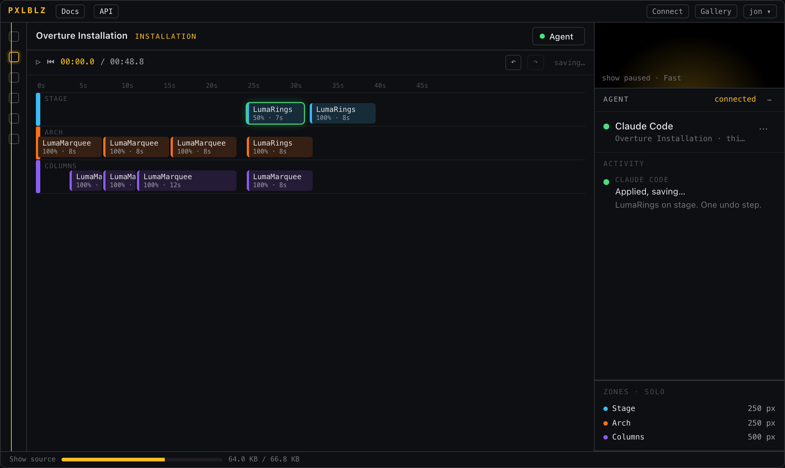
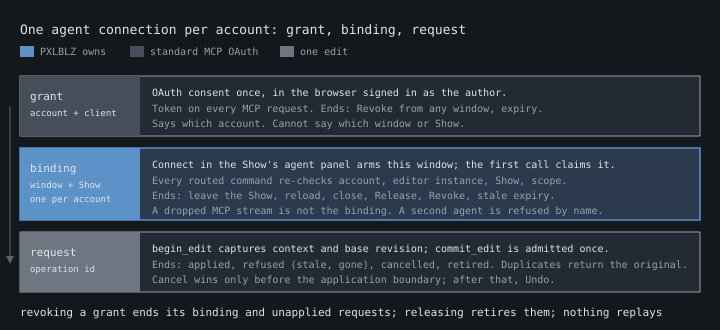

# Shared Show editing: interaction design for manual, built-in and external agents (#959)

Status: design for Jon's approval, 2026-09-06. Fable 5.1 authored it on the
behaviour decisions in
[`issue-959-shared-editing-ux-proposal.md`](issue-959-shared-editing-ux-proposal.md)
(v2, Astra-reviewed, Jon-accepted). The clickable prototype is
[`shared-show-editing-prototype.html`](shared-show-editing-prototype.html);
open it in a browser, no server needed. Nothing here is supported behaviour.
#946 owns admission policy, #947 the command census, #956 the service and
transport; this document is the source of their user-facing requirements and
must not be read as implementing any of them.

## What the author experiences

The Show editor gains one thing: an agent panel, opened from a button in the
timeline toolbar, with its own real estate beside the timeline like the
control panel. Everything agent-shaped lives there: what the options are, how
to connect an agent you already have, who is connected and to which Show, what
each request did to the document, who pays, and the built-in assistant's
conversation when that is the agent in use. The timeline, Clips, detail panel,
undo and save behave exactly as they do today. An agent edit is one history
entry the author can undo with Cmd/Ctrl+Z like any drag.

The panel is quiet by default. It becomes explicit only where the author must
decide: choose a service and its payer, allow a connection from this Show,
cancel a pending request, retry a failed save, release or revoke an agent.
Every request in the feed is attributed and ends in a truthful outcome:
applied is not saved, a stale request is refused with a reason, and a lost
acknowledgement says "outcome unknown" rather than guessing.

Connecting an external agent starts in the Show the author wants edited.
Connect arms that window; the agent's first call binds to it; the row appears.
Leaving the Show ends the session. Coming back and reconnecting is one click,
because the agent keeps its identity grant and simply reads current state.

## Layout



Further captures from the prototype: [nothing connected](images/shared-editing-prototype-desktop-none.png), [a stale refusal after a manual drag](images/shared-editing-prototype-desktop-stale.png), [save failed and rolled back](images/shared-editing-prototype-desktop-savefail.png), and [the narrow sheet](images/shared-editing-prototype-narrow-sheet.png).

Desktop: the agent panel docks to the right of the timeline workspace, in the
same column where the control panel and entity detail panel live, 320 px wide,
collapsible to a 36 px rail showing only the status glyph and unread count. It
never overlays the timeline. Opening it does not move keyboard focus away from
the timeline unless the author tabs into it.

The Show editor is a desktop product; Jon's position (2026-09-06) is that
the timeline is too complex for a phone and narrow layouts are resilience,
not a designed experience. At the existing Show workspace breakpoint
(viewport width 980 px and below) the app hides the right column and opens
the Stage preview as a modal dialog from the transport with focus trapped.
The agent panel must not follow that pattern, because the issue forbids a
chat or connection overlay that traps the author away from the Show. The
narrow requirement is therefore minimal: the panel remains reachable from
the same Agent button as a non-modal bottom sheet above the transport,
collapsible to a handle, with the timeline scrollable and focusable behind
it, Escape collapsing the sheet and returning focus, and outcomes still
announced. No narrow-specific interaction design beyond that.

Panel anatomy, top to bottom:

1. Header: title "Agent", status glyph, collapse control, and a Help affordance
   that opens the docs route section for agent editing.
2. Connection card: the single connection row, or the two service choices when
   nothing is connected, or the arming state while waiting for an agent.
3. Activity feed: newest at the bottom, each entry attributed and stateful.
   The feed is an `aria-live="polite"` region; terminal outcomes are announced,
   progress is not.
4. Conversation (built-in only): transcript and composer, below the feed. The
   composer is a single-line input with Enter to send and Shift+Enter for a
   newline; Escape from the composer returns focus to the timeline.

Progressive disclosure keeps the panel small. With nothing connected the panel
shows the two choices and one sentence each, with "How this works" expanding
into three short paragraphs and the per-client notes. With a connection, the
card shows agent name, kind, Show, payer, connected-since, and the Release and
Revoke actions behind a menu. With the built-in assistant, the conversation
takes the remaining height and the feed shrinks to its last three entries with
"Show all".



## Connection state model

One connection per account. The panel in the bound window shows the states
below; any other signed-in window of the same account shows only "connected in
another window" with Release and Revoke (D4, D5). The MCP column is what an
external client observes; the built-in client observes the same outcomes
internally and the panel renders them the same way.

| State | Author sees (bound window) | External MCP client receives | Document, history, persistence |
| --- | --- | --- | --- |
| None | Two choices: Use built-in assistant (payer, allowance) or Connect your own agent. | A tool call needing a live editor returns typed `no_live_editor` with the instruction to Connect from the Show's agent panel. | Untouched. |
| Arming (external) | "Waiting for your agent to connect to *Overture*", the MCP URL, per-client notes, a Cancel. Times out after a bounded interval to None. | First tool call that needs a live editor binds and returns the connection summary (Show name and id, scope, revision). A call from a different account returns `wrong_account`. | Untouched. |
| Connected, idle | Row: agent name and kind, *Overture* in this window, payer, since. Menu: Release, Revoke. | Tool calls succeed; `read_show` returns the current record and revision; `get_context` returns selection, playhead, hovered Clip captured at call time. | Untouched. |
| Working | Row gains a spinner; a pending feed entry attributed to the agent; Cancel on the entry. | Its own in-flight call. | Untouched until commit. |
| Waiting for gesture | Feed entry: "Waiting for your drag to finish". | `commit_edit` blocks for the bounded wait, then either applies or returns `stale_base` if the gesture changed the revision. #946 sets the bound. | Untouched while waiting. |
| Applied, saving | Feed entry: "Applied, saving…", Undo available immediately. | `commit_edit` returns `applied` with the new revision and an operation id; `saved` follows as a notification where the client supports it, otherwise via `get_outcome`. | One history entry; save queued per Show. |
| Saved | Feed entry: "Saved". | `get_outcome(op)` returns `saved`. | Durable. |
| Save failed | Feed entry: "Save failed, change rolled back" with Retry and Dismiss; the store's failure notice appears as today. | `get_outcome(op)` returns `save_failed` with `rolled_back: true` when the candidate was still current, or `superseded` when a later edit owns the outcome. | Store recovery policy applies unchanged. |
| Asked a question | Built-in: the question appears in the conversation, feed entry "Asked a question". External: the question stays in the client; the feed shows "Waiting for you in Claude Code". | Its own conversation. A structured `ask` outcome exists only for the built-in client's commit path. | Untouched. |
| Refused | Feed entry with reason: "That Clip moved while I was working; nothing applied", "Clip no longer exists", "Unsupported here", "Ambiguous target". | `commit_edit` returns `refused` with a typed reason and the current revision so the agent can replan. | Untouched; no history entry; no save. |
| Cancelled | Feed entry "Cancelled". | Its pending call returns `cancelled`; any later result for that operation id is refused as `retired`. | Untouched. |
| Outcome unknown | Feed entry "Outcome unknown; check the timeline" when the tab applied but the agent's acknowledgement was lost and the operation record is gone. Normally the tab knows and shows the real outcome. | `get_outcome(op)` returns `unknown`; the client must not resubmit automatically. | Whatever the tab shows is the truth. |
| Dropped | Row: "Claude Code disconnected" with Connect again. Pending requests move to Cancelled. | Next call returns `no_live_editor` (binding ended) or `retired` for the old operation. | Untouched. |
| Released | Row returns to None. | Next call returns `no_live_editor`. Grant intact. | Untouched. |
| Revoked | Row returns to None; a confirmation line "Claude Code's access was revoked". | Next request gets HTTP 401; refresh fails; the client must redo OAuth. | Untouched. |
| Connected elsewhere | Row: "Claude Code is connected to *Overture* in another window", Release and Revoke. | Unchanged in the bound window. | Untouched. |

Transitions that end a binding: leaving the Show, reload, tab close, Release,
Revoke, stale expiry, sign-out. Each retires every request that has not
reached the application boundary. Transport loss alone does not end the
binding; a dropped MCP stream is invisible to the author until a call fails.

## Request lifecycle


A request is one edit boundary: `begin_edit` captures editor context and the
current revision, one or more commands operate on a private candidate,
`commit_edit` submits the candidate with the operation id and base revision.
The tab admits it in one serialized step: base revision equal to current, Show
still bound, operation id not already applied, no active gesture (or the
bounded wait elapsed and the check repeated). Admission adopts the candidate
as one history entry and queues one save. Everything else is a typed refusal.

```
begin_edit ─▶ commands ─▶ commit_edit ─▶ [admission] ─▶ applied ─▶ saved
                                            │                 └─▶ save failed (rolled back | superseded)
                                            ├─▶ waiting for gesture ─▶ [admission again]
                                            ├─▶ refused: stale_base | target_gone | unsupported | ambiguous
                                            ├─▶ retired: cancelled | binding ended
                                            └─▶ duplicate: returns the original outcome, applies nothing
```

The operation id is minted by the server at `begin_edit` and echoed by the
client on `commit_edit`; a client retry after a 401 refresh or a dropped
response re-sends the same id and receives the original outcome. The tab keeps
a bounded ledger of applied and refused operation ids per binding (#946 sets
the retention window). An id outside the window returns `unknown`.

Manual undo of an applied agent edit is ordinary history: the agent is not
notified, and its next `read_show` sees the new revision. Redo likewise.
The agent's private candidate never enters editor history.

## Shared-edit interaction

The author never waits for an agent. The rules that make that safe:

- **Direct edit while the agent thinks.** Every manual commit bumps the
  revision. An agent request planned against the older revision is refused
  as stale at commit with a readable reason; the agent may re-read and replan.
  The refusal is a feed line, not a dialog.
- **Gesture in progress when the candidate arrives.** The tab exposes gesture
  state (pointer drag, field edit) at the admission boundary. The candidate
  waits, bounded, then re-checks the revision. A drag that changed the target
  produces a stale refusal, not a merge.
- **Two agent candidates on one base.** Only one connection exists, but a
  client can overlap calls. The first commit wins; the second is stale.
- **Attribution.** Each feed entry names the agent and the Clip or element it
  touched; the timeline highlights the affected Clips for two seconds after an
  applied edit, using the existing selection ring style, without changing the
  selection.
- **Bounded waiting.** No spinner runs indefinitely: a pending request shows
  elapsed time after ten seconds and Cancel is always available.
- **Undo and redo.** One applied agent request is one undo step. Cancelling
  after application is not possible; the feed says "Applied; use Undo".
- **Focus.** Applying an edit never steals focus. If the author is in the
  panel, focus stays in the panel; if in the timeline, it stays there. A
  refusal is announced through the live region.

## Connection and authorization flow

Identity grant (standard MCP OAuth against PXLBLZ):

1. The author adds the PXLBLZ MCP URL to their client, once.
2. The client discovers PXLBLZ's authorization metadata and starts the
   authorization-code flow with PKCE; the browser opens PXLBLZ's consent page.
3. The consent page uses the existing cookie sign-in. It shows the account
   (display name and provider) and the client's registered name, and asks the
   author to allow "edit Shows" scope. A signed-out browser signs in first.
4. The client receives access and refresh tokens bound to the PXLBLZ MCP
   resource. Refresh never re-prompts.

Target grant (PXLBLZ's own, initiated from the Show):

1. In the Show's agent panel the author chooses Connect your own agent. The
   window arms for a bounded interval and shows the MCP URL and per-client
   notes. Only one window per account can be armed; a second Connect elsewhere
   says "another window is waiting for an agent".
2. The agent's first call that needs a live editor finds the armed window
   for its account, claims the account's single slot atomically, records
   client session id, editor instance id, Show id and scope, and returns the
   connection summary. The armed window becomes the bound window and shows
   the row. If the call's account differs from the armed window's, it fails
   `wrong_account` and the window stays armed.
3. Every routed command re-checks binding, account, Show and editor instance.

Cases:

- **Reload or navigate away and back.** The editor instance changes; the
  binding ends; requests retire. The panel shows None with "Connect again";
  the client's next call gets `no_live_editor`. Reconnect is Connect, then the
  agent calls again.
- **Show switch in the bound window.** Same as leaving: binding ends.
- **Two tabs.** Only the armed window can bind. A second tab shows "connected
  in another window" with Release and Revoke.
- **Second agent while one is connected.** `slot_busy` naming the active
  agent and how to release it; the panel is unchanged.
- **Built-in while external is connected.** The built-in choice is disabled
  with "Release Claude Code to use the assistant".
- **Sleeping or crashed bound window.** Release or Revoke from any signed-in
  window; the stale expiry (#956) eventually frees the slot on its own.
- **Expired grant.** The client's request fails 401; refresh fails; the
  client redoes OAuth; the binding is unaffected if still live, because the
  binding is keyed on the client session and re-validated on each call.
- **Sign-out.** Ends binding and connection for that account in that browser.

Wrong-session targeting cannot silently succeed because a command reaches a
document only through a binding whose account, editor instance and Show are
checked on every call, and the binding is created only from the armed window
the author is looking at.

## Service and cost flow

The None state offers two choices, never a default:

- **Use the built-in assistant for *Overture*.** Under it: "PXLBLZ pays. 40
  requests left today." Choosing it claims the slot, binds this window, and
  opens the conversation. No approval prompt beyond the choice.
- **Connect your own agent.** Under it: "Your agent pays for its own
  thinking. PXLBLZ only applies the edits." Choosing it arms the window.

The connected row always shows the payer. When the built-in allowance is
exhausted, the row says "Allowance used for today" and the composer is
disabled with "Connect your own agent" offered beneath; nothing else changes.
When the built-in service is down, the row says so and offers the same. When
an external agent drops, the row says "disconnected" and offers Connect again
and, after Release, the built-in choice. Nothing switches on its own, and no
request is ever sent to a service the author did not choose.

Allowance numbers, the reservation model, and what "request" counts are
#956's. The panel needs only: payer, remaining allowance or "unlimited", and
an exhausted state.

## Scenario matrix

Each row states the intended document, history and persistence outcome beside
the visible feedback and the external client's result. The prototype walks
every row. Sequence letters refer to the #945 baseline reproductions.

| # | Scenario | Author sees | External client result | Document / history / persistence |
| --- | --- | --- | --- | --- |
| S1 | Built-in: open, clarify, edit, save, undo, focus returns | Choice, conversation, question, applied then saved, Undo restores, focus back on the timeline | n/a | +1 history; saved; undo restores the prior record |
| S2 | External: pair, verify target, discover commands, edit, applied and saved, disconnect, reconnect | Arming, row with Show and payer, applied then saved, disconnected, Connect again, row | Connection summary; `list_tools`; `applied` then `saved`; `no_live_editor`; new summary | +1 history; saved; second session starts from current revision |
| S3 | Wrong, expired or revoked pairing | Panel unchanged (wrong); "revoked" line (revoked) | `wrong_account`; 401 then OAuth; 401 | Untouched |
| S4 | Wrong account or session | Panel unchanged | `wrong_account` / `no_live_editor` | Untouched |
| S5 | Two tabs | Second tab: "connected in another window", Release, Revoke | Unchanged | Untouched |
| S6 | Navigate away and back during a request (baseline D) | On return: None, "Connect again"; the old request shows Cancelled | `retired` for the old op; `no_live_editor` after | Untouched; the late candidate never applies |
| S7 | Reload | Same as S6 | Same as S6 | Untouched |
| S8 | Cancel, then a late response | Cancelled | `cancelled`; late result `retired` | Untouched |
| S9 | Duplicate or retried delivery | One feed entry | Second `commit_edit` with the same op returns the original outcome | Exactly one history entry and one save |
| S10 | Manual drag or field edit during inference (baseline A, C) | Manual edit stays; agent entry "Refused: the Show changed while I was working" | `stale_base` with current revision | Manual edit preserved and saved; no agent history entry |
| S11 | Two agent candidates on one base | First applied; second refused stale | `applied`; `stale_base` | +1 history |
| S12 | Manual undo while a candidate waits | Undo applies; the candidate is stale | `stale_base` | Undo's record is current |
| S13 | Target Clip deleted during inference (baseline B) | "Refused: that Clip no longer exists" | `target_gone` | Untouched |
| S14 | Gesture active when the candidate arrives | "Waiting for your drag to finish", then applied or refused | `applied` or `stale_base` after the bounded wait | Depends on whether the drag changed the base |
| S15 | Save fails after visible application (baseline E) | "Save failed, change rolled back", Retry, Dismiss | `save_failed`, `rolled_back: true` | Store restores the durable record and matching history |
| S16 | Save fails after a later manual edit | Agent entry "Superseded" | `superseded` | Later edit owns the outcome |
| S17 | Disconnect after application, before acknowledgement | Feed shows the true outcome (applied, saved) | On reconnect, `get_outcome(op)` returns it; if outside the ledger window, `unknown` | Applied and saved; no replay |
| S18 | Built-in allowance exhausted or provider down | Row states it; composer disabled; external route offered | n/a | Untouched |
| S19 | External agent unavailable | Row "disconnected"; Connect again; built-in offered after Release | n/a | Untouched |
| S20 | Stock Show draft | Applied entries read "Applied (draft, not saved)" | `applied` with `persistence: draft` | In-memory draft only; no personal write |
| S21 | Keyboard-only, narrow window | Panel reachable by Tab; Escape collapses and returns focus; announcements read outcomes; no trap | n/a | Untouched |

## MCP tool surface (shape, not schema)

Names and shapes are illustrative so the state model can be read end to end;
#947 owns the census and #956 the transport. Every tool requires the identity
grant; tools marked "live" also require a binding.

- `get_connection()` — account, whether a window is armed or bound, Show,
  scope, revision. Never binds.
- `list_commands()` — the production allowlist with descriptors.
- `read_show()` (live) — current record and revision.
- `get_context()` (live) — selection, playhead, hovered Clip, viewport at
  call time.
- `begin_edit()` (live) — mints an operation id, captures context and base
  revision, opens a private candidate.
- one tool per allowed command, operating on the open candidate.
- `commit_edit(op)` (live) — submits; returns `applied | refused | cancelled
  | retired | waiting` as described above.
- `get_outcome(op)` — `applied | saved | save_failed | superseded | refused |
  cancelled | retired | unknown`.
- `cancel_edit(op)` — retires the operation before application.

Server-to-client progress ("waiting for your drag to finish", "saved") goes
out as MCP progress or logging notifications where the client renders them;
where it does not, `get_outcome` is the fallback and the panel is the truth.
Elicitation is not required by this design.

## Implementation handoff

### UI states to admission outcomes

| Panel or feed state | Producer | Admission or store outcome |
| --- | --- | --- |
| Pending, Working | panel, on `begin_edit` | none |
| Waiting for gesture | tab, at commit | gesture state exposed at the boundary (#946) |
| Applied, saving | tab | `updateShow` adopted; one history entry |
| Saved | store settlement | provider update resolved and current |
| Save failed, rolled back | store failure notice | failed while current; durable record restored |
| Superseded | store settlement | failed after a newer accepted record |
| Refused (stale, gone, unsupported, ambiguous) | tab admission or command registry | typed refusal; no adoption |
| Cancelled, Retired | tab ledger | operation retired before adoption |
| Outcome unknown | tab ledger | id outside the retention window |
| Draft, not saved | store | stock draft; no provider call |

### Seams

- `src/components/ShowEditor.tsx`: the `__pxlblzEditor` bridge becomes the
  admission owner's UI adapter: `applyShow(record, { requestId })` grows into
  `commit(candidate, { operationId, baseRevision })` with a typed result, plus
  gesture state exposure. The dev-only observation seam already records the
  phases the feed needs.
- `src/store/showStore.ts`: a per-Show revision counter bumped on every
  adoption (manual, agent, undo, redo, hydration), and the operation ledger.
  The existing settlement and failure-notice policy is the source of Saved,
  Save failed and Superseded.
- New `src/components/AgentPanel.tsx` (thin) over a pure
  `src/engine/agentSession.ts` state model with domain-neutral names (grant,
  connection, binding, request, outcome). The prototype's state machine is
  the reference for that module's transitions.
- Worker: `/mcp` Streamable HTTP endpoint, OAuth authorization-server routes,
  a tab channel, and grant/binding storage (#956). Commands relayed to the
  bound tab are the #947 allowlist evaluated by the existing registry.
- Built-in client: either an MCP client the Worker runs or an adapter over
  the same application service (#956); either way it enters the same
  `commit` path and appears in the same feed.

### Acceptance examples for downstream issues

Given a bound external agent and revision 12, when the author drags Clip A
and the agent commits an edit planned against 12, then the commit returns
`stale_base` with revision 13, the feed shows the refusal, the document
equals the post-drag record, history depth is unchanged, and no save request
was issued for the candidate.

Given an applied operation `op-7` at revision 14 whose acknowledgement was
lost, when the client calls `commit_edit(op-7)` again, then the response is
the original `applied` outcome, history depth is unchanged, and exactly one
PATCH for that record exists.

Given a bound agent, when the author navigates to another Show and back, then
the panel shows None, a `commit_edit` for the earlier operation returns
`retired`, and the reopened Show equals its durable record.

Given the built-in assistant with allowance 0, when the author opens the
panel, then the composer is disabled, the row reads "Allowance used", the
external route is offered, and no provider request is issued.

Given a stock Show draft, when an agent edit applies, then the feed reads
"Applied (draft, not saved)" and no personal-content request is issued.

### Tests implementation must run

- Browser (Playwright, Show suite): every scenario row S1 to S21 against the
  real editor route with a scripted agent, extending the #945 baseline harness;
  assert record projection, history depth, provider requests, feed text and
  live-region announcements; desktop and narrow.
- Authorization: consent page shows account and client; wrong-account binding
  refused; revocation invalidates refresh and retires in-flight operations;
  binding re-validated on every call; armed-window timeout; slot exclusivity
  under concurrent attempts.
- Client interoperability, one proof per supported client (Claude Code, Codex
  CLI, hosted Claude from Anthropic infrastructure): OAuth completes, tools
  discovered, edit applied through the real tab, retry after 401 returns the
  original outcome, notification rendering recorded as supported or not.
- Store: revision bump on every adoption path; operation ledger dedup and
  retention; Saved, Save failed, Superseded and draft classification against
  the existing recovery tests.

## Accessibility and keyboard

The panel button has an accessible name "Agent" and a state ("Claude Code
connected"). The panel is a `region` labelled "Agent", not a dialog. Its feed
is a polite live region announcing terminal outcomes only. All actions are
buttons with visible labels; Release and Revoke are behind a menu button with
`aria-haspopup`. The composer is a labelled textbox. Escape in the panel
collapses it and returns focus to the last focused timeline element; Escape
in the timeline keeps its existing "peel one surface" behaviour. On narrow
layouts the sheet does not trap Tab. Contrast follows the existing tokens.

## Open assumptions and blockers

- Tab channel and hosting model for the built-in client (#956). The design
  assumes the Worker can relay to a live tab and wait for its answer within
  the request the client is holding open.
- Revision admission and the operation ledger (#946). Without them every
  Applied state in this design would be baseline sequence A.
- Per-client rendering of progress notifications and the 401-retry path
  (qualification, not design). Where a client renders nothing, the panel is
  the only progress surface, which the design tolerates.
- Armed-window timeout, bounded gesture wait, stale-binding expiry and ledger
  retention are numbers for #946 and #956, shown in the prototype as
  placeholders.
- The diagnostic MCP server's grammar is not the production allowlist; #947
  decides what is exposed.
