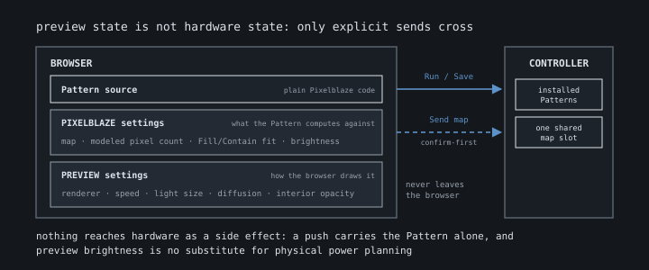
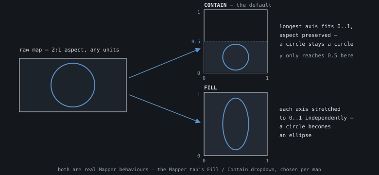
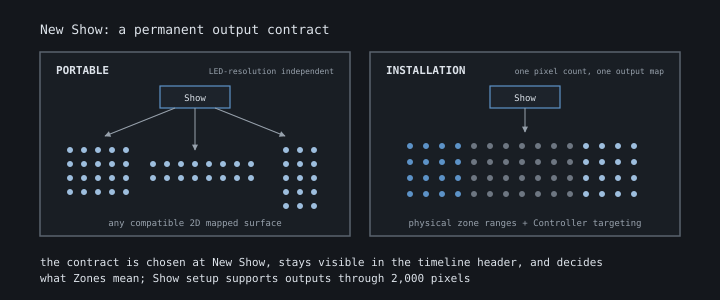
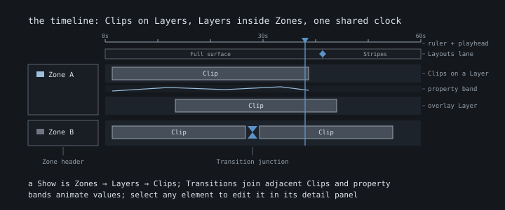

# PXLBLZ — Feature Guide

PXLBLZ-IDE is a browser IDE for Pixelblaze LED controllers. Browse a Gallery
of Patterns running live, write your own against a hardware-faithful preview,
and compose finished Patterns into Shows: timeline choreography that compiles
back into one ordinary Pixelblaze Pattern. Almost everything works with no
hardware at all, and nothing reaches your hardware unless you deliberately
send it.

If Pattern, map, or fixed-point are unfamiliar words, start with the
**Pixelblaze Ecosystem Primer**. If you are working on PXLBLZ itself, use the
**PXLBLZ Technical Reference**. This guide is the product tour: what each
feature is for, where to find it, and where the deeper guides pick up.

---

# Part 1 — Gallery, Studio, Docs

The Gallery header's **Studio** action opens **Quadrille** in Shows with preview
playback running, including after the Studio welcome/sign-in flow. It does not
restore a previous Show. Explicit Pattern and Show links retain their targets;
ordinary Show opening remains paused.

## 1. Gallery

`/gallery` is the front door: the built-in Pattern catalogue, with the
Gallery Shows set among the Patterns as marquee bands. A band is a Show's
stage at its natural proportions — wide for an installation, square for a
portable Show — with a caption beside it: title, byline, premise, and loop
length; a thin bar along the bottom tracks how far through the loop it is.
The first thing on the page is a Show, and the others are spread down the
grid; the **Shows** directory lists only them. A band opens the Show's own
page (`/s/<slug>`) with the stage at full size and its scenes as an arc.

Every Pattern card opens on a chosen keyframe of its Pattern, and the cards
nearest your pointer run the real preview engine from that moment, within a
pixel budget (a Show at 2,000 pixels takes the room of about two Patterns); move the mouse and the animation follows it, while cards that
leave the set freeze where they were and pick up again from there. Without a
pointer (touch), the cards nearest the top of the screen animate; a card with
keyboard focus always does. The density control in the header shows two, three,
or four cards per row and is remembered on this browser; 1D Patterns render as
wide strips. Browse by folder, dimension, or name. Each Pattern has a shareable
detail page (`/p/<slug>`) with a large live preview, the Pattern's own
controls, and read-only source, displayed with the map and look its author
intended.

From a detail page, **Open in Studio** loads the Pattern to read or clone its
code, or connect a Controller and use **Run** or **Save**. Public Gallery,
detail, Docs, and API Reference pages have no Controller controls and start
no Controller discovery or extension handshake.

Two folders are intentionally quiet: **Test Patterns** (diagnostics) and
**Luma Sources** (grayscale keying ingredients for Shows) are available in
Studio but stay out of the public Gallery.

## 2. Studio

`/studio` is your working environment. The place control beside the wordmark
chooses among six Studio areas, each with stable routes:

| Place | What opens |
|---|---|
| Patterns | Editable personal Patterns and read-only built-ins |
| Shows | Timeline-based multi-Pattern choreography |
| Maps | Editable custom maps, frozen imports, and read-only stock maps |
| Controllers | Durable profiles for physical Controllers |
| Mixins | Reusable pass-engine transformation source |
| Libraries | Reusable Pattern functions and shared state |

The place menu remembers the entity open in each Studio area and shows its
name below that area. It also groups the public **Docs** and **API** workspaces
under Reference. Most places use three panes: the entity list opens and creates
within the selected place, the center edits, and the right pane shows context
such as a Pattern preview, map wiring check, or library API reference. Shows
use the center workspace differently on desktop: the full-width timeline sits
above an aspect-correct Stage preview and its controls.

The list header gives its width to controls, with the pin at the right.
Patterns, Shows, and Maps have a permanent search field; Escape clears its
query, and leaving the field clears it as well. Patterns and Maps put the
All / 1D / 2D / 3D dimension pills and catalogue count on a second row. While
searching or filtering, the count shows matches out of the full catalogue;
Shows displays that row only while searching. Creation and import actions
remain in each list's existing buttons and Add menu.

The entity list starts pinned beside the workspace. Its pin remembers a
separate choice for Patterns, Shows, Maps, Controllers, Mixins, and Libraries.
Unpin it to leave a narrow place tab at the workspace edge. Hover there for
300 ms, click, or use Tab and Enter to slide the list over the workspace without
moving or resizing what is under it. Leaving before the hover delay cancels
opening, and dragging across the tab never opens the list. Hover leaves keyboard
focus where it was. Opening and closing use matching 225 ms slides, disabled when
reduced motion is enabled.
Choosing an entity, pressing Escape, clicking outside, or leaving the list for
a moment closes the overlay. A rename, search, menu, dialog, or in-list drag
holds it open until that work finishes. At 980 px and below the list always uses
the edge tab and overlay so the editor keeps the available width.

Personal content lives in folders with drag reordering and search that sees
into collapsed branches. The only permanent deletion in the rail is emptying
the Trash, and it asks first. Below your content sit the built-in catalogues,
including a folder of ZRanger1's published community Patterns, and every new
workspace starts with an editable **Start Here** example of each kind.

Two habits worth learning on day one: the center-pane title is the rename
control, and **Space** toggles preview playback anywhere outside a text field,
including while the place control or entity-list tab has focus. Press **Enter**
to open either control.
Controller names are the deliberate exception: Rename appears only while that
profile's physical Controller is live, because the device—not the profile—is
the source of truth.

### Sign-in and your workspace

Studio uses GitHub or Google sign-in; logins that share a verified email open
the same workspace. Your content is stored in the cloud, not the browser.
Signed out, Gallery, docs, and public previews work without personal storage.
Sign in to Studio to author and connect a Controller. If a save or delete
ever fails to reach the workspace, Studio tells you where you did it instead
of failing silently.

## 3. Docs and API reference

**Docs** and **API** under Reference in the place menu open public reference
workspaces without entering Studio, and both deep-link (`/docs/<id>`,
`/reference/<library>`).
From Studio, the API Reference adds **My libraries**, generated from the `//`
doc comments in your own code.

---

# Part 2 — Patterns, preview, and maps

The core loop: write Pixelblaze source, watch a faithful preview react,
choose the geometry it renders across.

## 4. The editor

The center editor is Monaco, the engine behind VS Code, tuned for the
Pixelblaze language: completion, signatures, hover documentation, and inline
errors. Pause typing and clean code slides into the preview; broken code
keeps its markers while the last working version keeps running, labeled as
such.

Saving is automatic and honest. A small cloud glyph appears while autosave is
stuck: amber while the code has errors (fix them and saving resumes), red
while saves are failing (the editor retries until one lands). Broken code is
kept too: navigate away mid-edit and Studio stores exactly what you typed,
restoring it when you return, with the preview covered until the code runs
again.

Controls come from code. Export `sliderSpeed(v)` and a slider appears; the
same convention makes toggles and color pickers, and every `export var` shows
in the var watcher, updating each frame. Numeric fields across Studio share
one control: type an exact value, or drag the grip for a transient
high-resolution slider, with units that mean what they say: percentages,
multipliers, seconds, degrees or turns.

Built-in Patterns open read-only; **Clone** makes an editable copy and keeps
the source manifest header: name, provenance, and what each control changes.

## 5. Preview

The preview runs your Pattern in the browser and draws it as a WebGL point
field in 1D, 2D, or 3D, with orbit, zoom, and glow. Pixelblaze hardware
computes in 16.16 fixed-point while browsers use float64, so there are two
renderers:

- **Fast** — ordinary float math, the everyday editing mode.
- **Precise** — emulates the device's fixed-point overflow and quantization,
  catching the ports that look fine on a laptop and break on hardware.

The settings deck is split by what hardware could carry. **PIXELBLAZE**
settings (map, modeled pixel count, Fill/Contain fit) describe
what the Pattern computes against; **PREVIEW** settings (renderer, playback
speed, light size, diffusion, solidity) are purely how the browser draws it.
Most settings are remembered per Pattern, and none of them ride along when
you send to a Controller.

In Studio, the right-aligned controls run from Reset through Display (when available), brightness, and Play/Pause. Reset appears to the left without moving the other controls. Brightness uses a sun icon, a short linear slider, and a read-only percentage. **Controls** opens by default;
**Pixelblaze**, **Preview**, and **Variables** fold to one-line readouts.
Each section remembers its open state per Studio mode across reloads. The
folded Map chip remains interactive. Expanded fields align in two columns,
falling to one column in a narrow preview pane.

Variables remain in their panel. Expanding sections takes space from the
preview without restarting the Pattern. Gallery Pattern details retain their
existing expanded controls and brightness within Pixelblaze. The controls scroll when their expanded
height leaves less than the minimum preview space.

## 6. Maps and display geometry

A map answers "where is LED #37?", and PXLBLZ keeps two answers separate:
**sample**, the coordinate the Pattern receives, and **position**, where the
preview draws that LED. That is why one 1D map can display as a Line, Ring,
or Pole without changing what the Pattern computes.

Any Pattern may try any map. Exact-dimension matches appear under
**Recommended**; everything else stays available with missing coordinates
filled sensibly. Generated geometry is catalogued by physical family (Paths,
Surfaces, Shells, Volumes) alongside your own imports.

Stock maps are real Mapper JavaScript: inspect, preview, send, or clone them.
**New Map** is plain JavaScript, a coordinate array or a
`function(pixelCount)`. The map pane is a wiring check, not a Pattern
preview: it colors points in wire order and reports bounds, dimensions, and
coincident points. A connected Controller can **Import map** from its
installed file.

**Contain** preserves aspect; **Fill** stretches each axis to `0..1`. Both
are real Mapper behaviors, and the built-in **MapAlignmentDiagnostic**
Pattern paints X, Y, and Z bands to check any map. For map theory, read
**Understanding Maps**.

## 7. Libraries and mixins

Both are reusable source with different jobs: a Pattern *calls* a library;
the pass engine *applies* a mixin.

A **Library** is a namespace of functions and shared state, called as
`SDF.circle(...)`; compilation flattens only the functions you actually use
into the final artifact. Six ship read-only (`SDF`, `Anim`, `Color`, `Coord`,
`Noise`, `Shader`), personal libraries compile through every Pattern path,
and `//` comments above functions become editor help and API Reference pages.

A **mixin** transforms a Pattern without editing it: **inject** adds source,
**intercept** wraps output calls such as `hsv`, and **bind** connects a
normalized input to a function or variable. Controller-specific pins and
limits belong to Controller profiles, so mixins stay generic and reusable.

## 8. Files

- **Copy Code** and **Download** emit one flat, tree-shaken `.js` artifact;
  preview settings never leak into it.
- **Import `.epe`** brings a Pattern in, restoring a matching preferred map
  when it can.
- Show exports are standalone generated Patterns that any Pixelblaze tool
  can use.

---

# Part 3 — Live hardware

Everything above works with zero hardware. Add a Controller and three layers
appear: a live connection, a durable per-device profile, and explicit send
actions. Nothing crosses to hardware as a side effect.

## 9. Connecting a Controller

Live access goes through the PXLBLZ Chrome extension, because an HTTPS page
cannot open a Controller's LAN WebSocket on its own. The Controller bar and
**Connect** are Studio-only. Pick a discovered Controller or enter an IP from
Studio's top-right menu; several can stay connected with one active. Visiting
the Gallery or another public route hides the bar without disconnecting;
returning to Studio shows the existing connection.

The live panel shows what the device says right now: brightness, FPS, IP,
pixel count, the running Pattern's controls and watched variables, and power
telemetry when the Pattern exposes it. Brightness and control changes are
live and volatile; a pixel count change is a deliberate saved write.
**Play/Pause** freezes or resumes the Controller's renderer without touching
flash.

The panel keeps high-value state visible without making every reading compete
for height. Brightness sits beside the running Pattern name. **Pixelblaze**,
**Controls**, **Power**, and **Variables** fold independently and remember their
state per Studio mode across reloads. Controls starts open; the other sections
start folded with one-line readouts. The 400 px popover aligns labels and
controls in two fields per row, switching to one below 360 px. Power keeps
its limiter, recent duty, and estimated draw in the header; expand
it for the complete telemetry and estimation assumptions. A grey **limiting**
label means idle and amber means the cap is intervening. The label follows a
three-poll majority so a single noisy report does not flash the state. When the
Controller is actively shuffling or playing a playlist, the corresponding
read-only icon appears first in the panel header; its tooltip warns that the
sequencer can replace a manual Pattern switch at the next interval.

The action row's **Switch** menu changes only what the Controller runs. It lists
saved Patterns alphabetically, marks the running one, and keeps a run-only
Pattern pinned as **unsaved · running** when it is not part of the saved
inventory. Large inventories gain a filter. A successful choice is also saved
as the Controller's boot Pattern; the menu stays open with the device's reason
if the change cannot be confirmed. Shuffle and playlist remain authoritative,
so their header indicator stays visible after a manual switch.

One flag worth knowing: firmware silently drops a map whose pixel count
disagrees with the device, so the panel calls out the mismatch with an amber
`256≠300` chip instead of letting it fail quietly.

## 10. Controller profiles

A profile is durable configuration for one physical Controller, keyed by its
device id and editable even offline. It is where hardware knowledge lives:

The profile name is not an offline alias. While the matched Controller is live,
rename it from the center title or its rail action; PXLBLZ writes the physical
device, reads the new name back, and only then updates the panel, rail, and
durable profile. A failed device write leaves the old name in place and reports
the failure where you made the edit. The confirmed name survives reconnect and
reboot because it is Controller configuration.

- **Inputs.** Describe a potentiometer or button once (pin, signal,
  smoothing) and route it to hardware brightness or to any Pattern's
  exported control. No Pattern editing required; the routing is compiled into
  what you push. Validation flags problems on the input that owns them, with
  one-click fixes.
- **Power.** Set a duty cap from a fixed value, or derive it from your supply
  budget and full-white load (chipset presets, or your own measured amps or
  watts). Every Pattern or Show sent through the profile respects the cap.
  PXLBLZ does not pretend to be an ammeter; plan the physical power system
  for real.
- **Saved Patterns.** The profile's inventory separates what PXLBLZ manages
  from everything else on the device. The running row has a green marker;
  managed rows show which profile features were baked into the artifact and
  use a status dot for current, stale, syncing, queued, failed, or unknown
  state. Hover or focus a row to reveal its actions. **Run** switches the
  Controller without opening or changing a Studio Pattern; foreign source
  remains importable. **Delete** removes an inactive saved Pattern after a
  confirmation; the running row must be switched first. Deleting a managed
  row keeps its Studio Pattern and re-arms **Save**, while deleting an Other
  Pattern warns that PXLBLZ has no recovery copy unless you import it first.
  **Keep Patterns up to date** rewrites only managed artifacts after an edit
  that changes generated code.

Two built-in diagnostics earn their keep here: **AnalogWiggleFinder** finds
which analog pin a pot is on, and **View generated artifact** shows exactly
what the profile inserted, wrapped, or bound.

## 11. Run and Save

The Studio Controller popover is the Run and Save surface for the visible
Pattern or Show. Its subject names the content being sent; entity headers keep
authoring and export actions. Pattern renderer warnings can offer a recommended
map; Show warnings explain target compatibility. Canceling a warning sends
nothing. Keyboard users can Tab to the Controller pill, press Enter to open it,
and reach Run and Save with readable reasons when gated. Escape cancels pending
confirmation.

**Run** compiles with the Controller's own compiler and loads transient
bytecode; **Save** writes a durable Pattern and activates it. The two track
dirty state independently — a clean Run does not pretend you saved — and
failures surface as visible alerts with a reason.

Both verbs act on the open Studio Pattern or Show. **Switch** beside them acts on the
Controller's saved inventory instead: it neither opens that Pattern in Studio
nor changes the Run or Save dirty state.

A Controller has one shared map slot, so **Send map to Controller** is its
own confirm-first action, re-baked for the device's pixel count, never a
per-Pattern side effect.

---

# Part 4 — Shows

A Show composes Patterns you already have into timeline choreography (Clips
on Layers, Transitions between them, Zones for routing) and compiles all of
it into **one ordinary Pixelblaze Pattern**. The source Patterns stay
untouched and reusable; the Show owns timing, routing, and adaptation. This
is the deepest part of PXLBLZ, with two dedicated guides:
[Visual Effects Guide](../guides/Visual effects guide.md) for Effects,
Transitions, and animation, and
[Inside the Show Compiler](../guides/Inside the Show compiler.md) for how one
Pattern can possibly hold all of this.

## 12. Portable or Installation

**New Show** asks one permanent question: what does this Show target?

- **Portable** adapts to any compatible 2D mapped surface; its map and pixel
  count are an authoring reference, not device identity.
- **Installation** fixes one pixel count and output map for a known physical
  build, unlocking physical zone ranges and Controller targeting.

The choice stays visible in the timeline header, and Show setup supports
outputs through 2,000 pixels. With a Controller profile selected in the rail,
**New show from profile** seeds an Installation Show from that device's
imported map and pixel count.

## 13. The timeline

One proportional timeline holds everything. The gestures you will use
constantly:

- **Space** plays and pauses, **A** rewinds, **1/2/3** set playback speed;
  click or drag the ruler to seek. Seeking replays deterministically from
  Show start, so it is exact — never approximate.
- **Add Clip** places a Pattern at the playhead; double-click empty Layer
  time to choose one there. Drag to move, Option-drag to duplicate, edges to
  resize, **Split** to divide at the playhead. Split uses the selected Clip;
  with none selected, it uses the first direct Clip under the playhead in
  keyboard traversal order (start time, Zone, Layer, then identity). It is
  unavailable in gaps and at boundaries where that Clip cannot be split.
- Drags land on the tick grid and snap magnetically to Clip, Marker, and
  playhead boundaries; Alt suspends snapping for one gesture, Shift gives
  fixed fine steps.
- An end resize stops at available same-Layer capacity. Exact Duration entries
  refuse a range that does not fit. If the Show changes during a resize drag,
  release discards that stale drag; start again on the current timeline.
- Every commit is one undo step (Cmd/Ctrl+Z), session-only.
- Select anything (a Clip, Group, Transition, Zone, or the Show itself)
  and its floating Entity Detail Panel opens with exactly that entity's
  fields. Escape peels one surface per press.

Marquee-select Clips and **Group** them into one movable occurrence across
Layers. **Duplicate** creates linked copies that share edits until **Make
Unique** breaks the link.

## 14. Clips

A Clip references a Pattern and adapts it non-destructively. The underlying
**Pattern instance** owns its state, clock, controls, and speed; Clips may
share one instance (splitting keeps motion continuous through the cut) or
take an independent copy with **Make Pattern Independent**.

Presentation belongs to the Clip: **Live**, **Freeze** (hold the entry
frame), **Strobe**, **Blink**, or **Stutter** (quantize the shared clock so
linked Clips step together). Every Clip also owns **Opacity**: Main fades
toward black, while higher Layers source-over composite against the content
below. **Brightness** adjusts the Pattern view before that composition. 2D Clips add
a **Transform** (position, rotation, scale), an optional **Aperture** mask
from the shape catalogue, and an ordered **Effect stack**: transforms,
distortions, address policies, and color Effects such as Luma key, Chroma
key, and Vignette, each searchable with cost notes and presets. Two policies
trade fidelity for measured double-digit FPS wins on hardware: **Freeze at
entry** and **Refresh**, which re-evaluates a quarter of the pixels per
frame.

## 15. Transitions and animation

A Transition is a visible, selectable junction between connected Clips, with
Blend, Fade, Wipe, Dissolve, Shape reveal, and Motion families. Hovering a
variant previews it on the Stage before you commit, each exposes only its
legal fields, and costs are explicit: a feathered reveal evaluates both
Patterns only inside the band.

Property animation uses one model everywhere: the destination owns the
value; the incoming boundary owns start, duration, and easing. Animation
speed, brightness, opacity, Transform, exported sliders, and split position all
animate the same way and appear as sparklines beneath their Zones. The
diamond beside any animatable field creates or reopens its ramp, and the
Clip's **Animations** overview is the one place to see and remove every
track.

## 16. Zones and routing

A new Show starts as one full-output Zone with no extra chrome; the
**Zones** rail appears when you want routing structure. Zone **Layouts**
live on the timeline and label stretches of the ruler, and the boundary
between Layouts is a routing switch with its own duration and easing: a
Show can rearrange its stage mid-flight while every Pattern keeps playing.

What zones mean follows the output contract. Installation Layouts assign
physical pixel ranges, with coverage validated exactly. Portable Layouts use
normalized routing modes (Stripes, Grid, Checker, Rings, Pinwheel, Wave, or
an animatable Split) that hold on any compatible surface.

The **Stage** is the whole Show rendered over its output geometry and driven by
Show transport. On desktop it fills the bottom-right corner of a strip below
the timeline. A narrow rail beside the canvas holds playback and the Zone-outline
and selected-Clip-outline toggles. Zone guides follow the current Zone Layout.
The selected Clip outline appears during that Clip's interval and shows its
authored transformed content bounds. Both guides are session-only. The Preview heading keeps overall browser brightness available when folded or expanded, using the same compact slider and percentage as the Pattern and Controller panels. It adjusts browser rendering without changing authored Clip brightness or Controller output. Preview, Zones, Stage, and Source code form one
left-aligned controls column on the bottom-left, capped at 480 px, with spare
width left as a gap before the preview rail. Each header summarizes its
folded section. Preview begins open; the other sections begin folded, and
PXLBLZ remembers each section independently for Shows. On entry without a remembered split, the timeline
fits its content with a little slack and the Stage takes the remaining height,
subject to the pane minimums. Subsequent window resizing preserves that
proportion, including before the divider has ever been dragged. This can leave
extra timeline space when growing or require scrolling its rows when shrinking.
Lane changes revise the initial content-based target until a split is remembered. Drag the horizontal divider to trade space
between the timeline and Stage, or focus it and use **Up/Down**. PXLBLZ
remembers the Show split; later lane changes preserve that position. While
paused, the Stage redraws the frozen picture throughout resizing without
advancing Show time. Light size and Diffusion update while paused in both the
Show and Pattern previews. Their sliders release focus after pointer adjustment;
Space plays or pauses, including when a slider has keyboard focus. Arrow keys
still adjust a keyboard-focused slider. The controls
retain at least 200 px beside the rail and scroll when expanded content exceeds
the strip height. The lower strip stays visible at narrow widths. Growing or shrinking the window
preserves the timeline/strip proportions within their size limits.

## 17. Cost, sending, and sharing

The Source code section beside the Stage reports delivered source size,
memory words, and running Pattern copies. Expand it for the byte-level inventory.
Warnings, blockers, and successful-send status remain visible below the section.
Run/Save failures appear in the Controller popover. The same Source code
section remains in the lower strip at narrow widths; Studio does not render
the old compile footer or source-inventory popup. Every Pattern row
distinguishes three things in plain language:
**configured uses** are separately configured versions of that Pattern in the
Show, **copies in delivered code** are the copies the compiler kept in the
generated Pixelblaze Pattern, and **timeline placements** are the Clips that
place those uses on the Stage. A Clip that crosses an internal Scene boundary
still appears and counts once on the timeline.

Those counts do not say how many run at once. **Pattern copies running** gives
the maximum number that can run simultaneously. **Busiest LED** says how many
Pattern color calculations can contribute to one LED: its normal count and,
when different, the higher count reached while visuals overlap. Effects add
work to a Pattern result but do not add another Pattern color calculation.
Compiler-owned blank routing does not appear as a running Pattern.

Each Pattern row then reads as an equation: one compiled copy, any additional
compiled copies, and the source generated for Show settings and placements add
up to the Pattern total. Identical measured copies may use repeated-cost
notation; unequal copies show a truthful aggregate. Shared Show infrastructure,
routing, Effects and Transitions, score data, provenance, and Controller
transforms remain separate rows or delivery layers. The inventory presents
measurements without guessing which creative change should come next. Limits
are enforced with a named cause while editing and preview continue.

Sending mirrors ordinary Patterns: **View code**, **Run**, **Save**, and
**Export `.epe`**. After an edit, Run and Save disable until the fresh
artifact is ready, so a stale Show can never be sent.

**Export Show file** shares the authored choreography itself: a `.pxlshow`
bundles the Show, every personal Pattern it reaches, and any custom output
map, so another PXLBLZ library can inspect it, import it, and continue
editing.

### Agent editing

For enabled accounts, add `?agent=1` to an editable Show URL and open the
right-edge Agent drawer. **Use the Pixelblaze agent** connects it to this Show;
write an edit request in the composer. Activity distinguishes saved personal
edits, changes applied only to a built-in Show's draft, and refused or cancelled
work. Successful edits remain ordinary Undo history.

A supported exact Clip resize can offer **Retry** against current state. Retry
adds a new activity and keeps the earlier failure and any unsent composer draft.
**Dismiss** hides the available actions. Leaving the Show or removing the URL
opt-in retires pending private work; an already-applied personal save continues.
Service availability and its shared daily allowance are controlled by the server.

## 18. Built-in Shows to learn from

The Shows rail ships learning material beneath your own: **Learn** lessons
that add one idea at a time, **Showcases** cataloguing every Effect,
Transition, animation, and easing, finished **Portable Shows** (the Coronal
Mass Ejection remix, Quadrille), and map-specific **Installations** (the
2,000-pixel Redline, and Overture, a 128 BPM opening night for the
Proscenium arch stage). Edit them freely: changes live in a session draft,
**Reset** or reload restores the shipped version, and **Clone** keeps your
variant.

The **Lesson pill** beside the title opens a **Reading card**: hover to read,
click to pin, or use Enter or Space while the pill has keyboard focus. Escape
closes the card and returns focus to the pill. The card explains what the Show
demonstrates, what to look for, and two things to try, with a link to its guide.
It floats above the timeline without shrinking the Stage preview.

The card's **Live strip** switch shows or hides one 32 px row above the
timeline, remembered per Show. The strip follows the current reference example
as the Show plays. Without a reference guide it follows the Scene in a multi-Scene
Show, or the most recently started Clip on the first Zone's main lane in a
single-Scene Show, showing its Pattern name and Clip counter even through gaps.
**Try with Pattern** runs another Pattern through
the same choreography: one slot has an inline chooser; several slots share a
**Patterns** chip that opens their choosers and Reset. The strip's × hides it.
At narrow widths, the pill becomes an icon and the strip keeps the narration
name, counter, and compact chooser on one row.

---

# Part 5 — Boundaries

## 19. What PXLBLZ deliberately does not do

- Manage Wi-Fi, LED chipset, timezone, Output Expander setup, or other
  Controller settings. Use the Pixelblaze web UI.
- Rename or arrange device playlists. PXLBLZ can list, import, run, and delete
  individual saved Patterns, but it does not author playlist membership.
- Recover source from a saved Pattern that contains only compiled code.
- Continuously synchronize hardware control positions with Studio preview
  controls.
- Publish personal Patterns to public Gallery URLs.
- Synchronize a Show across several Controllers.

## 20. Known preview limits

- Pattern execution runs on the browser main thread. A syntactically valid
  infinite loop can freeze the tab; clean compilation is not a watchdog.
- Sensor Expansion Board inputs are inert stubs: sensor-reactive Patterns
  load, but audio, accelerometer, and light data do not animate in preview.
- Fast mode uses float64. Precise mode emulates fixed-point arithmetic but
  not every firmware algorithm bit-for-bit.
- Show seeking reconstructs deterministic Pattern state exactly; Trails is a
  deliberate output-history exception, and wall-clock, network, and sensor
  history cannot be recreated from Show time alone.

## 21. Choose the next document by the job

| I want to… | Go here |
|---|---|
| Learn the Pixelblaze ecosystem from zero | **Pixelblaze Ecosystem Primer** |
| Understand maps, normalization, and `pixelCount` | **Understanding Maps** |
| Study Effects, Transitions, and animation by example | [Visual Effects Guide](../guides/Visual effects guide.md) |
| Make a Pattern faster on hardware | [Optimizing Pixelblaze Patterns](../guides/Optimizing Pixelblaze patterns.md) |
| See how a Show becomes one Pattern | [Inside the Show Compiler](../guides/Inside the Show compiler.md) |
| See measured Show rendering wins | **Show Rendering Optimization Results** |
| Understand how PXLBLZ is built | **PXLBLZ Technical Reference** |
