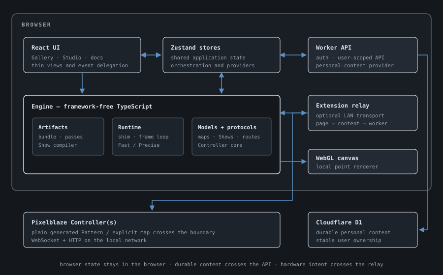
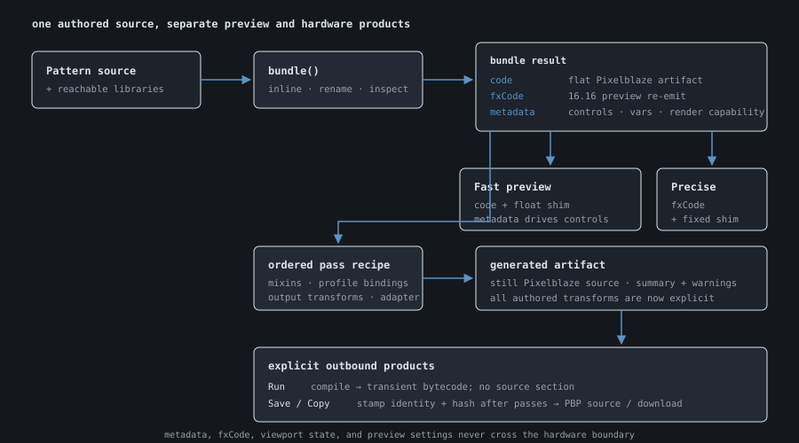
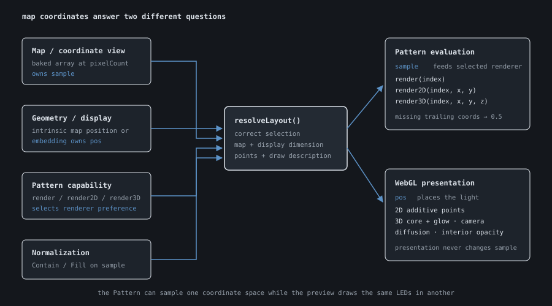
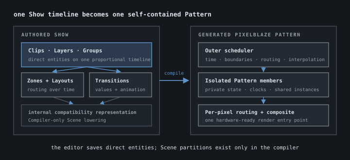

# PXLBLZ — Technical Reference

This is the as-built engineering reference for PXLBLZ-IDE. It explains the
current architecture, the decisions that constrain it, and the seams new work
should extend. User workflows belong in the **PXLBLZ Feature Guide**; Pixelblaze
platform concepts belong in the **Pixelblaze Ecosystem Primer**. Where this
document and the code disagree, the code wins.

PXLBLZ has two product surfaces over one browser engine: a public Gallery and an
authenticated Studio. Pattern editing, transpilation, execution, preview, and
hardware artifact generation happen in the page. Durable personal content lives
in Cloudflare D1 behind Pages Functions. Live Controllers sit behind an optional
Chrome-extension relay because an HTTPS page cannot open their LAN WebSockets
directly.

---

# Part 1 — Architecture

The browser is the center of PXLBLZ: it owns the product surfaces, shared state,
editing engine, preview runtime, and hardware artifact generation. Cloud storage
and live Controllers sit behind narrow provider boundaries, keeping durable
content and LAN transport out of the core engine.

## 1. Stack and system boundaries

| Concern | Implementation |
|---|---|
| Build and local development | Vite, with API proxying to local Wrangler |
| UI | React + TypeScript + Tailwind CSS + selected shadcn/ui primitives |
| State | Zustand stores, readable outside React |
| Editor | Monaco with a Pixelblaze language mode |
| Parsing and rewriting | Acorn |
| Personal persistence | Cloudflare Pages Functions + D1 |
| Preview drawing | WebGL point renderer |
| Tests | Vitest/jsdom plus Playwright route smoke tests and hardware harnesses |
| Commit gate | Husky: lint and full Vitest suite |



### Engine versus UI

`src/engine/` is framework-free TypeScript. It owns parsers, transforms,
compilers, state projections, validators, protocol logic, and geometry. Engine
modules do not import React. Components render state, delegate events, and call
engine functions; they do not become a second implementation of compiler or
model rules.

Zustand is the shared state seam because render loops, Controller providers, and
other non-React code need synchronous access. Stores may orchestrate engine
functions and persistence, but reusable transformations remain pure.

### Hardware artifacts stay Pixelblaze code

The transpiler inlines and renames; it does not translate Pixelblaze into a
different runtime language. Stock and personal libraries are Pixelblaze-dialect
JavaScript. Passes derive another inspectable Pixelblaze artifact. Shows compile
into one Pixelblaze Pattern. Map source is ordinary Mapper JavaScript.

That constraint keeps preview, generated source, the device compiler, and manual
copy/paste workflows on the same code path.

### Preview state does not leak to hardware

Fast/Precise mode, viewport embeddings, camera, light size, diffusion, solidity,
playback speed, preview brightness, selected preview map, and Pattern control
positions are browser state. They are not silently included in a Pattern push.

Hardware receives only an explicitly generated Pattern artifact or an explicitly
sent map. Controller-profile transforms are included because they are authored
hardware intent and appear in artifact inspection—not because preview state was
serialized by accident.

## 2. Routes, surfaces, and authentication

The pure route codec is `src/engine/routes.ts`; `routerStore` owns History API
mutation and location synchronization. `App.tsx` performs the route/store join
after personal collections resolve.

| Route | Surface |
|---|---|
| `/`, `/gallery` | Public Gallery |
| `/p/<slug>` | Built-in Pattern detail |
| `/studio` | Studio home/current entity |
| `/studio/<kind>/<id>` | Patterns, maps, mixins, libraries, Controllers, or Shows |
| `/studio-welcome` | Signed-out Studio gate |
| `/docs`, `/docs/<id>` | Public documentation workspace |
| `/reference`, `/reference/<library>` | Public API Reference workspace |

Legacy `#/docs/<id>` links redirect into the path router. Unknown routes and
missing entities render explicit not-found states after the relevant collection
has loaded.

The Gallery, Documentation workspace, API Reference, and global Controller
chrome are public. Studio routes wait for
`/api/me`; signed-out users see GitHub and Google sign-in choices rather than a
brief flash of authenticated UI. GitHub and Google identities attach to one
stable user row. Verified matching email may auto-link; an authenticated user
may explicitly connect another provider and may disconnect one unless it is the
last login.

`workspaceStore` exposes only resolved/authenticated state to the UI. OAuth,
cookie signing, identity linking, and owner allow-list enforcement remain in
Cloudflare helpers and Pages Functions.

### Gallery runtime

`galleryCatalog.ts` is the built-in Pattern catalogue. Gallery cards use the
real bundle/shim/render pipeline at bounded pixel counts, with a global animation
slot limit, IntersectionObserver pausing, staggered startup, and a static frame
for reduced-motion users. Cards, Pattern detail, and Studio resolve one shared
recommended presentation per Pattern; cards may reduce only its count. Layout
resolution enforces the Gallery ceiling after grid realization, so a Cube cannot
round a bounded request above 2,048 LEDs. Pattern detail uses the ordinary preview
stores and Controller push flow without a count multiplier; its Code view is
read-only Monaco.

### Analytics

Production route views and a small set of product actions are instrumented
through the analytics seam. Local development and tests do not send analytics.
React calls typed helpers rather than embedding provider-specific commands
throughout components.

## 3. Personal content and persistence

`personalContentProvider.ts` is the browser-side storage interface. The
authenticated implementation calls Pages Functions backed by D1. Demo mode
returns empty personal collections, ignores last-active/demo-override writes,
and rejects durable mutations while leaving stock content and live hardware
usable.

Durable resource families:

| Resource | API / storage |
|---|---|
| Patterns | `/api/patterns`, `personal_patterns` |
| Maps | `/api/maps`, `personal_maps` |
| Mixins | `/api/mixins`, `personal_mixins` |
| Libraries | `/api/libraries`, `personal_libraries` |
| Shows | `/api/shows`, `personal_shows` |
| Controller profiles | `/api/controllers`, Controller profile table |
| Settings | `/api/settings/:key` |
| Controller bindings, labels, push records | `/api/controller-metadata/:key` |

All reads and mutations are scoped by the signed session's stable `userId`.
There is no browser-local durable workspace and no implied migration between
local storage and D1. Local storage is used only for small device/session
preferences and the Studio-welcome acknowledgement.

The API treats authenticated storage limits as coarse anti-griefing tripwires,
not ordinary product quotas. Every durable create or update rejects JSON bodies
above 1,900,000 bytes and accounts above 100,000,000 stored content bytes;
creates also stop at 1,000,000 total personal rows across all resource families.
Settings and Controller metadata routes accept only the keys owned by the
application. Guard failures use stable JSON error codes. Reads and deletes are
not subject to these write guards, and transient request-rate flooding remains
the responsibility of the hosting edge rather than this storage layer.

The D1 health endpoint checks binding/schema availability; it is not an
alternate personal-content path. Local development uses Wrangler's D1 database
behind the Vite `/api` proxy, so migrations must be applied locally as well as
remotely.

## 4. Application state and editor modes

Major Zustand stores:

| Store | Responsibility |
|---|---|
| `routerStore` | Current route and History API synchronization |
| `workspaceStore` | Authentication resolution |
| `patternStore` | Personal Patterns, built-in selection, demo overrides |
| `mapStore` | Personal maps, active map/embedding/count, map-mode target |
| `mixinStore` | Personal and stock mixin editing state |
| `libraryStore` | Personal and stock library editing state |
| `showStore` | Personal Shows and persisted model mutations |
| `showTransportStore` | Ephemeral playhead, loop duration, seek request identity/status |
| `editorStore` | Source, last clean preview source, validation, metadata, editor flavor |
| `previewStore` | Playback, visual settings, telemetry, watched vars, zone solo |
| `controlStore` | Current Pattern control values |
| `cameraStore` | Orbit state, auto-orbit, Pole density |
| `controllerStore` | Multi-Controller connections and Pattern/map push orchestration |
| `controllerPanelStore` | Polled live state for the active Controller |
| `controllerProfileStore` | Durable Controller profile CRUD and live refresh |

Stores export initial state objects for test resets. Pure engine code should not
depend on React store hooks; when store-coupled lookups are needed, inject them
or confine orchestration to the store layer.

### Monaco and validation

`Editor.tsx` runs two independent timers:

- a short preview debounce publishes clean Pattern source to `previewSource`;
- a slower sync tick persists clean personal source or bakes a map.

Broken Pattern code remains in the editor while the last clean preview keeps
running. Monaco completion/signature data comes from the hand-maintained
Pixelblaze built-in manifest plus the active stock/personal library index.

The editor has four source flavors:

| Flavor | Validation | Right pane |
|---|---|---|
| Pattern | Pixelblaze syntax and forbidden-language rules | Live preview |
| Map | Plain-JavaScript parse/evaluation | Wiring-order geometry check |
| Mixin | Structured pass header plus source checks | Provenance and transform summary |
| Library | Pixelblaze parse plus top-level content rule | Live API reference |

Stock maps, mixins, and libraries open read-only and clone into personal records.
Source-less imported maps remain read-only. Opening a non-Pattern source does not
replace or mutate the last running Pattern preview.

---

# Part 2 — Pattern compilation and preview

An authored Pattern becomes several related but deliberately separate products:
a flat Pixelblaze artifact, preview metadata, and a fixed-point preview re-emit.
The same engine then validates, loads, advances, and draws those products without
turning browser-only state into hardware code.

## 5. Transpiler and library model

`bundle(patternSource, libraries)` returns:

```ts
{
  code,      // flat float artifact for preview/hardware
  fxCode,    // Precise-mode re-emit, preview only
  metadata,  // controls, vars, render capabilities, preview only
}
```

Patterns parse as Acorn modules because top-level `export` is legal. Libraries
parse as scripts. The bundler finds `Namespace.fn()` calls, resolves transitive
same-library and cross-library references, alpha-renames functions, rewrites call
sites, and emits only reachable functions.

If any function from a library is used, that library's top-level `var`
declarations are emitted once, unmangled, before its functions. This supports
the intentional out-var contract: a helper may write globals such as `ux`/`uy`
for immediate caller use. `validateLibraryContent` restricts top level to
functions, `var` declarations, and comments, so prepending those declarations
does not introduce hidden executable initialization.

Metadata records:

- `render`, `render2D`, and `render3D` presence;
- exported variables and top-level Pattern variables; and
- exported control functions and picker backing variables.

Metadata and `fxCode` never cross to hardware.

### Stock and personal libraries

Stock libraries live under `src/pixelblaze/lib/` and are loaded as raw source.
Personal libraries join the same namespace map for preview, Copy/Download,
Controller send, Show compilation, and artifact inspection. Names are
case-sensitive identifiers and cannot shadow stock namespaces or Pixelblaze
built-ins.

Library references are soft. Renaming or deleting a library is legal; dependent
Patterns then fail bundling with an unknown namespace/function error. API docs
are parsed from `//` comments directly above function declarations and feed both
Monaco hover and the library context pane.

### Shader porting contract

The stock `Shader` library fills real GLSL gaps without pretending PXLBLZ is an
automatic shader translator. Pixelblaze already supplies `mix`, `smoothstep`,
and `clamp`; the library does not shadow them. `Shader.fract` remains distinct
from Pixelblaze `frac` because GLSL floors negative values while Pixelblaze
truncates them.

Hash helpers use integer arithmetic rather than the familiar
`fract(sin(...) * largeConstant)` idiom, which overflows 16.16. Power-of-two
demotion preserves preview/hardware agreement. Textures, multipass feedback,
derivatives, discard, multiple render targets, and automated GLSL rewriting are
outside this library contract.

## 6. Pass engine and generated artifacts

`bundleWithPasses(source, libraries, recipe)` applies an ordered,
JSON-serializable recipe to the flat artifact. An empty recipe is byte-compatible
with `bundle()` and produces an empty transform summary.



Pass kinds:

- **Inject** prepends parameterized source and composes or creates
  `beforeRender`.
- **Intercept** rewrites AST-located, unshadowed output calls for supported
  `hsv`, `hsv24`, `rgb`, and `paint` arities.
- **Bind** calls a top-level function or assigns a variable from a normalized
  source with optional range mapping and quantization.
- **Renderer adapter** emits an exact map-dimensional renderer that forwards to
  an authored higher-dimensional renderer with missing coordinates set to
  `0.5`.

Generated identifiers use the reserved `__pxlblz_` prefix. User collisions and
unsupported call shapes become transform warnings. The summary records applied
passes, call-site counts, inserted globals/exports, `beforeRender` composition,
bindings, renderer adaptation, rough cost, and warnings. Generated source is
always inspectable and never presented as editable original source.

The interception boundary is intentionally honest. Arbitrary aliases, object
methods, dynamically selected sinks, shadowed built-ins, and palette-resolved
behavior hidden behind unsupported abstractions are not guessed.

### Artifact identity

Outbound source is stamped after all passes. The comment-only banner carries
version, kind, Studio id, name, CRC32 artifact hash, timestamp, and transform
ids. The hash excludes any existing PXLBLZ banner, so restamping is stable and a
source change is detectable.

Preview/evaluation uses unstamped source. Copy and Download return stamped
source. Save-mode PBP embeds stamped source. Run-only bytecode has no source
section and therefore no banner. `parsePxlblzBanner` and banner stripping are
the read-back seam.

New Controller program ids are 17 characters using the firmware alphabet and a
`pxb` prefix. The prefix identifies fresh ids minted by PXLBLZ without reading a
PBP; overwrite of a pre-existing binding preserves its older id, so the source
banner remains the durable provenance signal.

## 7. Validation, loading, and runtime shim

`validateSource` performs an Acorn syntax pass and an AST rule walk. It reports
all recognized Pixelblaze-language violations, including `let`, `const`, class,
`switch`, `new`, exceptions, and imports. It deliberately does not pretend to
statically prove every firmware semantic.

`loadPattern` removes `export`, appends an epilogue exposing render/control/var
handles, and evaluates with `new Function(...builtinNames, body)`. Built-ins are
injected as parameters; they do not pollute browser globals.

`createShim` supplies:

- color, waveform, interpolation, math, palette, clock, noise, and transform
  built-ins;
- map introspection from the resolved layout;
- Pixelblaze-like array behavior;
- captured color output per rendered pixel; and
- inert hardware/sensor globals so unsupported Patterns fail softly.

The float shim is the Fast reference behavior. Sensor Expansion Board inputs are
defined but inert.

## 8. Precise fixed-point preview

Precise mode re-emits bundled code for 16.16 arithmetic:

- raw values are signed int32 `round(value * 65536)`;
- add/subtract/comparison preserve int32 wrapping;
- multiplication uses limb decomposition to avoid float64 precision loss;
- division, modulo, fraction, bitwise, array indexing, increment, and decrement
  follow Pixelblaze-oriented semantics; and
- numeric built-in boundaries decode to float, execute, then quantize back.

`fxEmit.ts` rewrites operators and literals; `createFxShim` wraps the runtime
built-ins. Controls, render dispatch, and the var watcher use
`encodeScalar`/`decodeScalar`, so they remain mode-agnostic.

Precise mode is faithful to the numeric model, not a firmware clone.
Transcendental internals run in float64 before quantization. `perlin`, `prng`,
and related functions use documented alternate algorithms. Pure integer
arithmetic is the bit-identical target; accepted divergences are measured by the
hardware harness instead of hidden.

## 9. Render compatibility and frame loop

Pattern native dimension is the highest authored renderer and is metadata, not
a map filter. Render selection follows the firmware 3.66 preference order:

| Map dimension | Preference |
|---|---|
| Index / 1D | `render` → `render3D` → `render2D` |
| 2D | `render2D` → `render3D` → `render` |
| 3D | `render3D` → `render2D` → `render` |

Missing trailing coordinates are filled with `0.5`; extras are dropped.
`has2DMap`, `has3DMap`, and `pixelMapDimensions` report the selected map, not the
renderer or viewport dimension.

Each animation frame:

1. scale real delta by preview speed and advance the virtual clock;
2. call `beforeRender` once;
3. for each pixel, read map `sample`, adapt coordinates, apply the transform
   stack, call the selected renderer, and capture color;
4. paint the complete frame; and
5. publish FPS and decoded watched variables.

Runtime exceptions stop the loop and surface an error. `tickHeadless` executes
all stateful render work without retaining or painting an RGB frame; Show seek
replay uses it because render functions may mutate Pattern state.

The Show Stage has two deliberately different advancement contracts. Live
playback calls `advanceLive(deltaMs)` once for each presented animation frame,
so a delayed browser frame produces one larger Pattern delta rather than a burst
of catch-up renders. Deterministic seek still advances at fixed 60 Hz through
`advanceTo()`. Both paths run the same Pattern code, but only seek needs every
intermediate state transition.

Fast replay flattens map samples and selected render compatibility when the
runtime is created. Its hot pixel loop uses scalar transform/capture seams and a
stable packed `Float64Array`; tuple views, export snapshots, and checksums are
materialized only when a diagnostic caller requests them. Headless steps reset
captured color without allocating or retaining a frame.

## 10. WebGL, camera, and preview settings

`renderer.ts` draws all pixels as WebGL points. 2D uses an additive pass. 3D
uses an opaque depth-tested core pass plus an additive glow pass. Diffusion is a
per-source point-spread kernel, not a post-process frame blur. The renderer
degrades to a no-op when WebGL is unavailable, which keeps jsdom tests practical.
The Show Stage passes its packed RGB frame directly to this renderer; the
renderer reuses its upload storage instead of adapting every pixel into RGB
tuples.

`camera.ts` owns pure projection and fitting. 2D layout bounds determine canvas
aspect. The 3D orbit camera uses orthographic projection, rotation-invariant
fitting, depth cue, and optional normal-based solidity. Renderer caps protect
against accidental pathological counts (`MAX_PIXEL_COUNT = 65,536`, grid axis
256).

Changing Stage pane width, light size, or the 3D canvas extent resizes the
existing renderer in place. It does not construct a new Fast runtime, reset
Pattern state, or seek through Show time. A Stage map, compiled artifact,
fidelity mode, or Show identity change still creates a new runtime because it
changes execution inputs.

Effective preview settings resolve field-by-field:

```text
per-Pattern override
  → built-in Pattern recommendation
  → user comfort baseline (light size/diffusion only)
  → developer default
```

Personal Pattern overrides live on `PatternRecord.settings`; built-in overrides
live in `demoOverrides`. Fork snapshots effective values. Reset clears the
active sparse override bag. Fast/Precise is a separate global machine setting.

---

# Part 3 — Maps and spatial presentation

Maps decide what coordinates each LED gives a Pattern; geometry decides where
the preview draws those LEDs. Keeping sampling and presentation separate lets
one wiring order support virtual 1D domains, 2D surfaces, and 3D structures
without inventing coordinates that would not exist on hardware.

## 11. Map source and persistence

A map is an index-ordered coordinate set; `pixelCount` is modeled separately.
Hardware may therefore have a count/map mismatch, and PXLBLZ preserves that
possibility rather than making the map authoritative for count.

Map source is ordinary JavaScript, not Pixelblaze dialect and not fixed-point.
Accepted forms are a literal coordinate array or a
`function(pixelCount)` returning one. Coordinates may be 1D, 2D, or 3D and may
start in arbitrary units.

Stock maps under `src/pixelblaze/stock/maps/sources/` are the exact source shown
to the user and evaluated by the app. Function stock maps regenerate for the
requested count. Literal measured maps retain their authored point count.

Personal source maps bake on the editor sync tick. Their resulting coordinate
array is stored on the `MapRecord`; later pixel-count changes replay that baked
array until source is baked again, mirroring stale Mapper output on hardware.
Controller imports are source-less frozen records with display provenance.

## 12. Sample, position, and geometry families

Each resolved map point carries two channels:

```ts
{
  sample: number[] // values passed to the Pattern renderer
  pos?: number[]   // preview position
}
```



Ordinary 1D maps provide only `sample`; Line, Ring, or Pole provides preview
position. Ordinary 2D maps may be displayed Flat or wrapped around a Cylinder.
3D maps own physical position directly.

Generated geometry families separate one physical point generator from several
ordinary, hardware-real coordinate views. `positionSource` owns shared physical
positions; each view source owns `sample`. Cylinder therefore exposes Strand,
Surface, and Spatial while pixels remain on one wall. Shell and volume remain
different physical distributions.

Catalogue type—Path, Surface, Shell, Volume, Custom/imported—is explicit
metadata, never inferred from a display name. Surface views are offered only
when the generator owns a meaningful parameterization. Imported point clouds do
not gain invented topology.

## 13. Normalization and resolved layout

The shared normalization pass supports:

- **Contain** — one longest-axis scale preserves aspect;
- **Fill** — each axis independently spans `0..1`.

`pos` stays aspect-preserving. Fill stretches only Pattern-visible `sample`.

`resolveLayout` is the pure selection-to-runtime seam. Given Pattern capability,
selected map/view/embedding, count, normalization, and injected map lookups, it
returns corrected selection, map dimension, `sample`/`pos` points, modeled count,
display dimension, readout label, and a 2D or 3D draw description.

`previewResolution.ts` derives the Preview's discrete quick-selection ladder
from explicit stock-map `gridRecipe` metadata. Square, Wide, and Cube use complete
natural lattices; regenerating geometry without a lattice uses a bounded generic
ladder; fixed baked maps offer no ladder. Exact entry remains independent and
unbounded by the 2,048 quick-selection ceiling. Off-ladder values use the shared
indeterminate slider treatment, and Cube reports the complete side-cubed lattice
that `resolveLayout` actually realizes. `PixelCountPopover` receives this feature
only from `PreviewDeck`; the live Controller panel retains its exact, explicitly
applied hardware editor.

`LayoutSelector` exposes separate controls:

- Map owns `sample`;
- a generated family's View selects a coordinate view; and
- Shape/Display owns preview embedding when the map does not carry intrinsic
  positions.

An internal Auto sentinel chooses an exact-dimensional default without becoming
a saved map. Index is the explicit no-installed-map 1D convention
`x = index / pixelCount`.

Solidity is enabled only when the app owns trustworthy normals. Generated
Cylinder and shell recipes provide them; a coincidentally sphere-shaped imported
cloud does not. Normals and solidity remain preview-only.

---

# Part 4 — Controller integration

Controller integration extends the browser IDE across a constrained network
boundary rather than turning PXLBLZ into a device-management service. A typed
provider and optional extension relay carry explicit Pattern, map, and live
control operations while profiles preserve durable intent about physical
hardware.

## 14. Provider and extension architecture

An HTTPS page cannot open `ws://<controller>:81`. `ControllerProvider` contains
that transport boundary. Components and stores import its typed capabilities,
not extension APIs or raw sockets.

`PixelblazeConnection` is the transport-agnostic protocol core over an injected
`WebSocketLike`. It handles documented JSON messages, binary program/control
frames, compilation/push operations, map access, saved-program reads, and the
hardware divergence harness.

`ExtensionControllerProvider` uses `RelayWebSocket` across:

```text
page → window messaging → content script → extension service worker
     → Controller WebSocket / HTTP endpoints
```

Binary payloads cross extension messaging as base64. Device compiler execution
uses an extension offscreen context. Keepalive, inbound-silence detection, and
bounded reconnect handle ordinary MV3 service-worker eviction and Controller
blips.

The extension requests optional HTTP/WS host permission per Controller IP. It
does not hold blanket LAN access. Discovery uses ElectroMage's HTTPS discovery
service from the extension because browser pages lack CORS access and MV3 has no
usable UDP discovery API.

## 15. Identity, connection state, and live panel

Connection state is keyed by IP so several Controllers may remain live, with one
active. Durable identity is the Pixelblaze device id derived from board type and
MAC, with discovery as fallback. IP and device name are mutable transport/display
facts. A connection without stable id is unclaimed but fully usable.

`controllerStore` owns connection phase, discovery, active selection,
reconnection, and push state. The last connected IP/nickname is persisted for a
warm reconnect. `controllerPanelStore` polls the active Controller for config,
telemetry, vars, controls, programs, map point count, and FPS. Same-Controller
reopen retains last-known panel values; switching Controllers clears ownership.

Live brightness and controls are volatile writes, throttled with leading and
trailing delivery. Pixel-count edits are saved and hold an optimistic pending
value until the Controller confirms. Reducing count goes through the shared
blackout helper: set brightness to zero, wait one full old-length frame, save the
smaller count, then restore brightness so tail LEDs do not freeze lit.

Firmware availability comes from the Controller's first-party update protocol,
cached in memory for one hour per stable identity. Only an available result
changes UI. Unknown, unsupported, timeout, and update-service failure do not
become connection errors. PXLBLZ links to the Controller web UI and never
installs firmware.

## 16. Controller profiles

A Controller profile is durable hardware intent for one physical Controller.
Profiles are created/refreshed from observed hardware, not blank forms, and are
keyed by device id. The store prevents concurrent duplicate creation and
suppresses same-session recreation after explicit deletion.

A profile contains:

- board and last-seen Controller facts;
- typed hardware inputs with board-safe pin validation;
- enabled global transforms;
- the opt-in managed-artifact reconciliation preference;
- per-Pattern bindings;
- named, possibly multi-range zones;
- map fingerprint records; and
- metadata used to join saved Controller programs to Studio source.

Profile edits update Zustand optimistically, serialize durable writes per
profile, roll back the latest failed write, and expose a drain barrier. Pattern
push waits for that barrier before deriving generated code.

### Hardware inputs and bindings

Input records describe pin, signal, semantic role, smoothing, fallback, and
inversion. The user-facing Direction control shows the current normalized
mapping (`0 → 1` or `1 → 0`) beside **Invert**. Pattern bindings target an
exported slider, named function, or variable with optional min/max/quantize. The
pass recipe samples the input once per frame and applies the target without
editing original Pattern source.

The Controller panel retains program inventories by Controller IP after the
connection-time read. Controller-profile views consume that cache and only
invoke `listPrograms()` for an explicit refresh. Binding creation remains local
UI draft state until the user selects an installed, PXLBLZ-managed Pattern;
foreign programs have no regenerable source and are not binding candidates.
When the Controller is offline, configured rows resolve their names against
Studio Pattern identity and disable selection rather than exposing raw ids or
implying that the installed inventory is still available.

For a concrete Pattern artifact, bindings are resolved before global-input
precedence. If an active Pattern binding and enabled hardware-brightness
transform name the same input, the recipe omits the hardware-brightness sample
and intercept passes and emits only the Pattern binding for that input. The
profile UI derives its neutral `Brightness override` status pill from the same
predicate. Other Patterns and bindings on other inputs retain global hardware
brightness.

### Power model

Hardware-brightness and power-cap transforms are output-interception recipes.
Hardware brightness samples a configured input once per frame. Power cap wraps
supported HSV/RGB calls, estimates emitted duty, and scales output against the
mutable exported `__px_powerLimit`.

Power telemetry separates three jobs:

- a roughly two-second recent block average for a calm display;
- a fixed-point-bounded since-start average; and
- a roughly 250 ms internal response signal for limiting.

The cap setpoint is normalized output duty. Electrical values are derivation
provenance, not measurement. The Controller panel estimates amps from emitted
duty after limiting, live native brightness, live pixel count, and stored
full-white mA/pixel. Native brightness remains the final device-side cap.

Reserved `__px_power*` exports render as structured power telemetry instead of
ordinary watched vars. The live limit slider writes `setVars` and is volatile;
the next push reinitializes it from the profile.

## 17. Pattern push, PBP storage, and saved programs

Before every Pattern push, the store:

1. waits for profile writes to drain;
2. compiles stock and personal libraries;
3. resolves the active Controller profile by device id;
4. derives transform/binding passes;
5. derives a renderer adapter from installed map dimension when needed;
6. checks firmware compatibility; and
7. invokes the Controller's compiler.

Run/Save dirty signatures include source, relevant profile configuration, and
installed map dimension. Descriptive profile changes do not re-arm generated
code; transforms and bindings do.

### Run

Run pushes transient bytecode under a fresh id and does not create a Saved
Patterns entry, overwrite binding, source banner, or push record. A local label
cache lets the panel name the running transient Pattern.

### Save

Save stamps generated source, encodes a normal PBP, writes the saved program,
then activates matching bytecode under the same id. The PBP contains the name,
optional JPEG, bytecode, and compressed `{"main": source}` section.

The cached program inventory retains firmware order. Presentation may sort
owned and foreign rows case-insensitively for **A–Z** or expose the original
order as **Device** without another Controller request.

Overwrite bindings key `(Controller, Studio Pattern/demo)` to Controller program
id. Repeated saves reuse the id while it exists; a deleted device record causes
a new id to be minted. Bindings carry identity only, never control values.

A successful Save also writes a push record from the exact embedded banner:
artifact hash, transform ids, timestamp, name, and optional Show output contract.
This makes transform freshness and saved-Show output facts locally computable
without downloading every PBP.

### Inventory and recovery

The live Controller-profile context pane joins `listPrograms` with overwrite
bindings, push records, personal Patterns, and built-ins. Bound entries link to
Studio; foreign entries remain visible. Transform sets compare order-independently
as current, stale, or unmanaged. A saved Show row also reports Installation versus
Portable plus fixed count/map or variable-resolution class from its push record.

`readSavedProgram` fetches `/p/<id>`, decodes PBP, retains the device-stored name,
separates PXLBLZ provenance from stripped source, and permits source-less records.
Import then chooses one of four outcomes:

- open an existing stamped Studio Pattern/demo;
- restore a deleted stamped Pattern with its original id;
- create a new personal Pattern from foreign source; or
- explain that source recovery is unavailable.

Import never mutates the Controller program.
The inventory renders Import only for foreign rows; managed rows navigate to
their existing Studio source. Its fixed table layout truncates long device ids
inside their cells so the Controller context rail does not acquire horizontal
scrolling.

### Managed-artifact reconciliation

The Controller profile can opt into keeping its PXLBLZ-managed saved artifacts
current. A program is eligible only when the installed program id has both an
overwrite binding and a successful push record, and its Pattern, demo, or Show
source remains regenerable. Every other program is unmanaged. The planner keeps
foreign, unproven, source-less, and Controller-deleted programs outside the
write set; background work never creates, renames, or deletes a program.

Code-affecting profile edits schedule reconciliation after the serialized
profile write completes. Descriptive edits do not. The planner compares each
eligible push record with a per-artifact signature covering global transforms,
referenced inputs and bindings, and the installed map dimension. Ordinary
Pattern source edits remain on explicit Run/Save.

Reconciliation processes stale artifacts serially through the same per-
Controller device-write queue as explicit pushes. It saves over the existing id
without activating each intermediate Pattern. The active managed program is
updated last and reactivated under the same id. Independent failures do not stop
the batch. A newer profile edit or disabling the setting stops additional jobs
after the current device write reaches its boundary; reconnect schedules a new
plan from current Controller and profile state.

The inventory exposes current, queued, updating, and failed row state, aggregate
progress only while work is active, and one retry action. The Controller pill
keeps active or failed work discoverable outside the profile route.

## 18. Map push, read-back, and fingerprints

Pixelblaze has one shared map slot. Map send is confirm-first and uses the
provider's HTTP/binary capabilities.

The encoded map is a 12-byte little-endian header followed by quantized
coordinates. PXLBLZ encodes its already normalized points directly; it does not
silently apply another per-axis Fill normalization.

Map transfer rules:

- point count must exactly equal the Controller's configured pixel count;
- function maps are re-baked at that count before send;
- a fixed literal that cannot conform requires changing Controller count;
- true 1D maps require compatible firmware when the version is known; and
- map read-back is HTTP `/pixelmap.dat`, not a WebSocket message.

The format has no metadata field. Provenance is therefore a hash of exact
encoded bytes. Successful send stores `{hash, mapId, mapName, devicePixelCount,
pushedAt}`. Import first checks recorded fingerprints, then bakes and hashes
current stock/personal candidates at the read count. A match opens existing
source; a miss becomes a frozen imported map.

---

# Part 5 — Shows

A Show is authored as timeline choreography but shipped as one ordinary,
self-contained Pixelblaze Pattern. Its model preserves human intent—scenes, zones,
boundaries, routing, and automation—while the compiler flattens that intent into
a scheduler and isolated Pattern members the Controller can run by itself.

## 19. Show domain model and persistence

A Show is saved choreography over scenes, zones, clips, boundaries, and routing
layouts under one immutable output-contract kind. New records carry a versioned
`installation` or `portable-2d` discriminated object. Installation stores an
exact pixel count and output map; Portable 2D stores a reference count/map plus
its variable-resolution 2D compatibility declaration. `showModel.ts` owns
creation, normalization, projection, split, growth/removal, range parsing, and
mutation. `showStore` persists normalized records through `/api/shows`.

New contracts accept at most 2,000 pixels. Installation applies the ceiling to
its fixed output; Portable applies it to the editable reference preview and
checks the connected Controller count again before artifact actions. Record
normalization deliberately preserves an older Installation count above the
ceiling. The record remains readable and editable, while the artifact compiler
reports the unsupported count instead of truncating output.



Core ownership rules:

- a scene owns name, hold duration, and Show-wide property targets, including
  moving-split position and sample repeat scale;
- a zone owns semantic identity and nominal preview count;
- a clip owns Pattern reference, scene/zone span, adaptations, control targets,
  an ordered Effect stack, and Continue/Restart entry behavior;
- a transition is a stable boundary entity with kind, duration, easing, and
  type-specific configuration;
- a destination clip owns clip-level property targets, a destination scene owns
  Show-wide property targets, and the incoming boundary owns each interpolation's
  explicit start, duration, and easing;
- routing layouts own either Installation `zoneId → ranges` or Portable logical
  geometry; boundary routing transitions choose the destination layout plus
  optional transfer duration, easing, and direction; and
- the Show owns target Controller profile, output contract, and the Stage map
  derived from that contract.

`showInstallationCoverage.ts` validates each Installation routing layout against
the contract's master pixel count. Physical layouts must assign every index in
`0..pixelCount - 1` exactly once; missing, overlapping, and out-of-range indexes
are distinct diagnostics. Logical layouts instead project their semantic zones
across the complete output. A new Installation starts with one full-output
physical range, so creation produces a valid model before later zone edits.

`showPortableCompatibility.ts` enforces the complementary contract boundary.
Every Portable routing layout must carry logical geometry; physical ranges,
non-2D reference maps, missing logical zones, malformed grids, and member
Patterns without `render2D` or `render` are artifact-blocking diagnostics. A
1D `render` member remains compatible through an explicit normalized-local-index
adaptation and is reported as an advisory. `render3D`-only members remain
previewable for repair but cannot leave the editor as Portable output.

`ShowCreationFlow` keeps contract comparison and setup provisional. Opening the
flow stores only the previous Show id in `showStore`; the first durable write is
the final Create Show action. Cancel or workspace Escape clears the provisional
state and restores that id. Inputs and native menus retain their own first
Escape so an edit or open control closes before the enclosing flow.

The D1 record stores the contract as `output_contract_json`. Row loading accepts
only the known version and discriminants, then reconstructs canonical
compatibility literals rather than trusting display copy.

`showLegacyClassification.ts` is the pure compatibility boundary for rows
without a contract. A known version returns its stored discriminant directly.
For a legacy row, an explicit target Controller or at least one non-empty
physical index range proves Installation; the classifier derives its fixed count
from the saved zone model and retains the saved Stage map. Stage dimension,
logical routing, and the absence of ranges are deliberately non-evidence, so no
legacy combination silently becomes Portable.

`showStore.openShow()` persists a proven contract as a narrow contract/Stage
patch. An ambiguous row instead creates provisional classification state with
the previous Show id, modeled count, and inspectable reasons. Confirmation
persists exactly one contract while retaining scenes, clips, transitions,
routing, and Pattern state. Cancel clears the provisional state without a write
and restores the previous Shows context. A successful write makes every later
open follow the ordinary versioned path.

`src/pixelblaze/stock/shows.ts` owns the immutable built-in Show curriculum as
ordinary `ShowRecord` fixtures plus catalogue-only track, lesson, and description
metadata. The route resolves a built-in id without inserting it into `showStore`;
`ShowEditor` and `ShowStagePreview` accept the resolved record as an explicit
override. The editor disables mutation affordances while retaining transport,
inspection, compilation, cost, EPE export, and Controller actions. This keeps
the learning path on production behavior without creating D1 rows or a second
Show runtime. A disabled fieldset still provides the native mutation boundary in
Entity Details. The panel adds a `Built-in values` note and read-only descendant
styling that removes active-field cues while restoring full text opacity; action
buttons retain an explicit disabled treatment. The wrapper applies to every
contextual entity inspector, while `details` summaries remain operable for
inspection.

Reference-show explanation and interaction live in catalogue-only
`ShowReferenceGuide` metadata, outside `ShowRecord`. A session store owns the
optional **Try with Pattern** selection. `applyShowReferencePattern()` immutably
projects that Pattern into the guide's declared flat-cell and composition-instance
slots, clears source-specific Control targets, and produces one transient Show
override consumed by editor, Stage, compiler, generated-code view, EPE export,
cost disclosure, and Controller actions. Navigation or reload discards the
selection; no stock fixture, personal Pattern, Show row, or D1 record is mutated.

The Transform Effects reference keeps stable Effect ids and ordering across its
numeric affine states. Boundary-owned Effect descriptors lower those states as
one-source parameter ramps. Scene-sequence compilation recognizes a Crossfade
host whose adjacent scenes resolve to the same semantic Pattern member and emits
one renderer evaluation rather than evaluating and blending that member twice.
The final Wrap example stays discrete because address policy is not numeric.

Legacy scene-owned transitions and routing switches normalize into the boundary
model before compiler, editor, EPE, or persistence consumption. Every boundary
retains one explicit visual transition, with zero-duration cut as the neutral
form. Visual and routing entities may coexist.

Easing also normalizes at this boundary. Persisted transitions and property
descriptors use one structured curve representation shared by visual
Transitions, Pattern/property animations, routing/sample animations, and
animated Effect parameters. Linear has only its curve name. Quadratic, cubic,
sine, and Back carry `in`, `out`, or `in-out` direction; Back also carries a
nonnegative Overshoot. Cubic Bezier carries CSS control points `x1`, `y1`,
`x2`, and `y2`. Steps carries an integer count and start/end jump position.
Hold carries its normalized switch point.

The legacy `linear`, `ease-in`, `ease-out`, and `ease-in-out` strings remain
accepted inputs and map to the exact prior linear or quadratic behavior. Valid
custom structures survive JSON reload and repeated normalization unchanged. A
second normalization pass is therefore idempotent without making old Shows
timing-incompatible. Invalid structures normalize safely to Linear, while the
headless validator returns field-addressed `not-finite`, `not-integer`,
`out-of-range`, or `invalid-option` issues for a later editor to present.

The persisted record still uses the `cells` field and `ShowCell` type for
compatibility with existing saved Shows. Product language and editor behavior
call these entities clips.

A clip occupies a rectangular scene-by-zone footprint. `showCellAtSlot()` is
the shared occupancy query for direct cells and slots covered by either span.
Placement succeeds only in an empty slot. Growing a hold or zone span removes
every intersecting clip across both axes; scene and zone removal shrink or
re-anchor surviving spans so the record cannot retain overlapping or out-of-range
geometry.

Split is an atomic pure-model operation. It rejects transition windows and
sub-one-second fragments, creates one boundary across zones, divides covering
clips, deep-copies value objects, moves the original outgoing boundary to the
new right scene, and defaults destination clips to Continue.
`showSplitCapability()` projects the same rule into `ready`,
`scene-edge-margin`, and `no-scene` states with actionable text. The timeline
renders unavailable Split as an `aria-disabled` but focusable command; focus or
activation discloses an anchored live status, so keyboard and pointer paths do
not depend on native disabled-button tooltip behavior.

`duplicateShowScene()` is the global-time Clone operation: it inserts one new
stable Scene identity after the owner, deep-copies terminating clips, extends
holds that cross the insertion, preserves the following boundary on the copy,
and inserts a Cut after the original. `cloneShowCellAfter()` accepts a
one-scene, one-zone owner. It reuses an empty following slot when available;
otherwise it inserts a Scene through `duplicateShowScene()`, preserves unrelated
cells and holds, and places only the selected Clip copy in the new slot. Both
paths assign new clip and Effect identities and deep-copy nested editable
values. `moveShowCellToSlot()` accepts the same simple owner, preserves its Zone,
and commits only to an explicit empty Scene slot. Returning the input record is
the common refusal contract for collision, span, ownership, and range
violations.

`showSpatialSelection.ts` owns Installation spatial authoring as pure data
operations. A normalized 2D drag rectangle returns enclosed map-point indexes;
replace/add/subtract combine immutable index sets; sorted indexes compact into
minimal inclusive runs. `updateShowPhysicalZoneSelection()` replaces only one
physical `layoutId + zoneId` range entry and preserves the semantic zone record
and all choreography. The draft record passes through
`validateInstallationCoverage()`, so assigned, missing, overlap, out-of-range,
and total facts use the same authority as artifact gating.

`ShowZoneSpatialSelector` resolves the saved Installation output map at the
contract pixel count and renders its normalized points in the center pane. The
right Stage remains mounted as read-only preview context. The selector is
available only for an exact-count 2D map; Portable, 3D, missing, and fixed-count
mismatch cases never enter screen-space editing. Pointer drags preview indexes
and coverage before an explicit Save; Escape cancels without persistence.

## 20. Timeline editor and Stage preview

`ShowEditor` renders one proportional grid for scene headers, ruler, transition
lane, zone rows, clips, property lanes, and playhead. A moving-split layout adds
one Show-wide Split lane whose colored cells depict the authored ownership
boundary. `showTimelineViewport.ts`
owns Fit-to-16x zoom, playhead-anchored zoom, pan, navigator thumb geometry, and
range resizing. It also owns magnetic playhead snapping: structural Show
boundaries take priority over a zoom-aware nice-number time grid. Snap defaults
on and `showEditorSessionStore` persists only that editor preference; Alt
temporarily inverts it where supported. Zoom and Snap never change the saved
Show.

`showPropertyLaneProjection.ts` is the framework-free authority for compact
Property animation geometry. It samples authored segments plus every segment
boundary and interior points, applies the saved easing, retains truthful values
and extrema, and computes a separate display range that magnifies changes
smaller than 12% of the property's legal span. Its global adapter projects
Scene-owned Animation speed, Brightness, and public Pattern-control targets
together with boundary-owned ramps. Its local adapter projects typed keyframe
tracks. The global timeline renders only projections whose value actually
varies; static overrides remain in Clip summaries and Entity Details rather
than producing flat lanes. Default-only global targets also return
`disclosed: false`, so Zone row stride is derived from meaningful animation
instead of reserving empty rows.

`ShowPropertySparkline` is the shared React renderer used by the global Show
timeline, Scene X-ray, Super Detail, and the Scene-local editor. It draws into a
ten-unit SVG ordinate and separates four-pixel beat marks from twelve-pixel
pointer/keyboard hit targets. A selected global beat routes back to its owning
Transition; a selected local beat routes to exact keyframe fields. Read-only
consumers omit interactive buttons while keeping the same factual curve. The
component has no animation loop and disables its small UI transitions under
reduced motion.

`showCompositionProjection.ts` builds a lossless version-0 read sidecar from the
normalized flat Show and its unchanged compile recipe. It separates runtime
Pattern-instance summaries from Scene-owned full-duration base placements and
retains the normalized flat record as the compatibility authority.
`showSceneEditorScope.ts` narrows that sidecar to one resolved Scene x Zone,
including the active routing layout, global/local bounds, actual incoming and
outgoing boundaries, available zones, Main placements, ordered overlay layers,
and diagnostics. A
missing Scene closes the scope; a stale Zone falls back to the first occupied
Zone and then the first Show Zone.

`ShowSceneZoneEditor` is the production authoring consumer of that scope.
Super Detail's Open Scene command swaps the center timeline surface while the
global `SceneStrip` remains mounted, preserving viewport and X-ray state. Only
one transport control instance remains active, so document-level Space, arrow,
and Home shortcuts cannot be handled twice. `ShowSceneTransportControls` sets
an ephemeral playback window on `showTransportStore`, pauses on entry and exit,
and maps its start command and keyboard seeks onto the selected Scene's global
bounds. The local ruler previews playhead movement without rebuilding on every
pointer pixel, then commits one deterministic seek when the drag ends.

`ShowStagePreview` applies the same playback window to frame advancement. A
frame that reaches the Scene end pauses preview, requests a deterministic seek
to Scene start, and leaves playback stopped. Clearing the window on exit returns
the store to ordinary whole-Show transport without allowing local playback to
escape into the next Scene. The right Stage remains mounted throughout and
continues to render final all-zone output.

Ordinary Show playback advances the Fast runtime once per browser animation
frame and paints the returned packed buffer immediately. Stage masking owns one
precomputed pixel-to-zone plan. Complete coverage with no solo selection returns
the source frame by identity; a solo or uncovered-pixel diagnostic reuses one
fallback buffer. Pane resizing updates renderer geometry without reconstructing
the replay runtime. Timeline position publication is consumed by narrow
transport, ruler, playhead, and reference-instrument subscribers; `SceneStrip`
reads the latest position through an imperative store subscription so the whole
timeline projection does not rerender every frame.

The first local edit explicitly projects the flat compatibility cells into
`ShowRecord.composition` version 1. `showCompositionModel.ts` normalizes and
validates the sidecar, owns atomic Main and overlay layer/placement operations,
and resolves magnetic horizontal movement to legal millisecond bounds.
`showLayerDrag.ts` adds a vertical dead band before overlay movement can change
layers; after the threshold, each lane-height of pointer travel advances one
ordered layer. The UI resolves the target layer and nearest legal start before
calling one persisted update, so a pointer drop is one semantic undo operation.
Layer handles use the same ordering callback for pointer and Arrow-key input.
Main
placements and placements inside one overlay layer may leave gaps but cannot
overlap; placements in different overlay layers may overlap. Exact numeric
fields commit on blur or Enter. Normalized fields clamp to `0..1`. Split
preserves the explicit Pattern-instance id; Restart creates a new instance and
virtual time base.

`migrations/0016_show_composition.sql` adds one nullable `composition_json`
column to the existing Show row. Save, load, undo, and redo serialize this
versioned value without creating relational sub-entities. Returning to a flat
Show writes SQL `NULL` rather than retaining stale authored state. D1 hydration
normalizes and validates a version-1 sidecar before attaching it. A malformed
version-1 sidecar, unknown future version, or invalid ownership graph is omitted
without changing the flat Show. Create and update reject unsupported envelopes
before issuing a D1 write.

`showCompositionLowering.ts` validates the sidecar and unions every local Main
and overlay boundary. Each derived interval becomes an ordered routed stack:
Main is the back source, overlay array order determines front-to-back layering,
and every placement contributes opacity, render-view adaptations, and its
stable-id Effect stack. The compiler alpha-composites the active stack, advances
each unique Pattern instance once per frame even when several placements
reference it, and flattens the Scene before applying its top-level Transition or
routing switch. Uncovered intervals use the existing Empty Pattern. A transient
cell-to-instance identity table preserves Continue and Restart literally,
including across gaps. Flat-cell property-transition starts remap to the first
derived destination cell. Preview, fast replay, artifact generation, Controller
output, and EPE export all consume this same lowering. Shows without authored
composition bypass it.

`showCompositionFreeze.ts` is the production-path release gate over that seam.
Its Portable fixture measures 60,019 UTF-8 generated-source bytes. Comparing
that number with the separately measured 68,384-byte compiled-bytecode
activation ceiling yields an 87.8% source-size proxy, not a literal Controller
capacity measurement. Its fixed two-Zone Installation fixture reaches four
simultaneous Pattern renderers per pixel across stacked overlays and a
Crossfade. Preview/artifact code, normalized JSON, deterministic replay, EPE
stamping, and Controller preparation must agree for both fixtures.

The dated firmware-3.67 Controller gate passed on 2026-07-16. The Portable
artifact compiled to 23,134 bytes of Controller bytecode and ran at about 14.27
mean FPS. The Installation artifact compiled to 12,778 bytes, ran at 21.99 mean
FPS on the 256-pixel review matrix, and preserved the expected Scene-2 Zone swap
through the 62-second loop. Its four-renderer Crossfade was exceptionally smooth
in human review. The deterministic fixture's `representativeHardwareFps` field
remains `null` because automated replay must not impersonate physical evidence;
`docs/plans/issue-492-scene-composition-freeze.md` records the complete gate.

`showCompilePressure.ts` warns at 80% of the measured artifact budget and blocks
at 100%. It warns at three or four simultaneous renderers per pixel and blocks
at five. The five-renderer boundary is the unvalidated side of the four-renderer
release fixture, not a claimed device maximum. Blocked output remains
previewable and inspectable but cannot be exported, sent, saved, or reconciled
to a Controller. The compiler derives steady and worst renderer depth from each
Zone stack. Stacked output overrides the ordinary transition-only formula with
`2N` or `S * N`, so a two-layer Scene crossfading to another two-layer Scene
reports two renderers per pixel steady, four at the worst instant, and `4 * N`
Pattern evaluations during that window.

`showPropertyAnimation.ts` owns typed Scene-local Property animation. A track
targets either Pattern-instance Animation speed/public slider state or one
placement's brightness, phase, overlay opacity, or stable-id numeric Effect
parameter. Static values remain inline; only authored tracks persist. Validation
rejects missing or mismatched owners, duplicate targets and ids, non-finite or
out-of-range values, unordered or out-of-Scene keyframes, invalid easing, and
stale Effect id/kind/parameter combinations.

Each track uses whole Scene-local milliseconds and stores the easing that leaves
each keyframe. The pure evaluator and generated expression share the same
linear, Steps, Hold, cubic Bezier, and Back semantics, including legal easing
overshoot without clamping the interpolated value. Lowering carries the complete
source-Scene curve plus a local-time offset into every derived hold. Generated
stack wrappers apply placement tracks before compositing and hold the nearest
endpoint while a top-level Transition is running. Instance tracks apply once per
advanced Pattern instance. Preview, deterministic Fast replay, artifact output,
EPE export, and Controller output therefore consume the same emitted evaluator.

`ShowSceneZoneEditor` reveals a shared compact sparkline only after its track is
authored. Exact keyboard fields edit time, value, and easing; commands add at
the playhead, move to the previous or next point, delete a point, or delete the
track. Split and Restart clone affected placement- or instance-owned tracks
under new stable targets, while deletion removes tracks whose owner no longer
exists. `showSceneReadOnlyProjection.ts` resolves X-ray and Super Detail beats
to the same real placement, Effect, public-control, Animation-speed, and
Brightness targets; outgoing boundaries resolve their destination Scene rather
than borrowing the current Scene's value.

`showCompositionSplit.ts` partitions Scene-local Main and overlay placements,
overlay-layer identities, placement targets, and Property tracks when the
global timeline splits a composed Scene. Linear crossings gain evaluated
boundary keyframes on both sides; a split on an existing keyframe preserves the
easing leaving that point. `showSplitCapability()` refuses only a value-changing
nonlinear segment crossed between keyframes and reports the repair: add a
keyframe at the playhead or change that segment to Linear. The operation never
accepts silent curve drift.

`showEditorSessionStore` retains three independent diagnostic flags outside the
Show record: Zone outlines, selected-clip outline, and other-zone timing guides.
Only Snap is included in the store's persisted subset, so all diagnostics and
their selected Scene/Zone/placement focus reset with the application session.
`showStageDiagnostics.ts` projects the 2D Stage positions and `pixelZoneIds`
into read-only Zone bounds. `ShowStagePreview` draws those bounds in SVG above
the renderer canvas; it never masks, recolors, or otherwise mutates compiled
Show pixels. Other-zone timing boundaries render as non-interactive guides in
the local rail. The 3D Stage continues to render normally without pretending a
camera-independent 2D rectangle is a faithful spatial diagnostic.

`showSceneReadOnlyProjection.ts` narrows that sidecar to one Scene's global and
local bounds, boundary context, cut references, Effect activity, property beats,
active zone placements, Continue relationships, and diagnostics. It does not
synthesize local cuts, overlays, or keyframes that are absent from the saved
model. `ShowSceneXray` renders that projection in one explicit 36-pixel grid
row. `ShowSceneSuperDetail` portals the same read model to one modeless overlay,
handles Escape and click-away dismissal, and exposes only navigation into the
production local scope rather than inline authoring controls. Switching the
disclosed Scene transfers an open overlay without changing Timeline height;
ordinary zoom changes horizontal geometry only.

The production timeline frame uses 44-pixel clip rows and one three-region
toolbar grid. `ShowTransportControls` owns Play/Pause, Start, and the
tenth-second current/total readout. The center group writes through
`zoomShowTimelineViewport()` and anchors zoom to the playhead when visible or to
the viewport center otherwise. `ShowTimelineCommands` owns Snap, Fit, Split,
Clone, and compact session Undo/Redo. Clone enablement is derived from the one
selected owner: simple Clips can ripple an occupied or missing destination;
held, multi-zone, and unsupported owners provide a disabled reason. CSS container queries
remove command labels before they stack the time readout, so the toolbar adapts
to the center-pane width rather than the outer browser alone.

`showStore` keeps per-Show `past` and `future` snapshot stacks in memory. Every
successful `updateShow()` call records one semantic transaction; undo and redo
move normalized snapshots between those stacks and persist the selected state.
The stacks are never serialized. Full-record writes are queued per Show so
rapid edits cannot land out of order. A failed write restores the previous
normalized record and its prior history when the failed optimistic state is
still current; a later queued full snapshot remains authoritative when editing
has already advanced.

Timeline clip buttons use native drag events only for simple owners. Empty slots
become drop targets after the pure ownership and occupancy checks pass, show the
magnetic destination before drop, and delegate the single transaction back to
the store. Occupied slots and other zones never accept the drag.

`App` owns one ephemeral `libraryCollapsed` flag above every Studio mode.
`PatternList` always retains `ActivityStrip`; the active entity header exposes
**Collapse library**, which hides only the detail rail and fixes the left pane at
46 pixels. The collapsed strip exposes **Expand library**. The prior resized
width remains in memory and returns on explicit expansion. The expanded pane
starts at 288 pixels and cannot be dragged below 184 pixels. A 34% viewport-width
cap yields space back to the other two panes in narrow workspaces. Together,
those limits preserve useful names without turning the rail into an accidental
icon strip or forcing document-level overflow.
Entity-mode changes never alter the flag, so Shows can borrow horizontal space
without creating Show-only navigation behavior. Gallery navigation remains in
the top bar; the activity strip does not duplicate it.

`ui/ideMicrotype.ts` records the application-wide dense-tool baseline against
the near-black `#0b0c0f` panel. Entity-rail and pane headers are semantic
headings at 13px zinc-200. Selectable entity names and empty states are 12px
zinc-400 in a 15px line box. One-line rail rows have an explicit 20px minimum;
long names may occupy two lines before truncating, while their dimension and
count facts remain aligned to the first line.
Required persistent microcopy is 10px zinc-400 (7.63:1 measured contrast);
secondary labels may use 9px but retain zinc-400; 8px zinc-500 is reserved for
nonessential ornament or transient annotations. Disabled controls may remain
dimmer because their state is itself semantic. The shared Activity strip,
catalogue group labels, rail empty states, entity facts, compact Controller
badges, and inspection labels follow those roles. Stock catalogues do not apply
parent opacity on top of these colors. Containers recover density through line
height and padding rather than making required text smaller or darker.

The Show pane header gives its editable title first claim on horizontal space.
At narrower center-pane widths, action labels and Controller identity copy hide
while the icon buttons retain their accessible names; the output summary and
Run/Save labels disappear only at the tighter breakpoint. The header remains a
single row rather than wrapping into the timeline. This boundary is based on
the center pane through container queries, not on the outer browser width.

The authenticated responsive smoke test traverses Pattern, Map, Library,
Controller, and Show routes at desktop and narrow widths. It verifies the
shared heading hierarchy, keyboard reachability, the 46px collapsed Activity
strip, and absence of document-level horizontal overflow. Map wire-order
labels clip at the preview boundary, and the authenticated account control can
shrink and truncate its visible handle at narrow widths without losing its
accessible name.

Selection is UI-local and has one explicit open owner across Show setup, scene,
clip, empty slot, transition, zone, and routing switch. `ShowEditor` records the
owner key and its live Timeline element separately from the selected model
entity. A second click on the same owner toggles the panel closed; another owner
transfers it; Timeline-background click and Escape close it. Escape restores
focus to the live anchor. Removing an owner or changing Shows clears both the
open owner and anchor.

`ShowEntityDetailPanel` portals the existing contextual inspector to
`document.body` as one modeless application overlay. It stops pointer bubbling
without trapping focus or changing Timeline layout. The pure
`showEntityDetailPlacement.ts` helper chooses above or below, clamps the panel
to viewport margins, and keeps the stem aimed at the anchor. Resize, scrolling,
and anchor/panel size changes recompute placement. An empty slot presents the
same personal and built-in Pattern catalogue used by clip source replacement,
then delegates placement and persistence through `showStore`. Other model
mutations follow the same route; the React surface does not reproduce
occupancy, split/transition/routing rules.

`showClipInspectorModel.ts` is the framework-free owner boundary for Clip
Entity Detail. A discriminated owner identifies a flat global cell, a
Scene-local Main placement, or a Scene-local overlay placement. Projection
normalizes all three into one value containing Pattern identity,
Pattern-instance simulation state, placement view, Effects, and optional local
timing/layer data. The capability matrix determines which structural or local
sections are legal. Pure update adapters translate normalized patches back to
`ShowCell`, `ShowPatternInstance`, `ShowMainPlacement`, or
`ShowOverlayPlacement` edits and enforce shared numeric bounds before the
React surface requests one Show update.

`ShowClipEntityDetail` renders the common Pattern chooser, Animation speed,
Brightness, Mirror, phase, public Pattern controls, Effect stack, and numeric
field behavior. `ShowEditor` supplies global-only structure and clock controls;
`ShowSceneZoneEditor` supplies local timing, overlay layer/Opacity, and local
actions. Both Scene lanes use the same anchored `ShowEntityDetailPanel`; the
sparkline/keyframe lanes remain in the Scene rail because they are temporal
authoring surfaces rather than scalar Clip fields. Neither shared component
imports a Show store or duplicates occupancy and ownership rules.

The shipped property lanes are structural scene projections, not arbitrary
keyframe tracks. A destination clip or scene owns its target; the incoming
boundary owns an optional start, duration, and easing. Authoring a change inside
a scene first uses Split to create that boundary. Effect-parameter animation
additionally requires the adjacent clips to retain the same stable Effect ids
and kinds.

Static version-1 Effects are production-authorable. `showEffectAuthoring.ts`
adapts the shared registry's family, variant, preset, and parameter vocabulary
to the normalized `ShowClipEffect` union. It also owns stable duplicate ids and
stage-constrained reorder transformations. `ShowEffectsAuthoring` projects that
logic into the clip Entity Detail Panel and compact palette; it does not encode
family-specific compiler behavior in React.

Effect-palette hover/focus changes only the palette's progressive description
and cost disclosure. Each row owns a static SVG mnemonic whose child group runs
one CSS keyframe vocabulary under row hover or focus; no animation frame or
component-state loop exists. A reduced-motion media query disables every
mnemonic keyframe while preserving the glyph. The palette never writes
`showPreviewOverrideStore` or recompiles the Stage: rebuilding the compiled
Pattern runtime for every hovered Effect reconstructs private Pattern state and
produces repeated playback stutter. Apply sends the normalized stack through
the selected Clip owner adapter, so global cells and Scene-local placements use
the same palette without conflating their storage shapes. The existing Stage
then renders the saved result. The applied stack groups records by the compiler's Transform,
Distort, Address, and Color/output stages; move commands swap only siblings in
one stage. Its advanced disclosure reads aggregate cost evidence from
`GeneratedShowArtifact.summary.cost`.

The expanded Transition catalogue is production-authorable.
`showTransitionAuthoring.ts` maps the shared family/variant/preset vocabulary to
the persisted compatibility kinds (`fade-color`, `dither`, `portal`, and
`motion`) and their normalized fields. Replacement retains the stable boundary
id, `afterSceneId`, property animation, and any separate routing marker.
`ShowTransitionAuthoring` projects the same presentation catalogue into a compact
modeless palette and registry-driven exact parameter grid. React does not carry
a second family-specific normalization model.

Transition hover/focus builds an immutable candidate Show with
`replaceShowBoundaryTransition()` and writes it to the same ephemeral preview
override seam used by other temporary Show previews. Effects deliberately do
not use that seam. Transition preview also requests a deterministic seek to the
candidate boundary midpoint so the existing Stage actually shows both outgoing
and incoming sources. Leave, Escape, close, apply, and unmount clear the
candidate and restore the captured playhead position. Apply alone sends the
normalized boundary through `showStore.updateBoundaryTransition()`.

Show persistence writes complete records. `showStore` therefore serializes
updates per Show after applying each optimistic state change; rapid parameter
edits cannot let an older network response overwrite a newer full-record
snapshot. Failures reject their originating operation but do not prevent the
next queued snapshot from attempting to persist.

`showVisualToolkitPresentation.ts` builds stable presentation keys, family
summaries, search text, dimensional compatibility, and Effect pipeline stages
for all frozen variants without modifying the version-1 runtime registry or
fingerprint. Effects, Transitions, and the retained review prototype consume
this one presentation seam.

The Show timeline owns a local focus-return seam. Focus capture remembers the
last focusable selected timeline entity, while the timeline region is the
fallback workspace target. A change-capture handler on the contextual inspector
recognizes committed native `select` choices and schedules focus restoration
after React applies the saved update. It does not blur controls globally;
checkboxes, text-like editors, ranges, buttons, and navigator handles retain
their native keyboard ownership.

`StudioApp` owns the shared Space preview shortcut. Its document handler uses
`studioControlOwnsKeyboardEvent()` to leave text entry, Monaco, buttons, links,
menus, sliders, and contenteditable surfaces untouched. The Show handler keeps
the same guarded Space behavior as a local fallback and additionally accepts
Left/Right and Home when the Show workspace or a marked timeline entity owns
focus. Both handlers ignore an already prevented event, so one Space keydown can
toggle only once regardless of listener order. Relative and zero
commands clamp through `showTransportStore`, create ordinary deterministic seek
requests, and pause/resume around reconstruction so the previous playback state
is preserved. Unmount removes the handler, preventing shortcuts from leaking
into other Studio modes.

The ruler's transparent range input remains the primary full-width scrubbing
surface. `TimelinePlayhead` adds a five-pixel pointer target around its one-pixel
rendered line across the timeline body. Pointer capture maps movement through the
same range-thumb inset, Snap/Alt policy, pause-preview, deterministic-seek, and
resume sequence as ruler scrubbing.

`showTransportStore` holds ephemeral play/pause-adjacent timeline state:
duration, position, rebuilding status, and monotonic seek identity. The global
preview run state remains the transport source of truth.

`ShowStagePreview` compiles both generated artifacts used by Pattern preview.
Fast uses the float source; Precise uses the fixed-point source and FX shim. The
Stage reports measured animation-frame FPS and shares the preview store's sticky
Light size and Diffusion comfort settings. It deliberately omits Pattern speed,
elapsed time, user controls, and watch variables. Show transport is the canonical
clock, and a compiled Show can contain many Pattern instances whose controls and
variables do not form one coherent panel.

Stage preview does not apply artifact-action coverage or resource gates: an
invalid or resource-ineligible Installation stays visible and repairable.
Generated inspection, export, Run, Save, and managed-artifact reconciliation use
`compileShowForArtifact`, which rejects invalid physical coverage, output above
2,000 pixels, an over-limit Portable Controller target, or a whole-Show resource
failure with the same actionable diagnostic shown in the editor.
Generic strips build synthetic sequential map points and diagnostic zone rows.
A selected 2D/3D Stage resolves the real map. The identity row labels it once as
a reference map, output map, or generic preview layout and shows its fixed pixel
count; the diagnostic card is conditional on a note or uncovered-pixel warning.
Installation preview uses the
contract's saved pixel count and physical ranges even when a connected Controller
reports different setup; unclassified records may still project Controller
ranges. The Stage masks uncovered pixels grey, reports saved map/count/coverage,
warns for off-stage zones, and preserves solo geometry by blacking non-solo zones.

Portable preview takes its pixel count from the saved reference configuration,
never from a connected Controller. `buildShowLogicalStageProjection()` evaluates
the active logical predicate against resolved map coordinates for zone counts,
masking, and solo. `showLogicalAspectAdvisory()` reports when aspect-preserving
coordinates compress an axis used by stripes, grids, splits, or pinwheel routing.

## 21. Show compiler

`showCompiler.ts` turns a normalized Show recipe into one flat Pixelblaze
Pattern. Member sources are alpha-renamed and isolated. Compatible continued
clips reuse a member; Restart adds clip identity and a fresh time base. Repeated
appearances later in a sequence reuse compatible state rather than compiling a
new member per visual block.

An Installation recipe carries the contract pixel count as `masterPixelCount`.
Routing, coordinate normalization, transitions, deterministic seek, preview, and
artifact generation therefore share one output extent instead of inferring it
from the largest authored range or a connected Controller.

A one-zone Installation with no routing switch keeps the ordinary full scene
sequence and transition scheduler. Multi-zone and routing-switch Shows instead
lower every top-level Scene into a routed Scene sequence: each Scene maps every
Zone to a Pattern instance, and its outgoing boundary combines the complete
outgoing and incoming Zone sets. The compiler no longer substitutes the first
Scene's Zone placements for the complete Show schedule.

If every Scene resolves to the same Pattern placements and member targets, the
lowering retains the compact static-routing recipe. Routing-layout switches and
Show-wide routing or sample ramps still run, but an unchanged Pattern schedule
does not acquire a redundant Scene scheduler or duplicate compiled members. For
a dynamic routed sequence without an authored output layout, the connected
Controller zones supply the physical ranges, including ordered, non-contiguous
ranges. Installation and Portable contracts continue to own their saved
physical or logical layouts instead.

A Portable recipe carries no master count. Once a Show has multiple zones or
logical layout switching, `showRecordToCompileRecipe()` emits the routed Scene
schedule over the coordinate-predicate routing representation.
`emitLogicalRoutingSetup()` derives
zone id and local X/Y from runtime coordinates for single-surface, stripe, grid,
split, and pinwheel layouts. Generated member counts use runtime `pixelCount`;
the reference preview count is absent from routing ownership.

Each member has private elapsed time and adaptation state. A semantic Pattern
instance emits one alpha-renamed member even when several Zone placements use
it. The scheduler advances that member once per frame. Separate clocks or
resumable private state remain separate members and may carry separate source
bodies; the compiler does not attempt speculative lifetime-slot reuse or
source-body deduplication.

The outer scheduler selects every Zone placement for the active top-level Scene,
applies boundary-owned property, control, and Effect ramps, advances the unique
active members, then routes each physical pixel through the active domain.
Zone-local index and virtual
`pixelCount` are computed from ordered multi-range zones. Span mode merges zones
into one domain; Repeat mode reuses one member over separately normalized
domains and advances `beforeRender` once.

The summary separates code size, render policy, transition cost, clock policy,
evaluation policy, temporal policy, time-offset policy, routing representation,
routing-parameter pressure, expected active fraction, and warnings. It also
emits machine-readable cost metadata on five independent axes: Pattern
evaluations, generated scalar/array memory, artifact bytes against the measured
budget, output coverage, and compatibility warnings. Pattern evaluations use
literal formulas: ordinary selector and parameter work is `N`, bounded feather
blending is `N + E`, and live/live Crossfade is `2N`. Snapshot/live Crossfade
has one `2N` capture frame followed by `N + R`, where `R` is RGB arena replay
and blending rather than a second Pattern evaluation. Here `N` is the output
pixel count and `E` is the measured feather-edge pixel count; the compiler does
not invent an `E` estimate when one is unavailable. Renderer count and clock
behavior remain separate: exact pause is not described as a cached frame or
renderer saving.

### Exact routing and capture specialization

The compiler proves complete, disjoint physical ownership before replacing
general range tests with an ordered short-circuit. Authored ranges are sorted by
physical start only after the proof succeeds; each range retains its original
zone-local offset. Every branch except the last tests one upper bound, and the
last branch is unconditional because the Installation contract proves the full
output extent. A gap, overlap, unknown output extent, logical coordinate route,
or unsupported routed Scene shape retains the general first-match path and its
existing warning and black-output behavior.

Member capture uses a separate conservative source analysis. A renderer loses
its pre-render RGB clear only when Acorn control-flow analysis proves that every
direct path calls `rgb()` or `hsv()` and no light shutter can skip that call.
Default mirror mapping and three identity brightness multiplications disappear
only when the full Show recipe proves those properties cannot vary. Static
identity sample Effects already collapse before affine and inside-test emission;
animated or non-identity Effects retain the mapped path. The compile summary
names the selected sample, output, and clear policies and reports the maximum
per-evaluation operation reduction.

`compileShow(..., { exactSpecializations: false })` exists only as a test and
benchmark counterfactual. Production compilation enables exact specialization.
`npm run issue512` compares both artifacts at nine Redline score times in Fast
and Precise modes. `npm run issue512:hardware` uses the Controller compiler,
temporarily selects 2,000 pixels, records source, bytecode, ledger words, and
mean/min/max FPS, then restores the original Pattern and pixel count in
`finally`. The archived measurement is in
`docs/plans/archive/issue-512-routing-capture-specialization-results.md`.

### Exact frame-invariant specialization

The compiler also analyzes local initializers reachable from a member renderer.
An expression moves to a generated once-per-frame update only when Acorn analysis
proves that it is pure and independent of pixel index, sample coordinates,
`pixelCount`, renderer mutation, local evaluation order, and unknown calls. The
update runs after the member's authored `beforeRender`, so frame state and
Control changes are current before the first pixel evaluation. Cached values are
compiler-owned scalars; Pattern instance identity, clock, controls, and private
state remain unchanged.

Selection requires a pixel-count benefit, artifact headroom, and a 1,024-byte
source-growth allowance. The compile summary names every selected binding and
reports candidates, selected count, dependency classes, operations avoided per
evaluation, estimated operations avoided per frame, and added source bytes.
`frameInvariantHoisting: false` retains the #512 boundary for exact benchmark
comparison.

Routed Scene emission can also separate configuration plans from shared inline
render bodies. This kernel candidate remains opt-in: repeated pb32 firmware 3.67
measurements did not show a stable runtime gain even when it reduced source and
Controller bytecode. Production compilation reports `hardware-profile` and
retains baseline dispatch. `renderKernelSpecialization: true` exists for
hardware qualification rather than as the default path.

`npm run issue513` compares the production artifact with the #512 boundary at
nine Redline score times in Fast and Precise modes. `npm run issue513:hardware`
runs the reversible 256/1,000/2,000 Controller matrix. The archived exactness,
resource, and repeated FPS evidence is in
`docs/plans/archive/issue-513-frame-invariant-kernel-results.md`.

### Shared routed Motion transition kernels

Routed single-zone 2D Scene sequences may share generated Motion transition
code when every rendered boundary is Motion, one logical Zone owns the output,
and no routing switch, routing-property ramp, placement property track, or
transition ramp changes the environment. The compiler first interns equivalent
Scene stacks by their generated composition structure. It then emits the
logical routing and local-index environment once rather than repeating it at
every boundary.

The structural representation keeps one exact body per boundary. The selected
family representation additionally groups Cover, Reveal, and Push bodies by
stack pair, variant, address policy, and edge policy, with direction supplied by
two scheduler-written scalars. Zoom In bodies with the same stack pair and
policies share endpoint scale, anchor, and signed rotation through five more
scalars. Other Motion variants retain exact specialized bodies. This adds seven
persistent scalar globals, no array words, and no new per-pixel branch depth.
The production planner selects sharing only when the candidate is compatible
and smaller; benchmark options can retain unrolled or structural emission.

The Motion Transitions reference has 21 Scenes, 20 Motion boundaries, and three
Pattern instances. Its production representation interns two stack plans and
emits 11 kernels. Generated source falls from 108,385 to 67,552 bytes and
Controller bytecode from 59,202 to 37,722 bytes, while the three-plane arena
remains 6,012 words. The resulting source fits the measured 68,384-byte
activation budget with 832 bytes free. Sixty start/mid/end samples and the full
Motion family policy sweep match the unrolled representation in Fast and
Precise execution. On pb32 firmware 3.67, isolated 2,000-pixel runs had the same
0.665 FPS median; the change is therefore a capacity win, not an FPS claim.

`npm run issue525` pins source, expanded source, resource axes, selection, and
exactness. `npm run issue525:hardware` runs reversible representation probes and
polls both activation and restoration. Large sequential pushes can reset the
Controller connection, so qualification isolates representations and does not
compare rows after a failed activation. The complete evidence is archived in
`docs/plans/archive/issue-525-shared-motion-transition-results.md`.

### Whole-Show VM resource ledger

`showVmResourceLedger.ts` makes hardware eligibility one aggregate accounting
decision. The Pixelblaze array pool is modeled as 10,240 words, and every array
consumes its elements plus a four-word header. The ledger groups those words by
owner and purpose: reserved render target, member Pattern, routing, interned
plan, and auxiliary cache. Persistent globals use their separate 256-global
limit, while generated UTF-8 source uses the measured 68,384-byte activation
budget.

The compiler reserves three RGB planes at the Show's output extent. An
Installation with `N` fixed pixels therefore reserves `3 * (N + 4)` words. A
Portable artifact reserves against the maximum supported 2,000-pixel runtime
extent because its reference count is not a hardware requirement. At 2,000
pixels the reservation is exactly 6,012 words, leaving 4,228 words for every
member and compiler-owned allocation combined.

The reservation is physical as well as logical. Every production Show artifact
declares exactly three compiler-owned arrays before member code. The arrays use
the Installation's fixed pixel count or the Portable ceiling of 2,000 elements;
there is no fourth full-output plane. `showRenderTargetArena.ts` gives generated
code typed role bindings over those same arrays:

| Role | Plane channels | Intended use |
| --- | --- | --- |
| `stage-rgb` | `r=0`, `g=1`, `b=2` | complete Stage color |
| `sample-xy` | `x=0`, `y=1` | reusable sample coordinates |
| `scalar-field` | `value=0` | one reusable visual field |
| `previous-rgb` | `r=0`, `g=1`, `b=2` | captured prior Stage color |

One role assignment changes read/write meaning, not allocation. The compile
summary exposes all bindings and reports `stage-rgb` when snapshot/live
Crossfade or shared Pattern output owns the arena and `scalar-field` when a
planned visual field owns a plane; otherwise the role is unassigned. #515's reservation
alone performs no capture, replay, or per-pixel arena work. The
`renderTargetArenaEmission: false` compiler option exists only for paired
benchmarks; eligibility still accounts for the mandatory reservation. If that
test-only option removes the physical arena from a snapshot/live compile, the
compiler retains exact live/live behavior and emits a compatibility warning.

### Lifetime-aware render-target planning

`showRenderTargetPlanner.ts` separates cache selection from source emission.
Producers submit candidates for RGB snapshots, sample XY, scalar fields, or
shared Pattern RGB. Each candidate carries a half-open timeline lifetime, one
of Show, Scene, Transition, frame, placement epoch, or property epoch; the event
that invalidates it; exact or explicitly authored approximate semantics; setup,
replay, invalidation, and expected-reuse work; and any semantic conflicts.

The current policy is deterministic and deliberately conservative. Required
authored semantics are scheduled first. Exact optional candidates precede
approximate optional candidates, estimated saved work orders candidates within
those classes, smaller plane requirements break equal-benefit ties, and stable
candidate ids are the final tie-breaker. Optional candidates with no positive
estimated saving are declined. Approximate candidates are ineligible until the
author selects their policy.

For every accepted candidate, the planner chooses the lowest available physical
plane numbers. Overlapping lifetimes may partition the arena—for example,
sample XY on planes `0/1` and a scalar field on plane `2`. Non-overlapping
lifetimes reuse the same numbers, including two successive three-plane
Transition snapshots. Explicit semantic conflicts or insufficient overlapping
capacity reject the lower-ranked candidate with the winning candidate ids in
the explanation.

The compile summary publishes assignments, rejected decisions, estimated work,
peak plane use, invalidation boundaries, and a projection of the complete VM
ledger. `additionalArrayWords` is always zero: role plans bind channels to the
three arrays reserved by the arena, and emitters receive selected candidate ids
instead of independently choosing to materialize. A required snapshot candidate
that cannot use the physical arena falls back to live/live with a warning.

Snapshot/live Crossfade supplies the first production candidates. Direct,
ordinary Scene-sequence, and routed boundaries all submit Transition lifetimes;
the planner's selected ids control snapshot setup and replay emission. The #516
Redline harness retains exactly 15,421 live/live and 15,627 snapshot/live source
bytes after planner integration, so #517 adds compile-time structure and
diagnostics without changing the generated render loop or claiming a runtime
gain.

### Compatible Pattern-output reuse

`showPatternOutputReuse.ts` lets a routed Show materialize one exact RGB output
per unique local sample and replay it for several compatible placements. The
compatibility key includes Pattern source identity, Pattern instance, clock
domain, control inputs, placement properties, local coordinate space, sample
domain and pixel count, selected render function, and every Effect applied
before the cache boundary. Opacity and other consumer-only composition remain
after the boundary and therefore may differ without invalidating reuse.

The first production emitter is intentionally narrow: one physical Zone Layout,
1D local-index rendering, cut-separated routed Scenes, and no animated property
or Transition ramps. Equal-size physical Zones are compatible because their
Patterns receive the same local indexes and `pixelCount`; their distinct Stage
ranges affect routing after the cached RGB is produced. Different pixel counts,
properties, clocks, controls, render functions, or pre-cache Effects form
separate groups.

When the routed sequence falls outside that envelope, the compile summary
reports why instead of presenting an unexplained empty candidate list.
`output-dimension` means the layout is not the supported 1D local-index form;
`non-cut-transition` means at least one boundary requires live transition
rendering. These are whole-sequence exclusions. Per-consumer compatibility and
profitability exclusions remain available for sequences that enter the
analysis.

An Acorn analysis proves the selected renderer does not assign to persistent
Pattern state. Direct calls on the known side-effect-free Pixelblaze/math surface
are eligible. Persistent assignment, a missing renderer, parse failure, dynamic
call, or an unproved user helper excludes the consumer rather than guessing.
This proof concerns mutation during pixel rendering: `beforeRender` may still
advance the shared Pattern instance before the frame cache is filled.

Each compatible group submits an exact `shared-pattern-output` Scene-lifetime
candidate. Its relative cost compares one unique-domain render plus three RGB
writes and three reads per consumer against independent Pattern evaluations.
Non-profitable groups stay direct. A selected group runs a generated prepass in
`beforeRender`, writes its unique local samples through the planner's assigned
`stage-rgb` planes, and replaces each consumer render call with three arena
reads. Scene exit, Show loop, and every frame invalidate the values. No hidden
array is emitted: `additionalArrayWords` remains zero, and arena-disabled
counterfactuals fall back to independent rendering.

The compile summary reports group membership, producer and consumer ids,
compatibility exclusions, planner decision, estimated render operations,
physical planes, and the peak Pattern evaluations avoided per active frame.
`npm run issue518` proves exact Fast and Precise parity for a 2,000-pixel fixture
that repeats one 400-sample Pattern instance across five physical Zones. On a
firmware-3.67 pb32, `npm run issue518:hardware` raised median throughput from
4.554 to 8.729 FPS (+91.7%); mean throughput rose 71.0%. The selected artifact
avoids 1,600 of 2,000 Pattern evaluations per frame while retaining the same
6,012 arena words and restoring the Controller's original program and pixel
count after the probe.

### Scalar visual-field caching

`showScalarField.ts` defines the reusable one-plane contract for geometry,
masks, distance fields, waves, and other one-value-per-pixel computations. A
field explicitly names its producer semantics and operation estimate,
coordinate-domain kind and identity, half-open lifetime, invalidators,
exactness, expected frame count, replay reads, and consumers. Consumer domains
and lifetime keys must match the producer. A semantic match is never inferred
from similar-looking generated expressions.

The first production producer is the frame-stable coherent-noise geometry used
by spatial Dissolve Transitions. Direct, ordinary Scene-sequence, and routed
Shows submit exact Transition-lifetime candidates. The producer identity
includes normalized seed and scale; the coordinate domain is the Stage's 2D
sample domain. Softness, edge policy, and Transition progress remain consumers
of the field and therefore do not force the expensive noise geometry to be
recomputed.

The first active Transition frame computes the ordinary field from live `x/y`
samples and writes it by physical pixel index. The next `beforeRender` marks the
plane ready, after which rendering reads one scalar per pixel. This lazy fill
keeps the first frame exact on arbitrary 2D maps without inventing a coordinate
prepass. Every assigned plane has a generated owner token and readiness flag;
when a later field takes that plane, its first frame refills it. Two
non-overlapping Transitions can therefore reuse plane 0, while overlapping
required RGB snapshots or more profitable candidates retain planner priority.
Rejected and arena-disabled fields keep the original inline computation.

The specialized summary reports producer kind, coordinate domain, compatible
consumers, planner decision, physical plane, operations avoided per cached
frame, and zero additional array words. `scalarFieldCaching: false` exists only
for paired benchmarks. `npm run issue519` verifies exact Fast and Precise
checksums at seven score times on a routed, five-surface, 2,000-pixel fixture.
On a firmware-3.67 pb32, `npm run issue519:hardware` raised median throughput
from 2.161 to 3.115 FPS (+44.1%); mean throughput rose 34.2%. The selected path
removes an estimated 96,000 operations per cached frame, retains the 6,012-word
arena, and restores the Controller's original program and pixel count.

### Five-Pattern acceptance qualification

The #520 acceptance fixture is a 36-second, 2,000-pixel routed Show with five
distinct stock Pattern instances, five 400-pixel physical Zones, four Scenes,
continued instances, post-color Effects, one static spatial Effect, a
snapshot/live Crossfade, and a one-renderer soft-threshold Dissolve. Its selected
artifact uses 6,012 VM words, 170 of 256 persistent globals, and 51,511 of the
measured 68,384 source bytes. The planner assigns all three planes to outgoing
RGB from 1-7 seconds, then reuses plane 0 for the exact coherent-noise field from
14-20 seconds. No additional array is emitted.

Routed transition bodies execute in separate generated helper functions. This
is a firmware-safety boundary, not only source organization: the first
acceptance artifact inlined every Scene and transition into one `render2D` and
reliably failed on hardware when snapshot capture began if the later scalar
field was also present. Isolating each transition's execution frame made the
same snapshot-plus-field score activate and run, reduced selected source by 508
bytes, and preserved all Fast/Precise boundary captures. Future routed
transition families must retain this separation unless hardware qualification
proves an alternative safe.

On the firmware-3.67 pb32, the exact live/live stack raised median throughput
from 1.000 to 1.076 FPS (+7.6%). Selecting the explicitly authored
snapshot/live boundary raised it to 1.702 FPS, +58.1% over exact live/live and
+70.2% over the unoptimized baseline. The snapshot comparison is an authored
visual-policy comparison, not exact continuation. A current 2,000-pixel Redline
Show recheck measured 3.065 median FPS. Direct Redline at 4,000 pixels measured
1.864 median FPS and remains unsupported stress-only evidence; no 4,000-pixel
Show or framebuffer support is implied.

`npm run issue520` emits the compile, resource, rollback, deterministic capture,
and cache-plan report. `npm run issue520:hardware` performs the reversible
Controller matrix; `npm run issue520:visual` writes the scene/transition contact
sheet used for human review. The production recommendations are: keep exact
routing/capture and frame-invariant work enabled; keep the arena mandatory;
keep shared Motion kernels on automatic selection; select Pattern-output and
scalar caches only when their exact compatibility/profitability proofs pass;
preserve live/live for existing authored Crossfades and snapshot/live for new or
explicitly selected boundaries. Every optional specialization retains its
compiler counterfactual for rollback and measurement.

The Acorn-backed member census counts array literals, `array(pixelCount)`,
numeric expressions, supported `floor`/`ceil`/`round`/`min`/`max` expressions,
and top-level scalar constants used by later allocations. A size that cannot be
proved is not guessed: the ledger names the Pattern and allocation expression,
then blocks artifact actions with a constant-size or `array(pixelCount)` remedy.
Compiler-owned packed routing and interned-plan arrays are parsed from generated
source and enter the same ledger with their headers. They no longer rely on an
independent routing allowance.

`npm run issue514` pins the pre-arena headroom decision as a machine-readable
corpus fixture. At 2,000 pixels, 55 of 59 bundled Patterns fit the residual;
Aurora Sphere, Firefly Choir, Pulse Loom, and Rivalry Ring are the four known
full-pixel-plane exceptions. Seventeen representative saved Shows and the
five-member Clockwork Iris composition produce no failure caused solely by the
mandatory reservation. Four deliberately broad reference Shows still exceed
their pre-existing global or artifact-byte limits, and the report records those
failures separately. The census therefore permits arena implementation without
claiming that arbitrary Pattern math or arbitrary member count will fit.

`npm run issue515` proves that physical arena emission preserves Fast and
Precise Redline output at nine score times. `npm run issue515:hardware` compiles,
activates, and measures paired artifacts on a Controller while restoring its
original program and pixel count. The exact-fit, bytecode, and hardware evidence
is archived in `docs/plans/archive/issue-515-render-target-arena-results.md`.

Snapshot/live Crossfade is the first policy that actively spends the arena. On
the first rendered traversal of a boundary, generated code writes the complete
outgoing Stage composite into all three planes and renders the incoming side.
After the final output index marks that generation ready, later frames read the
snapshot and call only the incoming render path. Boundary exit and Show-loop
re-entry invalidate readiness, so a partially written or stale generation is
never replayed. Direct, ordinary Scene-sequence, and routed composite lowering
share this policy; routed capture initializes unassigned Stage pixels to black.

Pattern scheduling remains independent of pixel evaluation. The outgoing
member's `beforeRender` lifecycle may continue while its `render` calls are
skipped, so snapshot/live is an authored frozen-image semantic rather than an
exact optimization of live/live. Legacy Crossfades without a stored policy
normalize to live/live. Newly selected Crossfades store snapshot/live by
default, and deterministic replay reconstructs the same capture boundary from
Show start.

`npm run issue516` checks Fast and Precise deterministic replay and exact arena
accounting for a paired 2,000-pixel Redline fixture. On a firmware-3.67 pb32,
`npm run issue516:hardware` measured median Crossfade throughput rising from
1.810 FPS live/live to 3.197 FPS snapshot/live, a 76.7% improvement. Both
artifacts use the same 6,012 arena words; the snapshot form adds one persistent
readiness scalar and deliberately freezes the outgoing image.

## 22. Transition and adaptation policies

Current compiler policies:

| Policy | Runtime cost shape |
|---|---|
| Cut / Restart | One active member; optional fresh state |
| Parameter ramp | One continued member, values updated once per frame |
| Snapshot/live Crossfade | One `2N` capture frame, then outgoing RGB replay plus one live member renderer |
| Live/live Crossfade | Two member renderers during the transition window |
| Fade through color | One outgoing renderer before the midpoint, one incoming renderer after it |
| Hard or stable-dither Wipe | Both clocks may advance; one renderer selected per pixel |
| True feather-blend Wipe | Two renderers only inside the projected edge band |
| 2D circle/box/diamond/ring hard or dither | One renderer per pixel from the Stage-space SDF boundary |
| 2D circle/box/diamond/ring true blend | Two renderers only inside the feather band |
| Routing-layout cut | Immediate destination layout selection |
| Routing-layout directional transfer | Both clocks advance; one adjacent layout and renderer selected per pixel |

Easing is deterministic arithmetic shared by preview helpers and generated
code. The standard set is Linear; Quadratic, Cubic, and Sine in/out/in-out;
CSS-compatible Cubic Bezier; Steps start/end; Hold; and Back in/out/in-out.
Named Bezier presets include CSS ease, ease-in, ease-out, and ease-in-out.
Legacy ease names retain their quadratic definitions.

Cubic Bezier accepts CSS-compatible Y overshoot but requires both X control
points in `[0, 1]` so X remains invertible. The pure evaluator finds the curve
parameter by bounded binary inversion, then samples Y. Generated Shows inject
one fixed-iteration solver only when a Bezier curve is present. The solver is
called from `beforeRender` or the member advance path, so its work occurs once
per frame for Transition progress and property/Effect parameters, never once
per pixel. Steps uses an integer `1..64`; Hold switches at `0..1`; Back accepts
Overshoot `0..10`. Input progress clamps to `[0, 1]`, while Bezier Y and Back
may intentionally produce controlled output overshoot.

The UI-neutral easing descriptors publish stable ids, labels, defaults,
parameter constraints, and samples at progress `0`, `0.25`, `0.5`, `0.75`, and
`1`. The compiled cost record already reports exact artifact bytes and budget
ratio; because the Bezier helper is conditionally emitted, its code-size impact
is visible by comparing those factual fields with a non-Bezier build.

`showVisualToolkit.ts` is the framework-independent catalogue for property
animations, effects, and transitions. Families own stable ids and cost policy;
variants own parameter descriptors and conditional parameters; presets are
named parameter bundles rather than separate runtime implementations. The
registry describes the complete headless property-animation, output, affine,
distortion, blend, Fade, Wipe, Dissolve, shape-reveal, and motion catalogue.
Validation rejects duplicate ids, missing parameter references, and presets that
do not resolve through their variant's public parameter contract. React may
project this catalogue, but engine code does not import the UI framework.

`showVisualToolkitFixtures.ts` provides deterministic headless evidence for
every registered Property animation, Effect, and Transition variant that the
compiler lowers. Each fixture uses fixed Patterns, progress samples at `0`,
`0.25`, `0.5`, `0.75`, and `1`, and generated minimum/default/maximum or enum
parameter sweeps. The fixture harness compiles artifacts; it is not a temporary
editor and does not establish production UI.

`showVisualToolkitFreeze.ts` joins the registry to that evidence without UI
imports. Contract version 1 has fingerprint `f81bca37`, 59 registered variants,
and 104 fixtures. The freeze test rejects an uncovered or unknown variant,
duplicate fixture, registry validation error, or unacknowledged descriptor
change. An intentional catalogue change increments the version and refreshes
the fingerprint plus `docs/plans/issue-459-headless-freeze.md`. The fingerprint
seals the registry, variant-to-fixture mapping, compile recipes, persisted
record behavior, progress samples, capture geometry, stage dimensions, and
capture start times; changing any of those inputs changes the fingerprint.
The volatile Show `updatedAt` storage timestamp is intentionally excluded.

The frozen matrix uses 256-point 2D captures. One hundred fixtures compile to
`N`, two to `N + E`, and two to `2N`; none use `S * N`. The largest generated
artifact is 10,004 of the measured 68,384-byte budget, the largest generated
scalar allocation is 16, and the matrix uses no generated array elements. The
automated matrix emits no compatibility warnings under each fixture's declared
dimension. A 2026-07-14 external run on a firmware-3.67 `pb32` with a 256-point
2D map completed all 104 frozen fixtures plus ten SDF edge-policy probes. Every
Pattern compiled, became active, and returned telemetry; the frozen matrix
measured 29.47-80.49 mean FPS. The deterministic CI result keeps hardware FPS
`null` because hardware measurements remain dated external evidence rather than
an inferred field.

Fade through color is a boundary-owned two-phase Transition. The persisted
`#RRGGBB` color is an ordinary editable parameter; Black, White, and Custom are
presets that write that same field. Shared easing first transforms the complete
transition progress. During the first half, the compiler evaluates only the
outgoing Pattern and blends its captured RGB toward the selected color. At the
exact midpoint the output is the selected color. During the second half, it
evaluates only the incoming Pattern and blends from the color toward that
Pattern. Both the two-scene and scene-sequence lowering paths therefore report
`N`, not Crossfade's `2N`, while deterministic fixtures cover start, quarter,
midpoint, three-quarter, and end frames for black, white, and custom colors.

A new directional Wipe stores one ordinary `direction` parameter in turns:
east is `0`, south is `0.25`, west is `0.5`, and north is `0.75`. Diagonal
names are presets at eighth-turn increments; arbitrary angles use the same
field and persisted Transition kind. For direction vector `(dx, dy)`, the Stage
position is projected and normalized across the unit square as
`(x*dx + y*dy - minDot) / (abs(dx) + abs(dy))`. The incoming side advances
where that value falls below eased progress. This equation is shared by pure
preview helpers and generated code.

Legacy Wipes have no `direction`. They retain their index-domain west-to-east
equation, including the old rule that a positive feather with no explicit edge
policy means stable dither. A saved direction requires a 2D Stage Map; Show
lowering reports that requirement directly instead of silently changing the
angle on a 1D installation.

New Wipe records may select one catalogue variant while retaining the same
persisted `wipe` Transition kind. Linear uses the directional projection above.
Split maps distance from the selected horizontal or vertical center line to
`0..1`; Center out uses that distance directly and Center in reverses it. Barn
Doors uses the maximum normalized X/Y distance from an editable center, which
opens or closes a rectangular aperture.

Blinds applies `frac(axis * count + phase)` to horizontal or vertical bands.
Clock maps `atan2(y-centerY, x-centerX)` into one turn, then applies phase and
clockwise/counter-clockwise direction. Checker alternates cell parity and local
cell progress. Grid uses the maximum local distance from each cell center, so
all cells expand together. Count is an integer from `1..32`. Variant
normalization removes parameters that have no meaning for the selected mask;
the UI-neutral registry exposes Direction only for Linear, Mode only for Split
and Barn Doors, Orientation only for Split and Blinds, Center only for Barn
Doors and Clock, and Count only for Blinds, Checker, and Grid.

Every catalogue mask produces the same normalized position scalar consumed by
the existing Wipe edge evaluator. Pure preview helpers and generated
Pixelblaze expressions implement the same equations. Non-linear variants
require a 2D Stage Map. Deterministic fixtures cover both Split modes, Barn
Doors, both Blinds orientations, Clock, Checker, and Grid.

The shared edge contract has Hard, Stable dither, and Blend policies. Hard and
dither select exactly one Pattern for each output pixel and report `N`. Blend
still selects one Pattern outside the projected feather band, evaluates both
inside it, and reports `N + E`. Deterministic fixtures cover all eight named
directions plus an arbitrary angle under dither and true blend.

Dissolve remains the persisted `dither` Transition kind for compatibility. A
record with no new Dissolve fields is the Pixel variant and emits the exact
legacy expression `hash(index) < progress`; existing Shows and generated
artifacts therefore retain their appearance. New Pixel records may add a
16-bit integer seed while keeping one hash cell per output index.

Block Dissolve groups adjacent output indices with
`floor(index / blockSize)`, where Block size is an integer count of output
pixels from `1..1024`. The stable cell id plus the normalized 16-bit seed feeds
the same deterministic fractional hash used by Pixel Dissolve. Every member of
a block therefore makes the same source choice across frames, reloads, and
deterministic seeks. Pixel and Block share duration, easing, seed, and the
Stable dither edge-policy descriptor; Block alone exposes Block size. Both
variants select exactly one Pattern per output pixel and report `N`.

Headless fixtures preserve the field-absent legacy Pixel form and add seeded
Pixel plus 8- and 32-pixel Block captures. The fixture harness recompiles and
replays them at fixed progress points to verify stable output and JSON
round-trip behavior.

Coherent Noise Dissolve evaluates a stable 2D value-noise field. Stage
coordinates are multiplied by Spatial scale (`1..32`), four surrounding lattice
points are hashed with the normalized 16-bit seed, and smooth cubic interpolation
combines them. The field has no time input: seek, replay, reload, preview, and
generated output therefore see the same spatial structure. Coherent Noise uses
a hard field threshold and evaluates one Pattern per output pixel (`N`). It
requires a 2D Stage Map.

Soft Threshold uses the same coherent field and adds Softness (`0..1`) through
the shared edge contract. Hard compares the field directly with eased progress.
Stable dither converts the active softness band to one deterministic source
choice and remains `N`. Blend evaluates one source outside the band and both
inside it, so cost is `N + E`; at Softness `1`, the active band may cover the
full Stage and `E` may equal `N`. The UI-neutral descriptor restricts Pixel and
Block to Stable dither, Coherent Noise to Hard, and Soft Threshold to
Hard/Stable dither/Blend. Deterministic fixtures cover two spatial scales and
both dithered and blended soft edges.

Shape reveal stores explicit `grow-incoming` and `shrink-outgoing` reveal modes
for new records. Grow Incoming expands the incoming side from the selected
center. Shrink Outgoing keeps the incoming Pattern behind a contracting
outgoing mask. Legacy Portal records retain field-absent mode and continue to
derive the exact same behavior from `invert=false` and `invert=true`,
respectively; equivalent explicit modes generate byte-identical artifacts.

Circle uses Euclidean distance. Diamond uses rotated Manhattan distance. Box
uses a rotated rectangular distance
`max(abs(rx)/sqrt(aspect), abs(ry)*sqrt(aspect))`, with aspect clamped to
`0.25..4`. Scale changes the SDF radius, rotation changes the mask axes, and
center changes the mask origin. None of these parameters remap Pattern sample
coordinates. **Shape Shrink** therefore reveals the incoming Pattern through a
contracting mask, while **Content Shrink** is a coordinate Effect that resizes
the rendered Pattern itself.

New shape records use the shared Hard, Stable dither, or Blend edge policy.
Field-absent records continue to read the legacy Portal feather policy. Hard
and dither report `N`; Blend evaluates both Patterns only inside the SDF edge
band and reports `N + E`. Deterministic fixtures cover both reveal modes for
Circle and rotated/aspect-scaled Box while retaining the legacy Circle,
Diamond, and Ring fixtures.

The expanded catalogue adds Ellipse, Rounded box, Cross, Heart, Star,
Crescent, Regular polygon, Cat head, Side-profile cat, and Bastet. Regular
polygon clamps Sides to `3..8`; Star uses `3..12` points and Inner radius
`0.2..0.8`. Rounded box blends the box and elliptical norms through Corner
roundness. Cross takes the union of horizontal and vertical rectangular norms.
Crescent subtracts an offset inner circle from an aspect-scaled outer ellipse,
so its cutout is a real hole rather than a concave outline approximation.

The remaining silhouettes use cheap homogeneous polar metrics. Heart varies
its radial boundary with first- and second-order sine/cosine terms. Star and
regular polygons use repeated angular sectors. The three signature cats use
distinct low-order angular bumps: paired ears around a head, asymmetric
head/tail/leg lobes for the side profile, and a narrow seated body with paired
ears for Bastet. These candidates deliberately trade anatomical detail for
low-resolution readability and generated-math cost. Their engine contract is
shipped. The 2026-07-14 visual review approved the common catalogue and Cat
head; Side-profile cat and Bastet remain provisional pending stronger
high-resolution silhouettes. Both nevertheless compiled and ran successfully
in the representative physical-Controller matrix.

All catalogue shapes share center, scale, reveal mode, feather, edge policy,
and easing. Aspect and rotation appear only on shapes whose metric uses them;
Corner roundness, Arm width, Star points/inner radius, Crescent cutout offset,
Polygon sides, and Ring width are shape-specific. Both Grow Incoming and Shrink
Outgoing use the same metric with opposite polarity. Hard/dither remain `N`;
Blend remains `N + E`.

Twenty-four representative Heart/Star/Crescent/Polygon/cat fixtures compile to
8,246-8,680 bytes. The largest candidate is 12.693% of the measured 68,384-byte
device budget. On the representative 256-point 2D Controller, the required
Bastet, Side-profile cat, Star, Crescent, and eight-sided Polygon probes measured
50.16-54.39 FPS across Hard and Blend policies. The complete table and the
provisional signature-shape disposition live in the focused #452 review plan.

Motion is a separate Transition family because it remaps Pattern coordinates
rather than changing a coverage shape. Cover moves the incoming content across
a stationary outgoing source. Reveal moves the outgoing content away from a
stationary incoming source. Push moves both sources in the same direction, with
the incoming source one projected Stage span behind the outgoing source.
Content Grow scales the incoming coordinates from Minimum scale to `1`; Content
Shrink scales the outgoing coordinates from `1` to Minimum scale. The latter is
therefore visibly and structurally distinct from Shape Shrink.

Motion stores direction in turns and uses the same inverse-affine sampling
contract as clip Effects. A direction vector is multiplied by the unit-square
projection span `abs(dx) + abs(dy)`, which places the moving rectangle fully
outside the Stage at its endpoint for cardinal and arbitrary directions.
Content scaling uses the authored Anchor X/Y as its fixed point. Clip addressing
clamps transformed sample coordinates; Wrap addressing applies `frac` after the
same inverse transform. Motion requires a 2D Stage Map, and both direct
two-scene and scene-sequence compilation use the same coordinate equations.

Zoom In transforms the incoming source from Endpoint scale to full size; Zoom
Out transforms the outgoing source from full size to Endpoint scale. Both keep
Anchor X/Y fixed. Rotation is an ordinary nonnegative turn count paired with a
clockwise or counterclockwise direction, so Spin is a preset rather than a
separate compiler primitive. The Zoom, Spin clockwise/counterclockwise, and
combined Zoom + Spin presets write only endpoint scale, rotation, rotation
direction, and anchor values. Authors can edit every value after choosing a
preset, and persisted Shows contain no preset enum.

The compiler evaluates scale, sine, and cosine inside the shared motion block,
then applies one inverse uniform-scale/rotation transform around the authored
anchor. Zoom In/Out therefore use the same pure affine equations in direct
boundaries, scene sequences, deterministic fixtures, and generated Pixelblaze
code. Clip addressing preserves transformed coverage and clears an
out-of-bounds source to the black Show background during full blend. Wrap
addresses the same transformed coordinates with `frac` and treats every sample
as covered. Motion exposes hard selector (`N`) and full blend (`2N`) only;
bounded feather is not offered because these transforms do not define a narrow
spatial transition seam.

Hard composition uses transformed coverage to select exactly one Pattern per
output pixel and reports `N`. Full blend evaluates the outgoing and incoming
sources with their respective transforms across the transition window, mixes
them by eased progress, and reports `2N`. Cost metadata also reports the active
Clip/Wrap address policy and affine scalar work. Deterministic fixtures cover
Cover, Reveal, Push, Content Grow, Content Shrink, Zoom In/Out, clockwise and
counterclockwise Spin, and combined Zoom + Spin; compiler tests cover
boundary, midpoint, anchored scaling, transformed sampling, and both renderer
policies.

Property transitions share one descriptor model. Animation speed (`0×..4×`), brightness
(`0..1`), and exported slider controls carry destination targets on clips. Moving
split position (`0..1`) and sample repeat scale (`1..8`) carry their targets on
the destination scene. Every form
uses boundary-owned starts, durations, and easing. Generated control values call the
alpha-renamed slider once before member `beforeRender`. Missing, renamed, or
non-slider controls are compile errors rather than dropped automation. Replacing
a Clip's Pattern clears that Clip's prior control targets at the model boundary.

### Show Effects

An Effect is a clip-owned single-source operation. The persisted stack contains
stable Effect ids and preserves authored order. Opacity, brightness, hue,
saturation, contrast, invert, threshold, posterize, color map, translate,
rotate, scale, and shear expose numeric targets through the same boundary-owned
Property descriptor used by Animation speed. Wrap has no curve; it is an
address policy applied after the complete affine transform. Add, update, move,
remove, JSON reload, and normalization remain pure `showModel.ts` operations.

The stack has two explicit evaluation stages because coordinate operations must
run before the Pattern renderer and output operations must run after it.
Translate, rotate, scale, and shear compose in their relative authored order;
Wrap applies once after that matrix. The renderer captures raw RGB. Legacy Clip
brightness then runs as the implicit first output operation, followed by
Opacity and color/output Effects in their relative authored order. The Clip
border mask runs last so an out-of-bounds coordinate remains the black Show
background even when Invert or Color map is active. Interleaving a coordinate
Effect and an output Effect in the persisted list does not move either across
the renderer boundary.

Legacy `adaptations.brightness` records and their Property animations retain
their schema compatibility view, but RGB and HSV capture no longer evaluate
brightness. Both legacy brightness and the explicit Brightness Effect use the
single post-capture output evaluator. Existing output is unchanged, and there
is no second brightness path.

The common output catalogue uses these normalized parameters:

- Brightness multiplies RGB by `0..2`; `1` is neutral.
- Hue rotates RGB around the neutral-gray axis in turns; `0` is neutral.
- Saturation blends each channel around Rec. 709 luma; `1` is neutral.
- Contrast scales each channel around `0.5`; `1` is neutral.
- Invert blends toward `1 - channel`; Amount `0` is neutral.
- Threshold blends toward a black/white Rec. 709 luma comparison; Amount `0`
  is neutral.
- Posterize rounds each channel to `2..32` levels; Amount `0` is neutral.
- Color map remaps Rec. 709 luma between authored shadow and highlight RGB
  endpoints; Amount `0` is neutral.

Every neutral static output Effect is eliminated with no generated-code change.
Non-neutral operations clamp only where their definition requires it, and
preview uses the same formulas and authored order as generated Pixelblaze code.

The approved distortion catalogue contains Ripple, Swirl, Bulge / Pinch,
Pixelate, and Kaleidoscope. Each operation remaps the normalized source
coordinate and then evaluates the Pattern once. Amount `0` is exact identity,
so a neutral static distortion emits no runtime and every Amount can use the
shared Effect Property animation path.

- Ripple displaces the coordinate radially with a sine wave over Radius,
  Frequency, and Phase.
- Swirl rotates the coordinate with a squared falloff inside Radius.
- Bulge / Pinch divides the centered coordinate by a bounded radial scale.
  Positive Amount is Bulge and negative Amount is Pinch; the minimum scale is
  `0.05`, so the center remains finite.
- Pixelate blends toward the center of a bounded Columns by Rows coordinate
  cell. Columns and Rows normalize to integers from `1..128`.
- Kaleidoscope folds the polar angle into `2..16` mirrored Segments, applies
  Rotation, and blends toward the folded coordinate.

The registry labels Pixelate **Cheap**. Ripple, Swirl, Bulge / Pinch, and
Kaleidoscope are **Smooth** because they use radial or polar math. Stretch does
not enter the production registry because Scale and Shear already cover it.
Glitch remains outside the persisted schema and registry pending a stronger,
animation-stable visual policy. The candidate, compiler, and hardware
measurements live in `docs/plans/issue-456-distortion-review.md`; human review
approved the selected set on 2026-07-14. The representative 256-point 2D
Controller measured 35.03-42.05 FPS for the individual selected distortions and
31.37 FPS for the animated Ripple plus Pixelate composition.

Affine order describes content motion. The compiler composes forward content
matrices in list order around normalized center `(0.5, 0.5)`, then inverts the
result because the renderer maps each output sample back into the source
Pattern. Static matrices fold at compile time; animated matrices recompute once
per frame. This produces the literal runtime order:

1. Stage Map sample and zone-local normalization;
2. Show-wide sample remapping;
3. mirror adaptation;
4. the inverse composed affine Effect matrix;
5. ordered distortion coordinate remaps;
6. post-transform Clip or Wrap addressing;
7. one member renderer call;
8. legacy brightness and ordered output Effects; and
9. clip-border masking toward the black Show background.

Clip addressing clamps the source coordinate for a deterministic renderer call,
then masks samples outside `[0, 1]` to black. Wrap instead uses
`value - floor(value)` on both axes, including negative coordinates, and removes
that border mask. Both policies therefore retain one Pattern evaluation per
output pixel. An absent stack, or a stack containing only identity values,
emits exactly the pre-Effect artifact.

The compiled cost contract reports `N` Pattern evaluations for the single-source
path plus independent Effect facts: affine operations and animated parameters
updated per frame, eight scalar affine operations per evaluated pixel, active
output-Effect count, color scalar operations, floor calls, trigonometric calls,
distortion count, scalar operations, floor calls, trigonometric calls, square
roots, `atan2` calls, Cheap versus Smooth counts, three Opacity multiplies per
evaluated pixel when active, generated scalar globals, and Clip versus Wrap
addressing. Static Hue uses two trigonometric calls per evaluated pixel in the
current generated implementation; the cost report exposes that expense rather
than hiding it. Distortion costs likewise remain separate from Transition
renderer cost such as `2N` Crossfade.

### Show sample remapping

Coordinate remapping is a generated outer-renderer stage, not a Stage Map or
routing layout. Runtime order is Stage Map sample, zone selection and local
normalization, Show remap, then renderer compatibility and member invocation.
Preview `pos` never enters the path.

The synchronized-tiling transform stores one `repeatScale`. Generated
`beforeRender` evaluates its shared scene/boundary ramp once per frame. Scale
`1` takes an exact identity branch. Other values apply `frac(position * scale)`
to normalized 1D local index position or to 2D local X and Y. Native 2D members
retain the routing-produced index argument while reading repeated X/Y; 1D
members receive the repeated bounded index domain. Existing source Patterns are
unchanged.

The transform adds zero member renderers. Its worst 2D pixel cost is two
multiplies and two `frac` calls; 1D uses one of each. Compile summary exposes
that ceiling separately from routing and transition renderer cost. No 3D remap
is emitted until Z semantics are explicitly designed.

Discrete adaptations remain part of member compatibility:

- `timeOffsetMs` initializes private elapsed time;
- stepped clock accumulates scaled delta and releases it at cadence boundaries;
- light shutter controls explicit black output and source-renderer evaluation;
- shutter Continue advances time behind darkness;
- shutter Freeze integrates only open-time overlap; and
- mirror/phase and other domain adaptations alter member routing or sampling.

Time scale zero keeps private elapsed time and delivered Pattern delta at zero
while the outer Show renderer continues. Negative time is not supported because
arbitrary stateful Patterns are not reversible.

Spatial transitions share one `portal` boundary/compiler path. Circle uses
Euclidean distance, diamond uses the L1 norm after optional static rotation and
progress-driven spin, and ring uses the absolute distance from an expanding or
contracting radius with a shape-specific band width. Center, scale, invert, and
feather policy are shared. Preview runs the generated artifact, so editor and
hardware use the same equations and renderer-cost policy.

## 23. Routing representation

Named routing layouts preserve arbitrary inclusive range lists. First matching
route wins; uncovered pixels render black and produce a compile warning. Loop
wrap returns layout selection to the first layout without resetting member
state.

A nonzero routing transition progressively reassigns ownership between its
source and destination layouts. `beforeRender` computes one eased progress
threshold. The outer renderer compares that threshold with stable normalized
Stage `x` in 2D or physical index position in 1D, optionally reversed, then runs
only the selected layout route. It does not blend renderers or interpolate zone
coordinates. Member `beforeRender` functions continue throughout the transfer.

The representation planner proves exact route ownership and dense zone-local
indexing before specializing a complete, non-overlapping physical layout.
Contiguous blocks, repeated row bands, and interleaved pixels compile to formulas
when every layout is a cyclic reassignment of the same topology. A gap, overlap,
exception, reordered local index, or unrecognized shape rejects the formula.

One-layout physical range routing has an additional exact lowering. When the
ranges partition the complete fixed output, it emits an ordered upper-bound
short-circuit while preserving authored zone-local offsets. This optimization
does not change the selected `range-branches` representation; the compile
summary reports it separately as a routing specialization with baseline and
selected maximum comparisons per pixel.

Arbitrary layouts retain generated range branches. High-run irregular layouts
may use a packed per-pixel lookup only when the complete
`pixelCount * layoutCount` table fits the 2,048-element policy and its bytecode
estimate remains below the measured 68,384-byte activation budget. The compile
summary and compile bar name the selected representation and report separate
estimated bytecode and permanent-array costs. These estimates are conservative
selection diagnostics derived from the routing spike, not Controller compiler
measurements. RLE remains excluded because the hardware spike measured it worse.

## 24. Deterministic seek replay

A seek constructs a fresh Fast runtime with the Show-owned random seed, renders
time zero, and advances at 60 fixed steps per second. Intermediate ticks execute
every `beforeRender` and renderer call, including render-side state mutation,
but do not retain or paint RGB frames. Only the target frame is installed.

Production replay advances 250 ms of simulated Show time per cooperative chunk,
yields, and checks the current seek id. Newer seeks supersede old work. The
rebuilt runtime becomes the live runtime so playback continues from the sought
state.

A named logical moving-split layout owns an X or Y axis and an ordered two-zone
pair. Scene targets place the split; the incoming visual boundary supplies its
explicit start, duration, and easing. `beforeRender` updates one scalar split
position. The outer renderer selects one side, renormalizes that side to a local
`0..1` domain, updates each member's virtual `pixelCount` from its current share,
and invokes one Pattern renderer. Endpoint positions give the
complete Stage to one zone without dividing by zero. The routing state uses one
scalar and no arrays; the compile summary compares that constant storage with a
keyframe-equivalent enumerated table.

The current path always uses the selected Stage's full pixel count and has no
checkpoint cache, frame history, downsampling, representative pixels, alternate
timestep, or worker. Completed-stack measurements support this as the simplest
current architecture; extreme long/high-pixel/heavy cases rely on visible rebuilding
and cancellation. Detailed matrices remain in the archived replay reports.

Determinism covers owned random seed, fixed cadence, initial property/control
values, and scheduled Show automation. Unrecorded wall-clock, network, and live
sensor history is outside the guarantee.

## 25. Show delivery and export

`showEpeExport.ts` packages the exact generated source used for inspection and
Controller compilation into the standard EPE envelope. Export adds:

- a normal Controller-format program id;
- a 100×150 preview JPEG;
- a readable Show summary;
- PXLBLZ artifact provenance; and
- source Pattern provenance/license comments retained inside isolated members.

Version-1 source banners may also carry optional map, compatibility, and Show
output-contract comment records:

```js
// pxlblz:map preferred=stock:plane name="Square"
// pxlblz:compat portability=adaptive dimensions=2 classes=surface aspect=0.75:1.33 resolution=adaptive exact=false
// pxlblz:show-output version=1 kind=portable-2d dimensions=2 classes=surface resolution=variable
```

The preferred map and compatibility contract are independent. Preferred stock
maps use stable catalogue ids. Custom maps carry names only; an import reconnects
one unambiguous exact-name match and otherwise retains the metadata while using
the normal preview fallback. Compatibility records dimension and physical map
class lists, adaptive/fixed resolution, an optional aspect-ratio interval, and
exact-map intent. Older banners without any optional line parse unchanged; malformed
optional lines do not invalidate the core artifact identity.

`pxlblz:show-output` is the authoritative artifact-level Show contract. Its
Installation variant records `pixels` and optional stock/custom map identity plus
an eight-hex map-data fingerprint. Its Portable variant records 2D, compatible
map classes, variable resolution, and an optional aspect interval. It never
serializes Portable reference pixels as physical identity. `parseEpe()` and
`recoverSavedProgram()` return the parsed record beside intact source; banner
stripping removes all recognized optional lines. Unknown versions or malformed
fields omit only this optional record.

The summary lists Pattern references, scenes, routing layouts, and transition
configuration. Generated orchestration names are collision-safe and do not
replace human-readable provenance.

The Show editor sends that canonical stamped source through the shared
`pushPattern` transport policy under identity `show:<show-id>`. Run compiles and
starts a throwaway id without touching saved bindings. Save writes a PBP preview,
starts the same stable id, records the per-Controller binding, and overwrites it
on later saves. Both modes update the Controller panel's local program label;
Save also refreshes its saved-program inventory.

`showControllerArtifact.ts` is the only device-derivation seam. It compares the
Show's generated renderer capabilities with the connected Controller's installed
map and firmware. A compatible artifact stays byte-identical. A required
exact-arity adapter is appended through the pass engine, restamped as the same
Show with `renderer-adapter` provenance, and presented through the ordinary
compatibility confirmation. Known unsupported firmware blocks the send.
Restamping preserves preferred-map, compatibility, and Show output-contract
fields. Controller preparation compares Installation pixel count and map
id/name/fingerprint when known. Exact matches are clean, unknown map state
requires explicit confirmation, and known mismatches block. Portable dimension,
class, and aspect differences are advisory; reference count and exact reference
map are never compared. Program delivery does not mutate the Controller's shared
map or pixel count.

---

# Part 6 — Supporting systems and limits

The core architecture is surrounded by export, documentation, testing, and
evidence systems that make its promises inspectable. The remaining limits mark
where PXLBLZ deliberately stops, where browser and firmware behavior can still
diverge, and which assurances are measured rather than assumed.

## 26. Export and in-app documentation

Pattern Copy/Download emits stamped `bundle(...).code`; `fxCode` and metadata are
preview-only. `.epe` import reads `sources.main` into a new personal Pattern and
parses any PXLBLZ map metadata before selecting preview settings. A resolved map
is persisted as that Pattern's map override. Missing or ambiguous custom-map
references leave the source banner intact and surface an import notice instead
of guessing.

User documentation is imported as raw Markdown in `src/docs/catalog.ts` and
served by the public `DocsWorkspace` at `/docs/<id>`. Its left catalog selects a
document; the remaining surface renders a width-constrained reading canvas.
`docsMarkdown.ts` is a purpose-built safe parser for the Markdown subset used by
the repository: headings, paragraphs, quotes, lists, fences, tables, images,
rules, and basic inline spans. Unsupported syntax degrades to text; raw HTML is
never injected. Relative documentation links route inside the app when
catalogued and fall back to repository URLs otherwise.

The public `ApiReferenceWorkspace` at `/reference/<library>` uses a pure catalog
model built from the Pixelblaze built-in cheatsheet and parsed Library `//`
comments. Its public catalog contains built-ins and stock Libraries. The
reference-navigation store records a Gallery, Pattern, or Studio origin when a
header button opens the surface; that context appends already-loaded cloud
Libraries and returns to the origin through the explicit Back control or active
Docs/API button. API entries use a two-column grid when space permits and never render
Library source. Stock entries may link to repository source and cloud entries
link back to `/studio/libraries/<id>` for editing.

## 27. Testing and evidence

Most coverage belongs around pure engine logic. Component tests are light smoke
coverage over delegation and rendering. The repository also carries:

- fixed-point and library fidelity suites;
- fake-relay Controller protocol tests;
- PBP/map binary round trips;
- compiler and generated-artifact execution tests;
- Show model/compiler/runtime equivalence tests;
- performance harnesses for Pixelblaze built-in costs and generated strategies;
- `npm run issue508`, which compiles and advances the real 2,000-pixel Redline
  Installation fixture and reports median/p95 engine phase time, simulated
  ticks per presented frame, runtime initialization count, and buffer identity;
- Playwright public route smoke plus synthetic authenticated D1-backed Studio
  persistence and complex Show-authoring flows; and
- explicit live-hardware probes and archived result reports.

The pre-commit gate runs lint and the full Vitest suite. E2E, performance, and
hardware tiers remain explicit because they have different reliability and
environment requirements.

Development builds additionally expose a hidden Show Stage telemetry output for
browser acceptance work. It records browser frame cadence, Pattern evaluation,
Stage masking, WebGL paint, runtime initialization, and resize counts without
publishing React state per frame. Production builds omit this probe.

## 28. Known limits and accepted divergences

- Pattern execution and ordinary preview rendering run on the main thread. A
  valid infinite loop can freeze the tab; there is no browser-side watchdog.
- Sensor Expansion Board globals are inert stubs in preview.
- Fast is float64; Precise emulates 16.16 but does not duplicate every firmware
  algorithm.
- Controller-profile interception understands supported top-level output call
  shapes, not arbitrary dynamic aliases or all palette-resolved paths.
- Personal Pattern sharing is not public; only built-in Gallery slugs exist.
- Device playlist/rename/delete management remains in the Pixelblaze UI.
- One Show compiles for one Controller target; synchronized multi-Controller
  playback is outside the current system.

## 29. Evidence and further reading

- Feature Guide — `docs/reference/PXLBLZ Feature Guide.md`
- Pixelblaze Ecosystem Primer — `docs/reference/Pixelblaze Ecosystem Primer.md`
- Understanding Maps — `docs/reference/Understanding Maps.md`
- Optimization Guide — `docs/guides/Optimizing Pixelblaze patterns.md`
- Domain glossary — `CONTEXT.md`
- Show routing representation —
  `docs/plans/archive/issue-400-routing-representation-results.md`
- Adaptive routing/operators —
  `docs/plans/archive/issue-409-adaptive-show-routing-results.md` and
  `docs/plans/archive/issue-410-adaptive-spatial-operator-results.md`
- Coordinate-remapping decision and measurements —
  `docs/plans/archive/issue-406-coordinate-remapping-design.md` and
  `docs/plans/archive/issue-406-coordinate-remapping-results.md`
- Seek replay decision —
  `docs/plans/archive/issue-421-show-seek-replay-decision.md`
