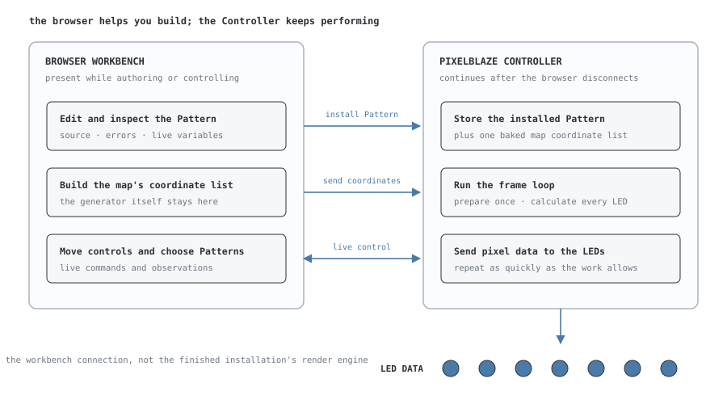

# The Pixelblaze Ecosystem — A Primer

**Addressable LEDs** are lights chained together so software can give each one a
different colour. Pixelblaze is a small WiFi computer that generates those
instructions. Instead of storing a video of colours, it repeatedly runs a small
**Pattern** that decides what every LED should show right now.

Pixelblaze is builder hardware, not generally a finished plug-and-play appliance.
What you buy is an assembled Controller PCB with connection points; a working
installation also needs compatible LEDs, appropriate power, wiring or connectors,
and usually some soldering. Depending on the board and project, you may solder it
directly to a strip, attach wires, or add a connector. Larger installations often
power the LEDs separately while the Controller supplies their data signal.

| Piece | Its job |
|---|---|
| **Pixelblaze Controller** | Calculates and sends the colour data |
| **Addressable LEDs** | Turn that data into physical light |
| **Power supply and distribution** | Provide enough current at the correct voltage |
| **Wires, connectors, and structure** | Join the electronics and hold the LEDs where the project needs them |

The benefit is not that the electronics disappear. Pixelblaze removes much of
the embedded-software work: WiFi setup, live code editing, Pattern storage,
controls, mapping, and the LED timing engine already exist. You still build the
lighting object; you do not also have to invent its firmware toolchain.

Three comparisons carry most of the system:

- A **Pattern is a recipe, not a recording**. It describes how to generate light
  from time, position, controls, and optional sensor input.
- A **pixel map is a seating chart**. Wiring order says which LED receives data
  first; the map says where each LED should be treated as living in space.
- The **browser is the workbench; the Controller is the machine**. You edit and
  inspect from a browser, but the physical Pixelblaze stores and performs the
  Pattern after the browser goes away.

This primer explains that shape for someone encountering the ecosystem for the
first time. ElectroMage's [official documentation](https://electromage.com/docs)
remains the authority for setup, wiring, the complete Pattern language, and
firmware-specific behavior. For this project's software, use the **PXLBLZ
Feature Guide** or **PXLBLZ Technical Reference**.

---

# Part 1 — The useful mental model

Pixelblaze becomes much easier to understand once four things have separate
jobs: the Controller runs, the Pattern decides, the map locates, and the browser
helps you author. Most of the apparent complexity is one of those jobs crossing
into another.

## 1. The Controller runs the lights

A **Controller** is the physical Pixelblaze board at the computational center of
the project. It connects to the LEDs' data input, joins or creates a WiFi
network, stores Patterns, and calculates a colour for every LED many times per
second. It may share a small project's power path, but it is not a substitute
for planning the LEDs' voltage, current, wire size, and power distribution.

It is self-contained. A laptop or phone is useful for editing and control, but
is not part of the finished installation. Once configured, a Controller can sit
inside a sculpture, costume, sign, vehicle, or room and continue running on its
own.

That makes Pixelblaze closer to a tiny lighting instrument than a video player:
it continuously generates the result instead of streaming a pre-rendered frame
sequence from somewhere else.

ElectroMage sells several form factors and optional boards. Those choices affect
wiring, size, sensors, power distribution, and output channels much more than
the basic Pattern model. Start with the official
[Quick Start and hardware guides](https://electromage.com/docs) for the exact
board in your hand.

## 2. The browser is the workbench

Every Pixelblaze serves its own web app. Point a browser at the Controller's IP
address and you can choose Patterns, edit code, create a map, configure hardware,
and see live values. The browser is the workbench around the machine; closing
the workbench does not stop the machine.



The boundary matters:

- the browser presents editors, previews, controls, and configuration;
- the Controller stores and runs the installed Pattern;
- a map generator runs in the browser, then sends coordinate data to the
  Controller; and
- control values and exported variables can move back and forth while a Pattern
  is running.

ElectroMage's [Pixelblaze App User Interface](https://electromage.com/docs/user-interface/)
guide covers the built-in app screen by screen. PXLBLZ-IDE is another workbench
for the same underlying Pattern and Controller concepts; it does not replace the
Controller's Settings and WiFi administration.

## 3. A Pattern is a recipe for light

A **Pattern** is a small program written in Pixelblaze's JavaScript-like
language. It does not say "LED 12 is blue at 1.3 seconds." It gives the Controller
a reusable rule such as "move a rainbow through the installation" or "make each
point pulse according to its distance from the center."

The minimum useful loop has two stages:

1. **Prepare the frame.** `beforeRender(delta)` runs once and advances time or
   other shared state.
2. **Colour every LED.** `render(index)`, `render2D(index, x, y)`, or
   `render3D(index, x, y, z)` runs once for each LED and calls `hsv(...)` or
   `rgb(...)` with its colour.

In compact form:

```text
new frame
  → update shared animation state once
  → ask the Pattern for LED 0's colour
  → ask for LED 1's colour
  → …
  → send the completed frame to the LEDs
  → repeat
```

The Pattern is evaluated rather than played back, so the same source can adapt
to a different pixel count, map, speed, or user control. More pixels or more
expensive math means each frame takes longer; there is no hidden GPU evaluating
all LEDs in parallel.

### Controls are knobs on the recipe

A Pattern can ask its host app to create a slider, toggle, button, or colour
picker simply by exporting a specially named function such as
`sliderSpeed(value)`. Moving that **control** changes the running Pattern without
editing its source. Values are remembered per Pattern.

This is one of Pixelblaze's friendliest ideas: the author decides which parts of
the recipe should become knobs, and the interface appears automatically. The
official [Language Reference](https://electromage.com/docs/language-reference/)
lists every control type and its naming convention.

## 4. A pixel map is a seating chart

LEDs have at least two kinds of position:

- **wiring position** — first LED, second LED, third LED; and
- **spatial position** — left edge, top corner, center of the sculpture.

Those are often unrelated. A matrix may snake left-to-right on one row and
right-to-left on the next. A sculpture may be wired in whatever order made it
possible to reach the next physical point.

A **pixel map** translates wiring order into Pattern coordinates. It is like a
seating chart: "person 37" is the identity in the list; "row 4, seat 6" is where
that person sits. With a map installed, the Pattern receives LED #37's `x`, `y`,
and possibly `z` position instead of having to reverse-engineer the wire.

That separation makes Patterns portable. The same 2D Pattern can run on a small
matrix, a curtain of vertical strips, or a triangular wall if each installation
has an honest map describing its own geometry.

Maps are optional. A simple strip can use index alone. When you need the next
layer, read ElectroMage's [Intro to Mapping](https://electromage.com/docs/intro-to-mapping/)
for the official workflow and **Understanding Maps** in this repository for the
full map-function, normalization, and `pixelCount` mental model.

## 5. Fixed-point is a measuring tape with limits

Browser JavaScript normally represents numbers with a huge floating-point
range. A Pixelblaze Pattern uses **16.16 fixed-point** numbers instead. Imagine a
measuring tape with evenly spaced marks and a finite length: values between the
marks are rounded, and calculations that run off one end wrap around rather than
continuing forever.

For ordinary Pattern work, three habits do most of the job:

- Keep colour, phase, brightness, and mapped coordinates near `0..1`.
- Be suspicious of very large intermediate values, even if the final result
  would return to `0..1`.
- Expect ports from browser shaders or desktop JavaScript to need numerical
  adaptation, not just syntax changes.

The exact range is roughly `-32768..32768`, with steps of `1/65536`. You rarely
need those numbers to get started; you do need the intuition that the arithmetic
has visible edges. The official Language Reference documents the numeric model,
and **Optimizing Pixelblaze patterns** covers measured hardware costs and porting
tactics.

Generated packed tables expose two advanced edges of that measuring tape.
Neither `32768` nor `65536` is representable as a positive 16.16 value, so a
decoder must stage large multiplies; for example, materialize a 15-bit fraction
lane as `((fraction * 256) * 128)` instead of multiplying by `32768`. Firmware
3.67 also parsed about 0.5% of sampled 32-bit packed decimal words one ULP low,
with no decimal spelling that reached the missing word exactly. PXLBLZ's packed
format leaves the low lane odd: a one-ULP loss consumes that guard bit without
changing either decoded 15-bit value or borrowing from the high lane. Ordinary
Pattern constants do not need this scheme; generated binary-packed data does.

## 6. The whole trip from idea to LEDs

A typical first Pattern takes this path:

1. Connect the Controller and LEDs using the guide for the actual hardware.
2. Put the Controller in client mode on an existing WiFi network, or AP mode so
   it creates its own network.
3. Open the Controller's web app and configure LED type, colour order, and pixel
   count.
4. Start from an installed Pattern or one from the
   [Pixelblaze Pattern Library](https://patterns.electromage.com/).
5. Change a number, move a control, or edit the Pattern and watch the LEDs react.
6. Add a map only when the Pattern needs to understand the installation's shape.
7. Leave the Controller powered: it keeps running without the browser.

That immediate edit-and-observe loop is the center of the ecosystem. The
language, mapper, controls, variable watcher, sharing format, and third-party
tools all exist to shorten or extend that loop.

---

# Part 2 — The next layer when you need it

The mental model above is enough to explore safely. The remaining details matter
when you start writing substantial Patterns, connecting remote tools, or powering
more than a small handful of LEDs.

## 7. The Pattern language is JavaScript-shaped, not JavaScript

Pixelblaze uses a compact subset of JavaScript syntax with firmware-provided
colour, waveform, noise, time, math, and coordinate functions. Familiar loops,
functions, arrays, arithmetic, and `var` declarations work; many browser-language
features do not.

Useful guardrails:

- Call built-ins directly: `sin(x)`, `time(x)`, and `hsv(h, s, v)`, not
  `Math.sin(x)` or browser APIs.
- Use the exported `render*` and `beforeRender` entry points the runtime expects.
- Do not assume objects, classes, `let`, `const`, exceptions, imports, or normal
  closures are available.
- Check the Language Reference shown by the Controller's own editor when exact
  behavior depends on installed firmware.

The small language has two scopes in the firmware 3.67 compiler: module globals
and function locals. `var` is function-scoped even when written inside a block;
it hoists to the function entry, and reading it before assignment yields `0`
rather than JavaScript's `undefined`. Assignment without `var` always creates or
writes a global. Top-level functions hoist, but a nested function cannot close
over an outer function's locals; attempting that is a compile error.

Array literals also carry some history. Older v3-era documentation described
them as unsupported, so much community code still fills `array(size)` one
element at a time. The firmware 3.30 language reference includes array literals,
and firmware 3.67 compiles numeric literals into a dense data segment. That makes
the modern form both clearer and much smaller on the Controller; the
**Optimizing Pixelblaze patterns** guide gives the measured prices and the cases
where packed literals are worth the decode.

ElectroMage's [Language Reference](https://electromage.com/docs/language-reference/)
is the authoritative syntax and built-in catalogue. This primer should give you
a place to hang those facts, not duplicate the catalogue.

## 8. Networking: local by design

In client mode, a Controller joins an existing WiFi network and receives a local
IP address. If ElectroMage discovery is enabled, open
[discover.electromage.com](https://discover.electromage.com/) from the same
network to find it. In AP mode, the Controller creates the network and is
normally available at `192.168.4.1`.

The built-in app can talk directly to its Controller. Other local tools use the
documented WebSocket API on port 81 to switch Patterns, change brightness, move
controls, and read or write exported values.

A hosted `https://` app has one extra obstacle: browsers block it from opening a
plain `ws://` connection to a LAN Controller. Such an app needs a LAN-side helper
or a browser extension. That is a browser security boundary, not a Pixelblaze
configuration failure.

Use ElectroMage's [WebSocket API](https://electromage.com/docs/websockets-api/)
when building integrations. Use the **PXLBLZ Technical Reference** for this
project's extension relay and provider architecture.

## 9. Hardware and power: follow the board-specific guide

Addressable LEDs combine logic and significant electrical load. The software is
forgiving; incorrect voltage and power wiring are not.

The few universal rules worth carrying into a first build are:

- Match the configured LED type and colour order to the actual strip or panel.
- Observe data direction; addressable strips have an input end.
- Share ground between the Controller and any separate LED power supply.
- Never feed 12 V into a Pixelblaze 5 V input.
- Plan power for the brightest state the installation can produce, not just the
  dim animation currently on screen.
- Expect long or high-current runs to need appropriate wire and multiple power
  feed points.

ElectroMage's [Hardware Getting Started](https://electromage.com/docs/hardware-getting-started/)
guide is the source of truth for supported LED families, connector diagrams,
voltage, current, GPIO, and power arrangements. Its conservative planning figure
for common RGB LEDs is 20 mA per colour channel, or 60 mA per pixel at full
white; many modern LEDs draw less, but the actual part and brightness limit
decide the real budget.

Sensor and output expansion are optional layers, not new Pattern systems. The
[Sensor Expansion Board](https://electromage.com/docs/sensor-expansion-board/)
adds sound, motion, light, and analog inputs. The
[Output Expander](https://electromage.com/docs/output-expander/) and
[Pro Output Expander](https://electromage.com/docs/pro-output-expander/) add
parallel LED outputs and different power-distribution options.

## 10. First-contact troubleshooting

Most first failures are mundane, which is good news.

| Symptom | First thing to check |
|---|---|
| No Controller network on first boot | Look for `Pixelblaze_XXXXXX`; join it and open `192.168.4.1`. |
| Router or password changed | Hold the onboard button for about five seconds to reset WiFi settings, then repeat setup. |
| Controller joined WiFi but its IP is unknown | Use ElectroMage discovery from the same network, then check the router's DHCP list. |
| Web editor works but LEDs are dark | Check power, common ground, data direction, configured LED type, colour order, and pixel count. |
| Colours are swapped | Try the supported colour-order settings before changing Pattern code. |
| A hosted web tool cannot connect | Confirm its required extension or LAN helper is installed; `https` cannot directly open the Controller's `ws://` socket. |
| Clock-based Patterns behave strangely | Use client mode with network time available. |
| Connections become unreliable with many tools open | Close extra Controller editor tabs and integrations before debugging the network. |

For screenshots and board-specific recovery steps, use ElectroMage's
[Quick Start](https://electromage.com/docs) and
[Pixelblaze App User Interface](https://electromage.com/docs/user-interface/)
guides. The [ElectroMage forum](https://forum.electromage.com/) is the best place
for revision-specific hardware questions and unusual installations.

## 11. Choose the next document by the job

| I want to… | Go here |
|---|---|
| Set up a new Controller or wire LEDs | [ElectroMage Quick Start and Hardware Setup](https://electromage.com/docs) |
| Learn the built-in Pixelblaze app | [Pixelblaze App User Interface](https://electromage.com/docs/user-interface/) |
| Write or debug a Pattern | [Pixelblaze Language Reference](https://electromage.com/docs/language-reference/) |
| Find Patterns to run or study | [Pixelblaze Pattern Library](https://patterns.electromage.com/) |
| Build a 2D or 3D map | [ElectroMage Intro to Mapping](https://electromage.com/docs/intro-to-mapping/) and **Understanding Maps** |
| Integrate another tool | [Pixelblaze WebSocket API](https://electromage.com/docs/websockets-api/) |
| Understand PXLBLZ-IDE as a user | **PXLBLZ Feature Guide** |
| Understand how PXLBLZ-IDE is built | **PXLBLZ Technical Reference** |
| Make a Pattern faster on hardware | **Optimizing Pixelblaze patterns** |
| See how a Show becomes one Pattern | **Inside the Show Compiler** |

Pixelblaze rewards experimentation: change one thing, watch the result, and keep
the parts that make the installation more expressive. The point of the platform
is not to memorize every built-in before beginning; it is to make the feedback
loop short enough that the lights teach you what the code means.
